# Pipette 操作ガイド

[English version](OPERATION-GUIDE.md)

このドキュメントでは Pipette デスクトップアプリの操作方法を説明します。
スクリーンショットは特に記載がない限り GPK60-63R キーボードを使用して撮影しています。

---

## 1. デバイス接続

### 1.1 デバイス選択画面

アプリを起動すると、接続されている Vial 対応キーボードの一覧が表示されます。

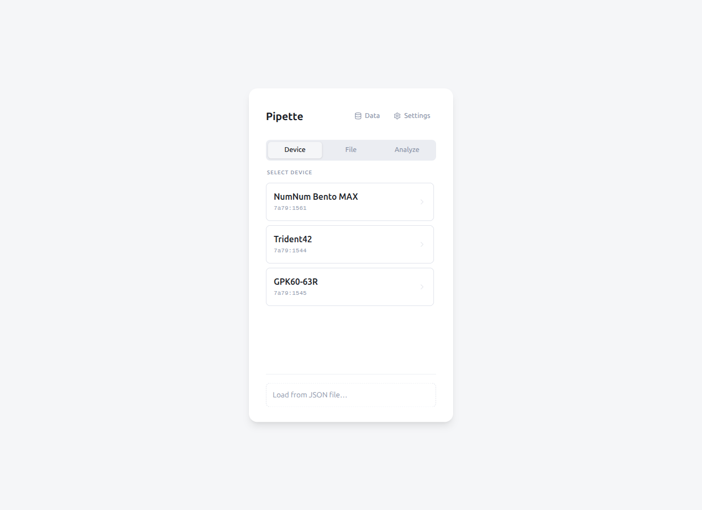

- USB 接続されたキーボードが自動的に検出されます
- 複数のキーボードが接続されている場合は、一覧から選択できます
- Linux で検出されない場合は、udev ルールの設定が必要です

### 1.2 キーボードの接続

一覧からキーボード名をクリックすると、キーマップエディタに遷移します。接続中はオーバーレイにキーボードデータの読み込み進捗が表示されます。

クラウド同期が設定されている場合、接続時に同期進捗も表示されます（お気に入りを先に同期し、次にキーボード固有データを同期）。

### 1.3 データモーダル

デバイス選択画面の Data ボタンをクリックすると、お気に入りと Hub 投稿を一元管理するデータモーダルが開きます。

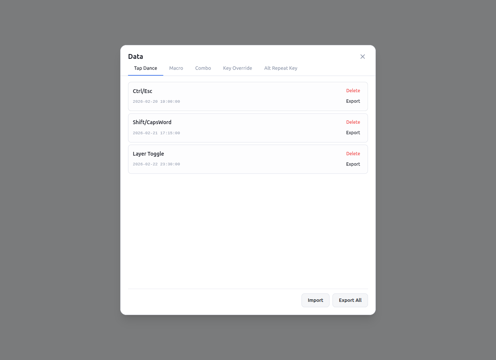

- **お気に入りタブ**: Tap Dance、Macro、Combo、Key Override、Alt Repeat Key — タイプごとにタブが分かれています
- エントリごとの操作: クリックでリネーム、削除、または個別の **Export**
- **Hub アクション**: Hub 接続時、各エントリに **Upload to Hub** / **Update on Hub** / **Remove from Hub** ボタンが表示されます（インラインお気に入りパネルと同じ）
- フッターの **Import** / **Export All** ボタンで一括操作

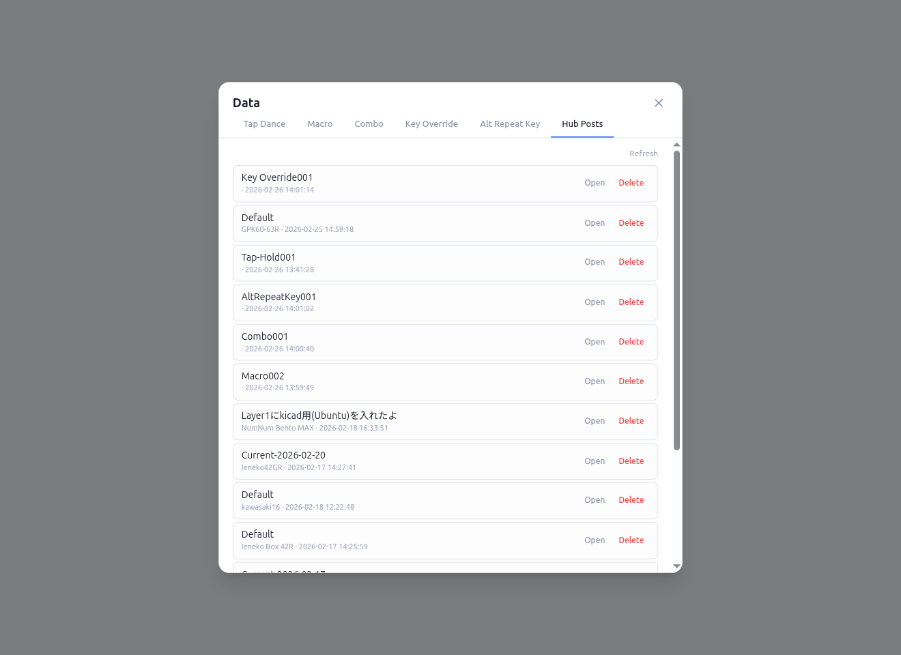

- **Hub Posts** タブ: Pipette Hub のアップロードを管理 (Hub 接続時に表示)

---

## 2. キーマップエディタ

### 2.1 画面構成

キーマップエディタはキーボードレイアウト表示とキーコードパレットの 2 つの領域で構成されます。

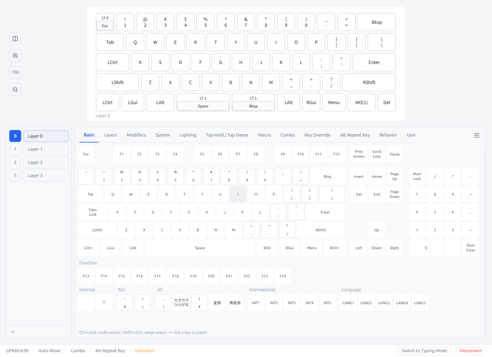

- 画面上部: キーボードの物理レイアウト (各キーに現在のキーコードを表示)
- 画面左側: ツールバー (デュアルモード、ズームなど)
- 画面下部: キーコードパレット (タブ切替式) とオーバーレイパネルトグル
- 右側 (展開時): キーコードオーバーレイパネル (ツール、保存、レイアウトオプション)
- 画面最下部: ステータスバー

### 2.2 キーの変更方法

1. キーボードレイアウト上のキーをクリックして選択
2. キーコードパレットから割り当てたいキーコードをクリック
3. キーの表示が更新されます
4. 変更は自動的にキーボードに反映されます

- Ctrl+クリックで複数のキーを選択できます
- Shift+クリックで範囲選択ができます

### 2.3 レイヤー切替

キーボードレイアウトの左側にレイヤー切替ボタンがあります。

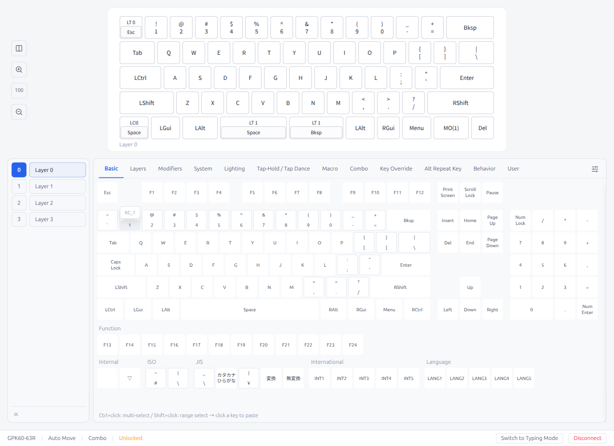

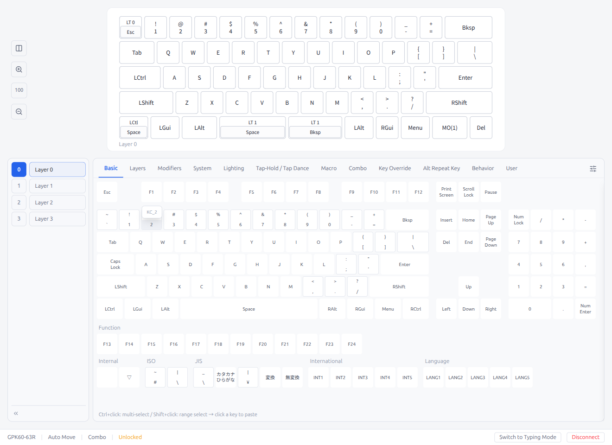

- レイヤー番号ボタンをクリックしてレイヤーを切り替えます
- Layer 0 がデフォルトレイヤーです
- 利用可能なレイヤー数はキーボードの設定に依存します

レイヤーパネルは折りたたんでスペースを節約できます:

折りたたみボタン (シェブロン) をクリックしてレイヤーパネルを番号のみに縮小できます。展開ボタンをクリックすると完全なレイヤー名が復元されます。

### 2.4 キーポップオーバー

キーボードレイアウト上のキーをダブルクリックすると、キーポップオーバーが開きます。パレットをスクロールせずに、素早くキーコードを検索・割り当てできます。

**Key タブ**

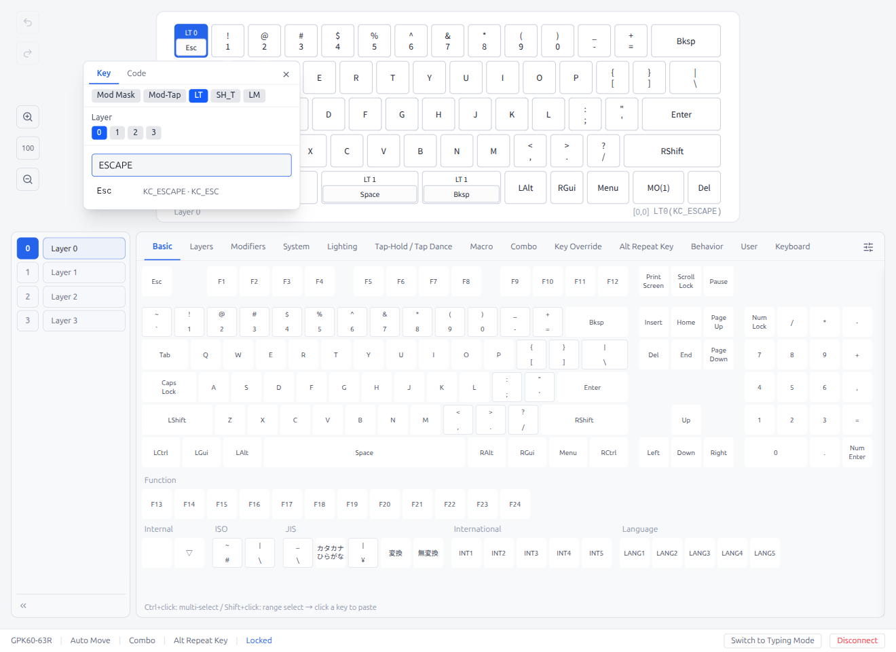

- 検索入力には現在のキーコード名がプリセットされます
- 名前、QMK ID、エイリアスで検索でき、関連度順に結果が表示されます
- 検索結果をクリックするとすぐに割り当てられます
- 詳細エディタ (Tap Dance、Combo、Key Override など) のキーフィールドをダブルクリックしても同様にポップオーバーが表示されます

**Code タブ**

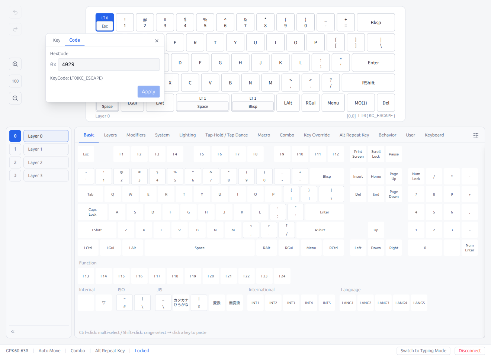

- 16進数でキーコード値を直接入力できます (例: `0x0029` で Escape)
- 入力欄の下に対応するキーコード名が表示されます
- **Apply** ボタンをクリックして割り当てます

**ラッパーモード**

ポップオーバー上部のモードボタンで、複合キーコードを構築できます:

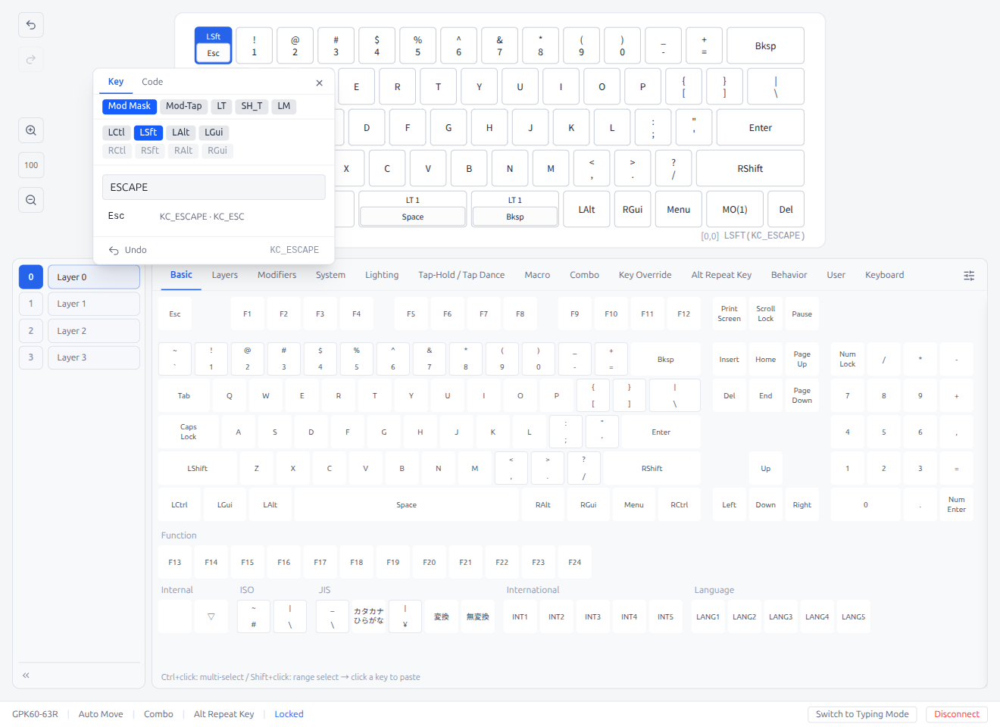

- **Mod Mask**: 修飾キーとキーを組み合わせます (例: `LSFT(KC_ESCAPE)`)
- **Mod-Tap**: 長押しで修飾キー、タップでキー (例: `LSFT_T(KC_ESCAPE)`)

どちらのモードでも修飾キーチェックボックスが表示され、Left/Right の Ctrl、Shift、Alt、GUI を選択できます。Left と Right の修飾キーは同時に選択できません — 片方を選択するともう片方は無効になります。

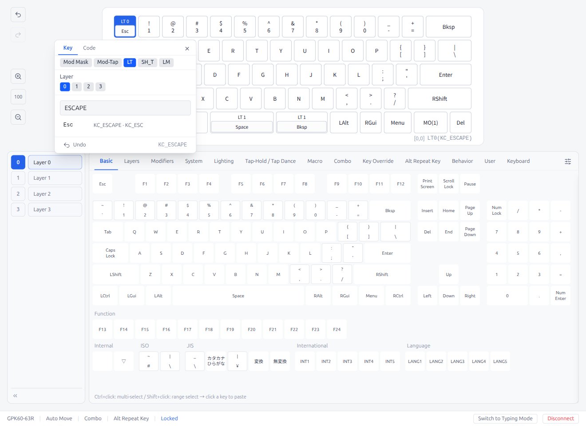

- **LT**: Layer-Tap — 長押しでレイヤーを有効化、タップでキーを送信 (例: `LT0(KC_ESCAPE)`)。レイヤーセレクタが表示され、対象レイヤーを選択できます。
- **SH_T**: Swap Hands Tap — 長押しでスワップハンド、タップでキーを送信 (例: `SH_T(KC_ESCAPE)`)
- **LM**: Layer-Mod — 修飾キー付きでレイヤーを有効化 (例: `LM(0, MOD_LSFT)`)。レイヤーセレクタと修飾キーチェックボックスの両方が表示されます。

アクティブなモードボタンをクリックするとモードが解除され、基本キーコードに戻ります。

Escape キーを押すか、ポップオーバーの外側をクリックすると閉じます。

### 2.5 レイアウトオプション

一部のキーボードは複数の物理レイアウトに対応しています（例: 分割バックスペース、ISO エンター、ボトムロウの構成変更など）。キーボードにレイアウトオプションがある場合、キーコードパレットのタブバー右端にレイアウトオプションボタン（グリッドアイコン）が表示されます。

- グリッドアイコンをクリックしてレイアウトオプションパネルを開きます
- **チェックボックスオプション**: レイアウトバリアントのオン/オフを切り替えます（例: 「Macro Pad」「Split Backspace」「ISO Enter」）
- **ドロップダウンオプション**: 複数のレイアウトバリアントから選択します（例: 「Bottom Section」で Full Grid / Macro Pad / Arrow Keys を選択）
- 変更は即座に反映されます — 選択したオプションに応じてキーボードレイアウト表示がリアルタイムに更新されます

- オプションを変更すると、キーボードレイアウト上の表示キーが更新されます
- レイアウトオプションはキーボードに保存され、セッション間で保持されます
- パネルの外側をクリックするか Escape キーを押すと閉じます

> **Note**: レイアウトオプションボタンは、複数のレイアウトバリアントが定義されているキーボードでのみ表示されます。固定レイアウトのキーボードにはこのボタンは表示されません。このセクションのスクリーンショットは「JSONファイルから読み込み」機能でダミー JSON 定義を使用して撮影しています。

---

## 3. キーコードパレット

画面下部のタブ付きパレットから、各カテゴリのキーコードを選択できます。

### 3.1 Basic

通常の文字キー、ファンクションキー、修飾キー、ナビゲーションキーなどの基本キーコードです。Basic タブは 3 つのビュータイプに対応しており、キーコードオーバーレイパネル (§3.10) から切り替えできます:

**ANSI キーボードビュー** (デフォルト)

キーコードを ANSI キーボードレイアウトとして表示します。ビジュアルキーボード上のキーをクリックして割り当てます。

**ISO キーボードビュー**

ISO 固有のキーを含む ISO キーボードレイアウトとして表示します。

**リストビュー**

従来のスクロール可能なリスト形式でキーコードを表示します。

全ビュー共通:
- 文字キー (A-Z, 0-9, 記号)
- ファンクションキー (F1-F24)
- 編集キー (Enter, Tab, Backspace, Delete)
- ナビゲーションキー (矢印, Home, End, PageUp/Down)
- テンキー

### 3.2 Layers

レイヤー操作用のキーコードです。

- **MO(n)**: 押している間だけレイヤー n に切り替え
- **DF(n)**: デフォルトレイヤーを n に変更
- **TG(n)**: レイヤー n をトグル
- **LT(n, kc)**: 長押しでレイヤー、タップでキーコード
- **OSL(n)**: 次のキー入力のみレイヤー n を有効化
- **TO(n)**: レイヤー n に切り替え

### 3.3 Modifiers

修飾キーの組み合わせやタップ時の動作を設定するキーコードです。

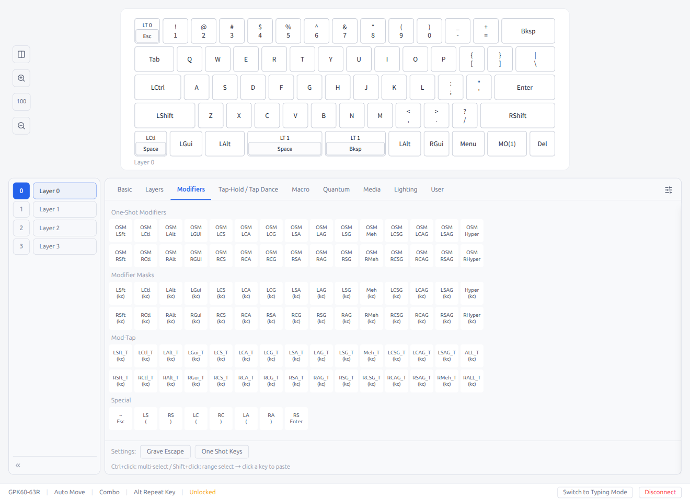

- **One-Shot Modifier (OSM)**: 次のキー入力のみ修飾キーを有効化
- **Mod-Tap**: 長押しで修飾キー、タップで通常キー
- **Mod Mask**: 修飾キーの組み合わせ

### 3.4 Tap-Hold / Tap Dance

タップとホールドで異なる動作を割り当てるキーコードです。

Tap Dance セクションは全エントリを一覧表示する**タイルグリッドプレビュー**を備えています:

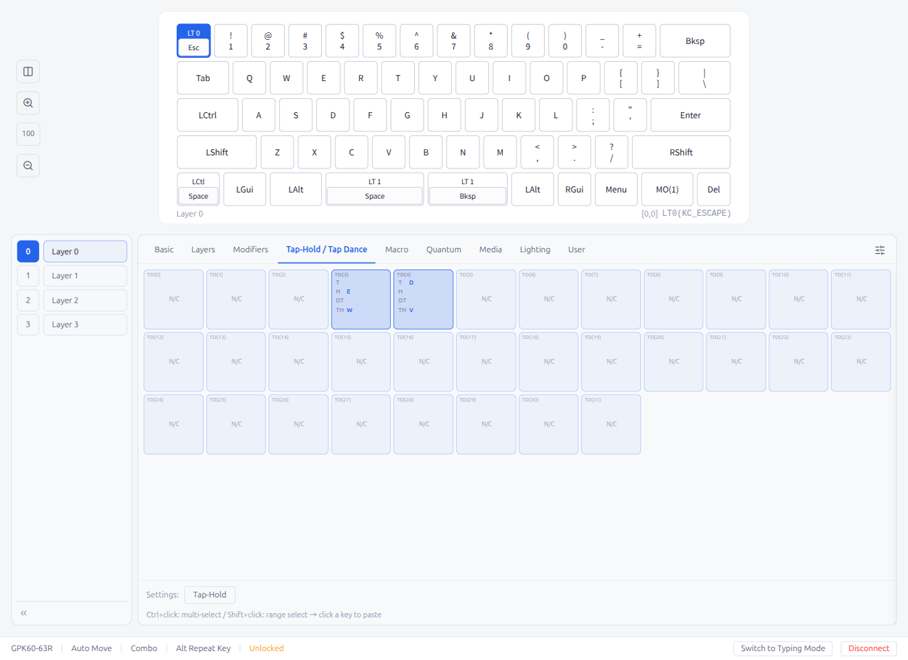

- 各タイルにはエントリ番号と設定済みアクションの概要が表示されます
- 設定済みエントリはタップ/ホールドアクションを表示し、未設定タイルは番号のみ表示
- タイルをクリックして Tap Dance 編集モーダルを開きます
- 各エントリにタップ・ホールド・ダブルタップなどの動作を設定できます

### 3.5 Macro

マクロキーコードです。

Macro セクションは全エントリを一覧表示する**タイルグリッドプレビュー**を備えています:

- 各タイルにはマクロ番号と記録されたシーケンスのプレビューが表示されます
- 設定済みエントリはキーアクションの概要を表示し、未設定タイルは番号のみ表示
- タイルをクリックして Macro 編集モーダルを開きます
- キー入力のシーケンスをマクロとして登録できます

### 3.6 Quantum

QMK の高度な機能用キーコードです。

- Boot (ブートローダーモード)
- Caps Word
- Magic キー
- Auto Shift
- Combo
- Key Override
- Alt Repeat Key
- Swap Hands

### 3.7 Media

メディアキー、マウスキー、ジョイスティック操作のキーコードです。

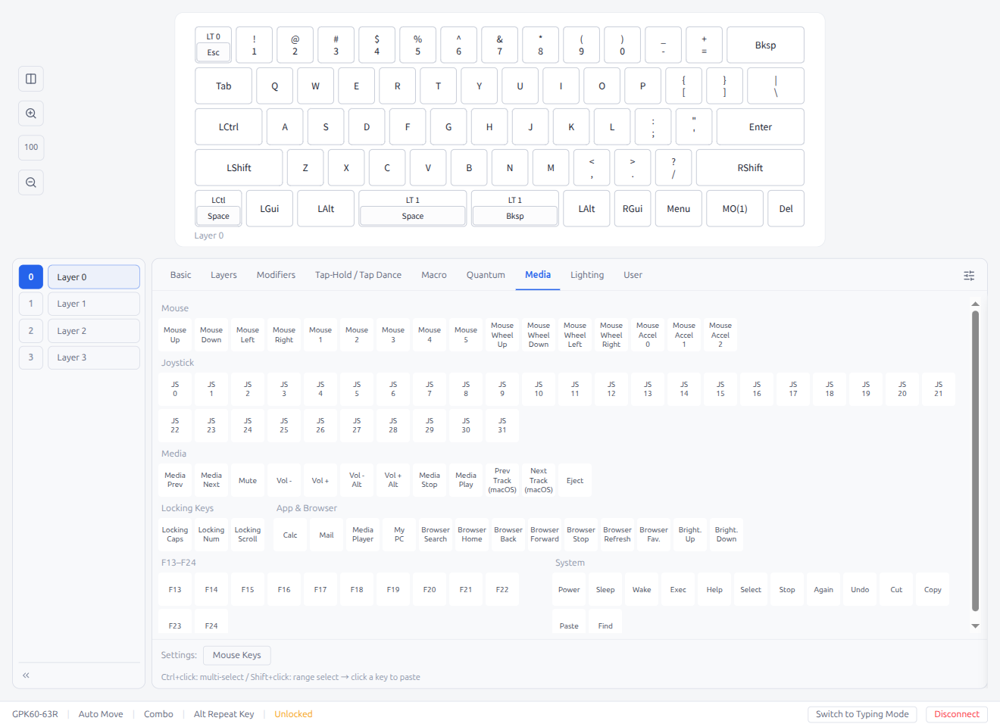

- マウスボタン・移動・スクロール
- メディア再生制御 (再生/停止/音量)
- アプリケーション起動キー

### 3.8 Lighting

バックライトと RGB ライティング制御のキーコードです。

- RGB Matrix 制御
- RGB Lighting 制御
- バックライト制御
- LED Matrix 制御

### 3.9 User

ユーザー定義キーコードです。

- ファームウェアで定義されたカスタムキーコード

> **Note**: MIDI タブは MIDI 対応キーボードでのみ表示されます。

### 3.10 キーコードオーバーレイパネル

キーコードオーバーレイパネルはエディタツールと保存機能への素早いアクセスを提供します。キーコードタブバー右端のパネルボタンでトグルします。

**Settings タブ**

- **Basic View Type**: Basic タブのビュータイプを切り替え (ANSI キーボード、ISO キーボード、リスト)
- **Keyboard Layout**: キーラベルの表示レイアウトを選択 (QWERTY、Dvorak など)
- **Auto Advance**: キーコード割り当て後に次のキーへ自動移動する機能の切替
- **Split Key Mode**: 複合キーコードの分割表示を切替 (例: Mod-Tap を 2 つに分けて表示)
- **Key Tester**: Matrix Tester モードの切替 (対応キーボードのみ)
- **Security**: ロック状態 (Locked/Unlocked) の表示と Lock ボタン
- **Import**: `.vil` ファイルからの復元、またはカスタム JSON 定義のサイドロード
- **Reset Keyboard Data**: キーボードを初期状態に戻す

**Save タブ**

- **Export Current State**: キーマップを `.vil`、`keymap.c`、PDF キーマップチートシート、PDF レイアウトエクスポート（キーアウトラインと Tap Dance・Macro・Combo・Key Override・Alt Repeat Key のサマリーページ付き）としてダウンロード
- **Save Current State**: 現在のキーボード状態をラベル付きで保存
- **Synced Data**: 保存済みスナップショットの一覧。Load・Rename・Delete・Export の操作が可能
- エディタ設定パネル (§6) と同じ Save パネルです

**Layout タブ** (利用可能時)

一部のキーボードはレイアウトオプションに対応しています (§2.5 参照)。対応キーボードでは Layout タブがオーバーレイパネルの最初のタブとして表示され、同じレイアウトオプションにアクセスできます。

---

## 4. ツールバー

キーマップエディタ左側のツールバーには以下の機能があります。

### 4.1 デュアルモード (Split Edit)

キーボードレイアウトを 2 つ並べて表示し、レイヤー間のキー比較やコピーが可能です。

- ボタンをクリックしてデュアルモードを切り替えます
- レイヤー間でキー設定をコピーする際に便利です

### 4.2 ズーム

キーボードレイアウトの表示倍率を変更します。

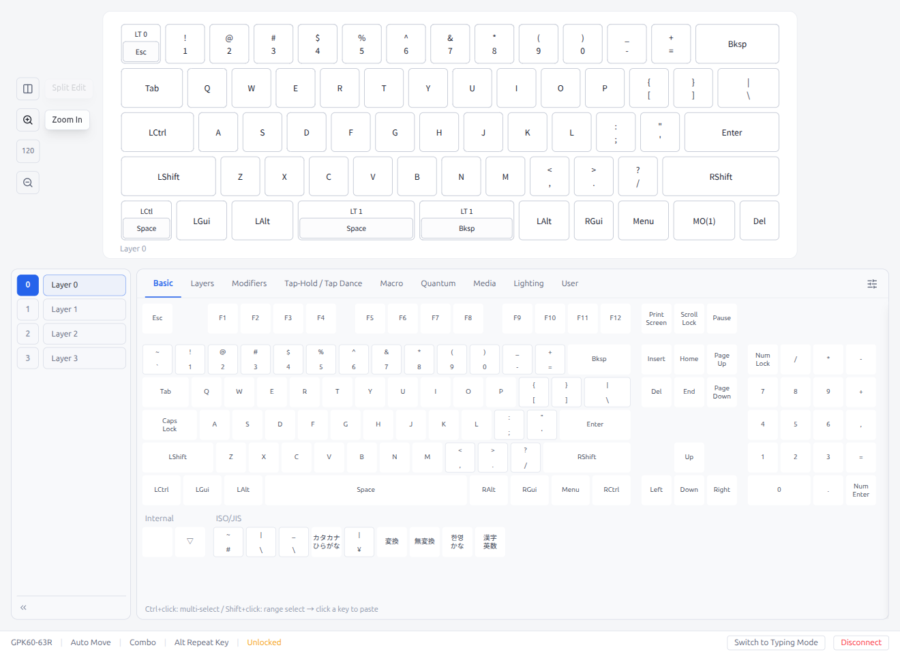

- (+) ボタンでズームイン
- (-) ボタンでズームアウト
- エディタ設定でも調整可能です

### 4.3 タイピングテスト

タイピング練習機能です。現在のキーマップでタイピングテストを行えます。テスト中はキーボードレイアウトが下部に表示され、キー入力がリアルタイムでハイライトされるため、物理キーマップと画面表示の一致を確認できます。

ツールバーのタイピングテストボタンをクリックしてテストモードに入ります。

#### モード

上部のモードタブから 3 つのテストモードを選択できます:

**Words モード**

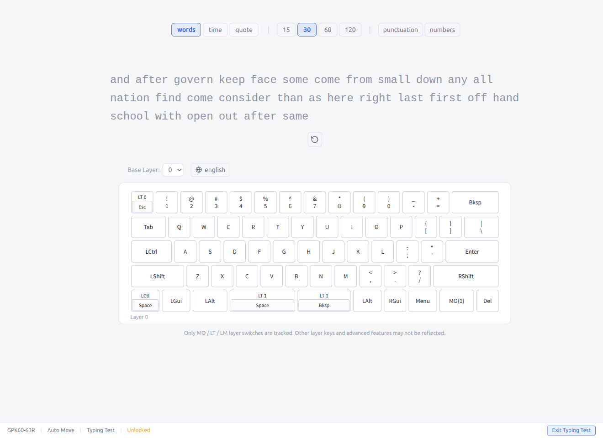

- 固定数のランダムな単語をタイプ (15 / 30 / 60 / 120 語)
- 全ての単語を入力すると終了

**Time モード**

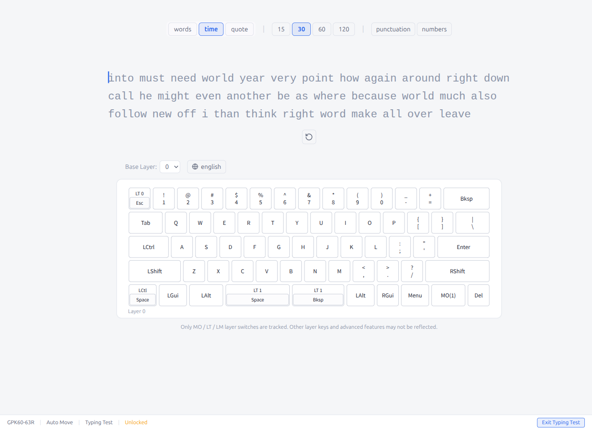

- 制限時間内にできるだけ多くの単語をタイプ (15 / 30 / 60 / 120 秒)
- 残り時間がカウントダウンで表示

**Quote モード**

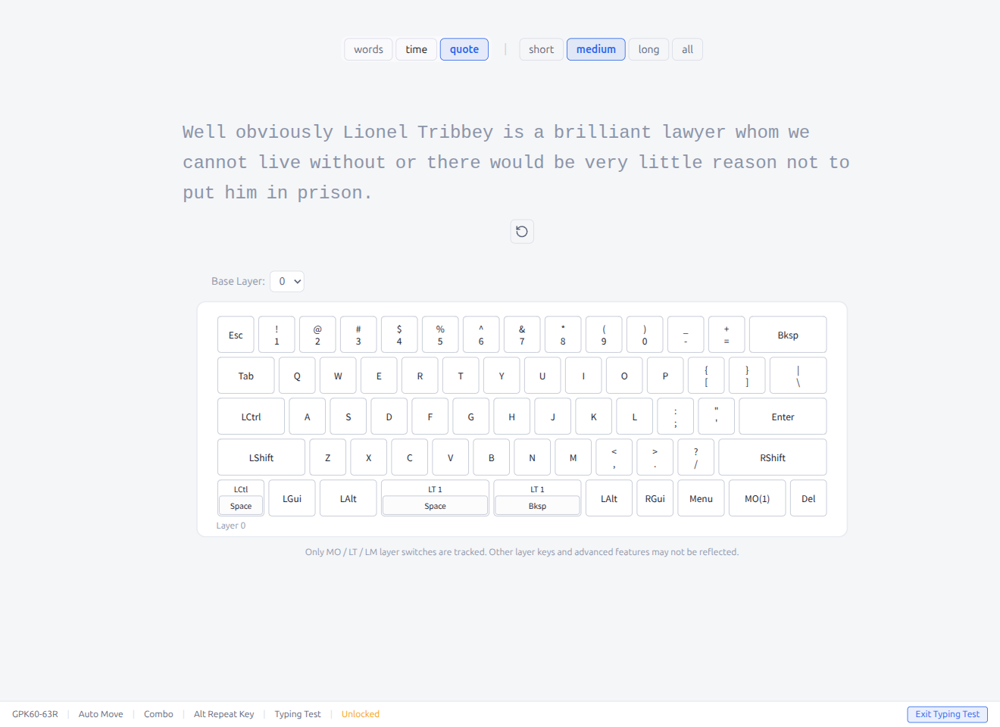

- 実際の引用文をタイプ (short / medium / long / all)
- 完了後に引用元が表示

#### オプション

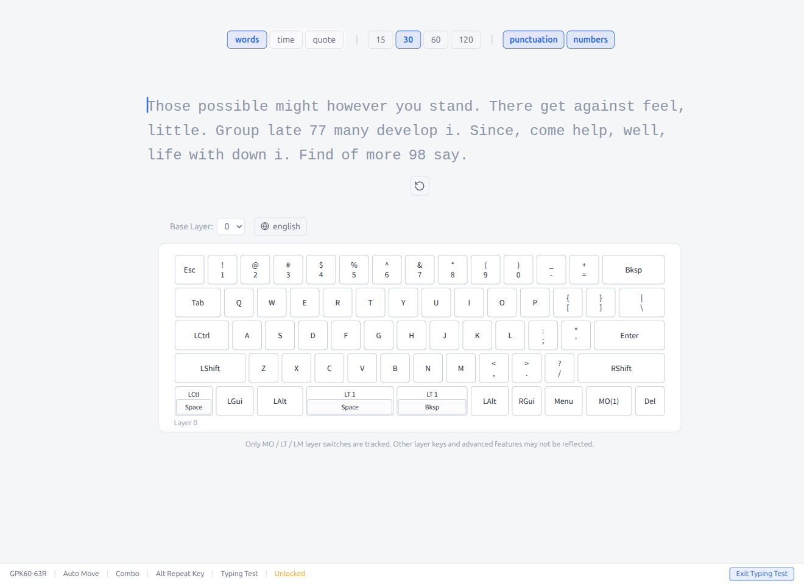

Words モードと Time モードでは追加オプションを切り替えできます:

- **Punctuation**: 句読点（カンマ、ピリオドなど）を単語リストに追加
- **Numbers**: 数字を単語リストに追加

Quote モードではこれらのトグルは利用できません（原文がそのまま使用されます）。

#### テスト中

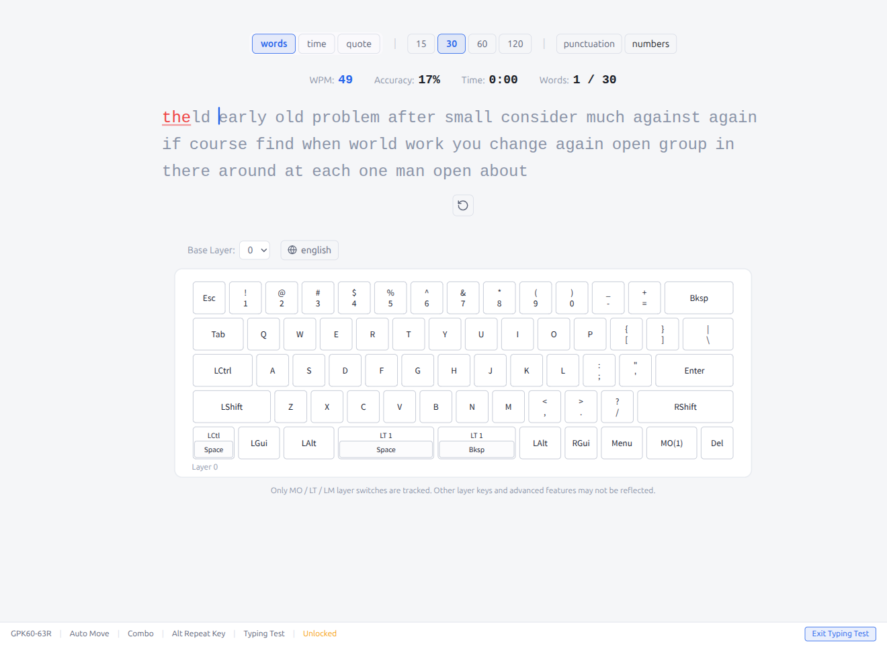

タイピング中は以下の統計情報がリアルタイムで表示されます:

- **WPM**: Words Per Minute（現在のタイピング速度）
- **Accuracy**: 正確に入力された文字の割合
- **Time**: 経過時間（Time モードでは残り時間）
- **Words**: 現在の単語 / 総単語数

正しく入力された単語は緑色に変わります。誤った文字は赤色でアンダーライン表示されます。カーソルは入力に応じて進み、単語は自動的にスクロールします。

- リスタートボタン (↺) を押すといつでもテストを再開できます
- Escape キーでタイピングテストモードを終了します
- テスト領域下部のキーボードレイアウトは、Vial マトリクステスタープロトコルを通じてキー入力をリアルタイムで表示します

---

## 5. 詳細設定エディタ

キーコードパレットの各タブ下部にある設定ボタンから、詳細設定モーダルを開けます。

### 5.1 ライティング設定

Lighting タブの設定ボタンから開きます。RGB ライティングの色やエフェクトを設定できます。

- HSV カラーピッカーで色を選択
- プリセットパレットから色を選択
- エフェクトとスピードを調整
- Save ボタンで保存

### 5.2 コンボ

Quantum タブのコンボ設定ボタンから開きます。複数キーの同時押しで別のキーを発動させる設定です。コンボエディタは**2画面フロー**で構成されています。

**画面1 (一覧)**: 番号付きタイルのグリッド (0--31)。設定済みエントリはサマリー表示。タイルをクリックして編集画面へ。Timeout (ms) と Save ボタンはこの画面に表示されます。

**画面2 (詳細)**: 左パネルにコンボエディタ (Key 1--4, Output フィールド)。右パネルにインラインお気に入りパネル (Save Current State / Synced Data / Import / Export All)。

- **Clear** ボタンで全フィールドをリセット (2段階確認付き)
- **Revert** で最後に保存した状態に復元 (2段階確認付き)
- **Save** ボタンで変更をキーボードに書き込み
- **Back** ボタンでタイルグリッドに戻る

### 5.3 キーオーバーライド

Quantum タブのキーオーバーライド設定ボタンから開きます。特定のキー入力を別のキーに置き換える設定です。キーオーバーライドエディタは**2画面フロー**で構成されています。

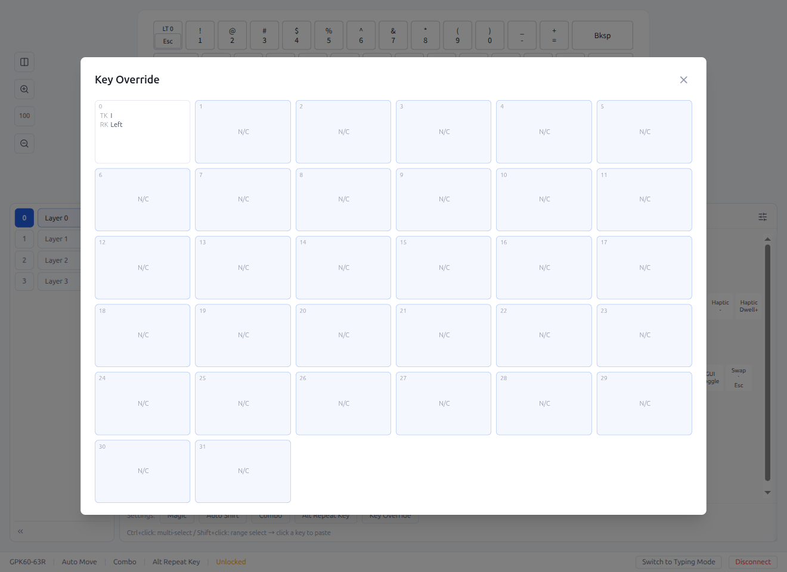

**画面1 (一覧)**: 番号付きタイルのグリッド。設定済みエントリはサマリー表示。タイルをクリックして編集画面へ。

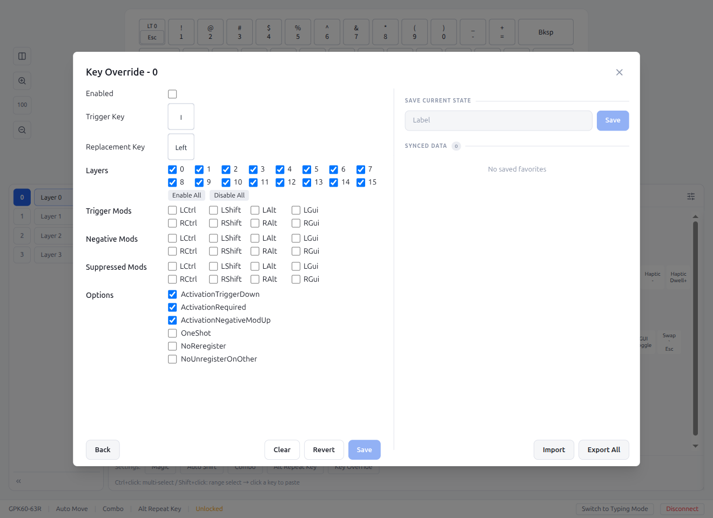

**画面2 (詳細)**: 左パネルにキーオーバーライドエディタ。右パネルにインラインお気に入りパネル (Save Current State / Synced Data / Import / Export All)。

- トリガーキーと置換キーを設定
- レイヤー、修飾キー条件を指定
- 個別に有効/無効を切り替え可能
- **Clear** ボタンで全フィールドをリセット (2段階確認付き)
- **Revert** で最後に保存した状態に復元 (2段階確認付き)
- **Save** ボタンで変更をキーボードに書き込み
- **Back** ボタンでタイルグリッドに戻る

### 5.4 Alt Repeat Key

Quantum タブの Alt Repeat Key 設定ボタンから開きます。Repeat Key の代替動作を設定します。Alt Repeat Key エディタは**2画面フロー**で構成されています。

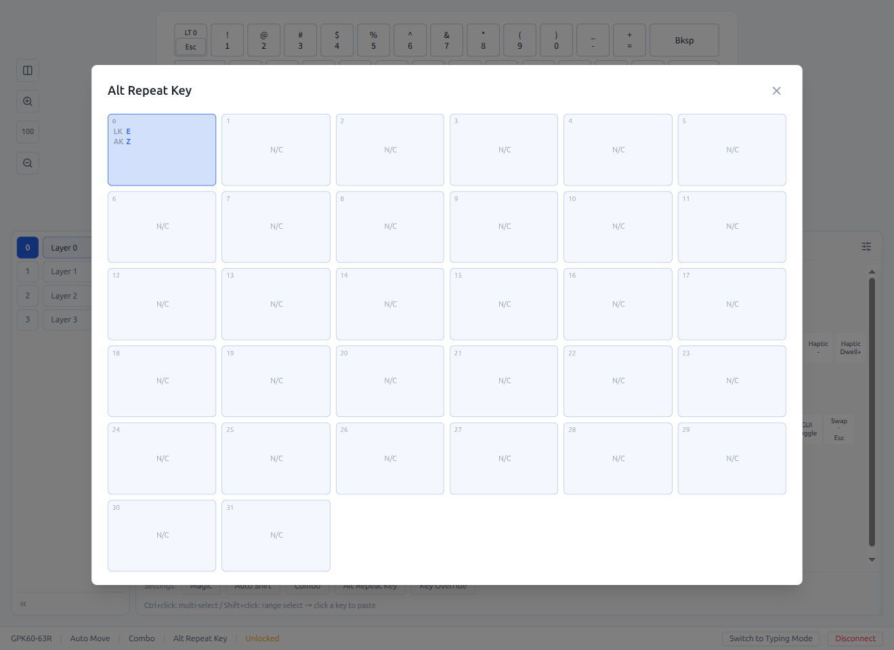

**画面1 (一覧)**: 番号付きタイルのグリッド。設定済みエントリはサマリー表示。タイルをクリックして編集画面へ。

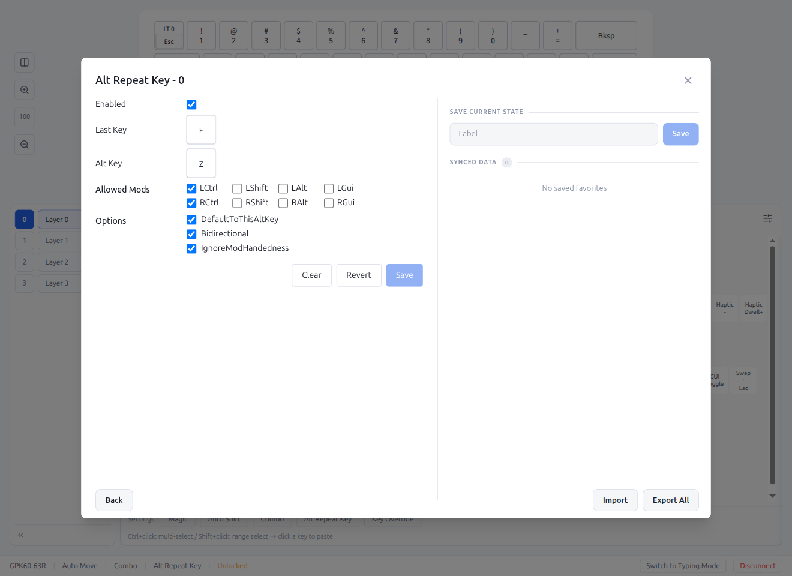

**画面2 (詳細)**: 左パネルに Alt Repeat Key エディタ。右パネルにインラインお気に入りパネル (Save Current State / Synced Data / Import / Export All)。

- 直前に押したキーに応じた代替キーを設定
- 許可する修飾キーを指定
- 個別に有効/無効を切り替え可能
- **Clear** ボタンで全フィールドをリセット (2段階確認付き)
- **Revert** で最後に保存した状態に復元 (2段階確認付き)
- **Save** ボタンで変更をキーボードに書き込み
- **Back** ボタンでタイルグリッドに戻る

### 5.5 お気に入り (Favorites)

各エディタモーダル (Tap Dance、Macro、Combo、Key Override、Alt Repeat Key) には、エディタの右側にインライン**お気に入りパネル**があります。

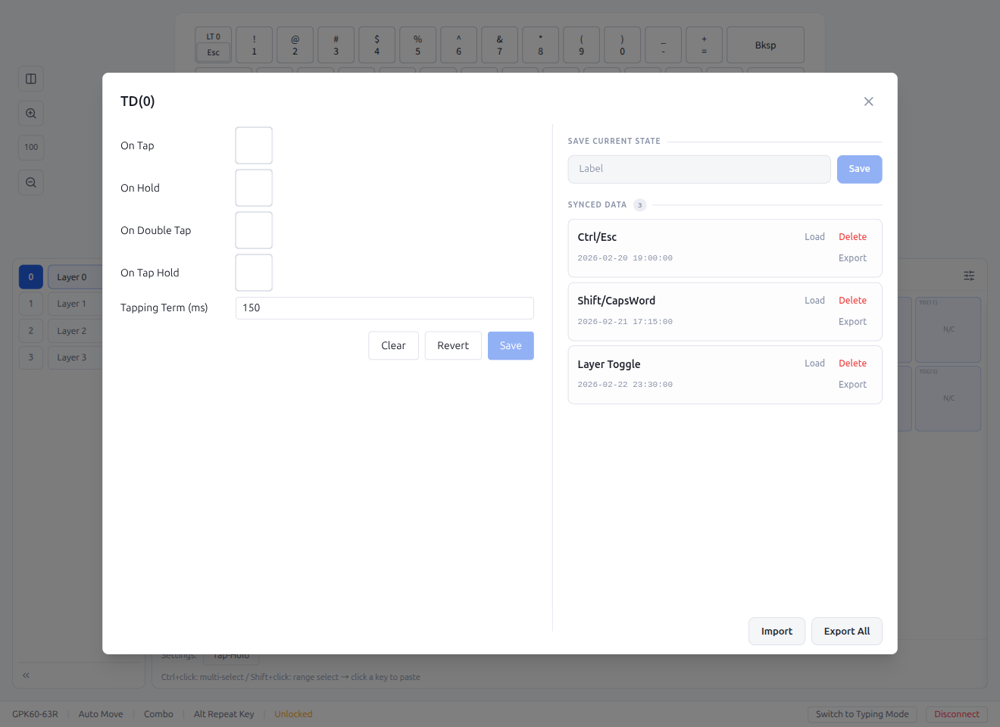

インラインお気に入りパネルの機能:

- **Save Current State**: ラベルを入力して Save をクリックすると、現在のエントリ設定が保存されます
- **Synced Data**: 保存済みのエントリが一覧表示され、Load・Rename・Delete・Export の操作が可能
- **Import** / **Export All**: フッターのボタンでファイルからのインポートや全エントリの一括エクスポートが可能

Synced Data リスト内:

- **Load**: 保存した設定を現在のエントリに適用
- **Rename**: 保存したエントリのラベルを変更（Hub にアップロード済みの場合、Hub 上のタイトルも同期されます）
- **Delete**: 保存したエントリを削除
- **Export**: 個別の保存済みエントリをファイルとしてダウンロード

Pipette Hub 接続時は、各エントリに Hub アクションも表示されます:

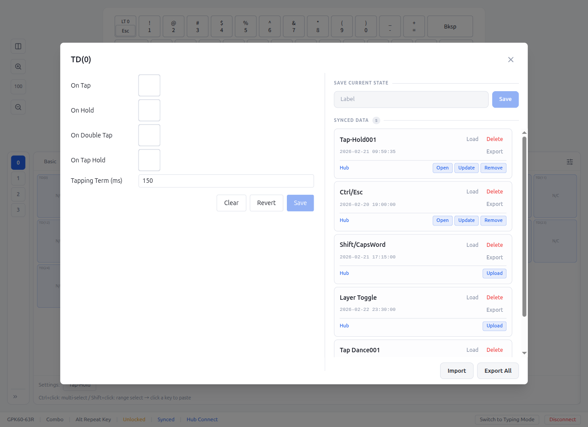

- **Upload to Hub**: お気に入りエントリを Pipette Hub にフィーチャー投稿としてアップロード
- **Update on Hub**: 最新の設定で Hub 上の投稿を更新
- **Remove from Hub**: Hub からエントリを削除（2段階確認付き）
- **Open in Browser**: Hub の個別投稿ページをブラウザで開く

> **Note**: お気に入りは特定のキーボードに依存しません。保存したエントリは互換性のある別のキーボードでも読み込めます。クラウド同期を有効にすると、複数デバイス間でも同期されます (§6.1 参照)。お気に入りはデバイス選択画面のデータモーダルからも管理できます (§1.3 参照)。

---

## 6. エディタ設定パネル

キーコードタブバーの保存ボタン (フロッピーディスクアイコン)、またはキーコードオーバーレイパネルの Save タブ (§3.10) からエディタ設定パネルを開けます。

エディタ設定パネルは単一の **Save** パネルを提供します:

- **Export Current State**: キーマップを `.vil`、`keymap.c`、PDF キーマップチートシート、PDF レイアウトエクスポート（キーアウトラインと Tap Dance・Macro・Combo・Key Override・Alt Repeat Key のサマリーページ付き）としてダウンロード
- **Save Current State**: 現在のキーボード状態をラベル付きで保存します。Label フィールドに名前を入力して Save をクリックします。Label が空の場合は Save ボタンが無効になります。保存したスナップショットは下の Synced Data リストに表示され、読み込みや削除ができます
- **Synced Data**: 保存済みスナップショットの一覧。クリックで読み込み・名前変更・削除
- **キーボードデータリセット**: キーボードを初期状態に戻す (要注意)

> **Note**: ツール設定 (キーボードレイアウト、Auto Advance、Key Tester、セキュリティ) はキーコードオーバーレイパネル (§3.10) に移動しました。ズームはツールバー (§4.2) で操作できます。レイヤー設定はエディタ左側のレイヤーパネルから直接管理します。

### 6.1 クラウド同期 (Google Drive appDataFolder)

Pipette は保存したスナップショット、お気に入り、キーボードごとの設定を Google Drive 経由で複数デバイス間で同期できます。

同期はデバイス選択画面の **設定** モーダル (歯車アイコン) の **データ** タブで設定します:

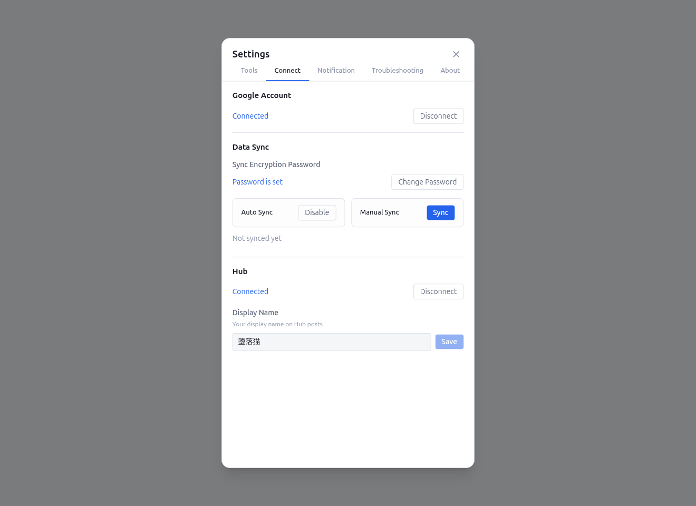

データタブには Google アカウント、データ同期、Pipette Hub、トラブルシューティングの各セクションがあります。

#### Google アカウント

- **Connect** をクリックして Google アカウントでサインイン
- **Disconnect** をクリックしてサインアウト。Pipette Hub も接続中の場合は、Hub も切断される旨の警告が表示されます

#### 同期暗号化パスワード

- 同期データを暗号化するためのパスワードを設定します (必須)。強度インジケーターで安全なパスワードを選択できます
- 別のデバイスで既にパスワードが設定されている場合は、同じパスワードを入力するようヒントが表示されます
- **パスワード変更**: **Change Password** をクリックすると、全ての同期ファイルが新しいパスワードで再暗号化されます。データは削除されず、既存ファイルがその場で復号・再暗号化されます

#### 同期コントロール

- **Auto Sync**: 自動同期のオン/オフを切り替え。有効時は変更が 10 秒のデバウンスで自動同期され、3 分間隔のポーリングも行われます
- **Sync**: お気に入りと接続中のキーボードデータを手動で同期します。全キーボードではなく、お気に入りと現在接続中のキーボードのみが同期対象です

#### 同期ステータス

- 同期ユニット名とアイテムカウンター (current / total) で同期進捗を表示
- 同期ユニットが失敗した場合はエラーや部分同期の詳細が表示されます

#### 復号不能ファイル

- 現在のパスワードで復号できない、またはその他の理由で読み取れないファイル（例: 以前のパスワードで暗号化されたファイル）
- **Scan** をクリックして復号不能ファイルを検出し、削除対象を選択して **Delete Selected** で Google Drive から完全に削除

#### 同期不可アラート

- 同期バックエンドに接続できない場合に表示されます。**Retry** をクリックして再接続を試行

#### Reset Sync Data / Local Data

- **Reset Sync Data**: ターゲット（キーボードデータ、お気に入りデータ）を選択して Google Drive から削除
- **Local Data**: ローカルデータのインポート/エクスポート、または選択したローカルターゲット（キーボードデータ、お気に入り、アプリ設定）のリセット

#### データの保存先

同期データは [Google Drive appDataFolder](https://developers.google.com/workspace/drive/api/guides/appdata) に保存されます。これは Pipette のみがアクセスできる非表示のアプリ専用フォルダです。個人の Drive ファイルには一切アクセスしません。

詳細は [Data Guide](Data.md) を参照してください。

#### 設定 — トラブルシューティング

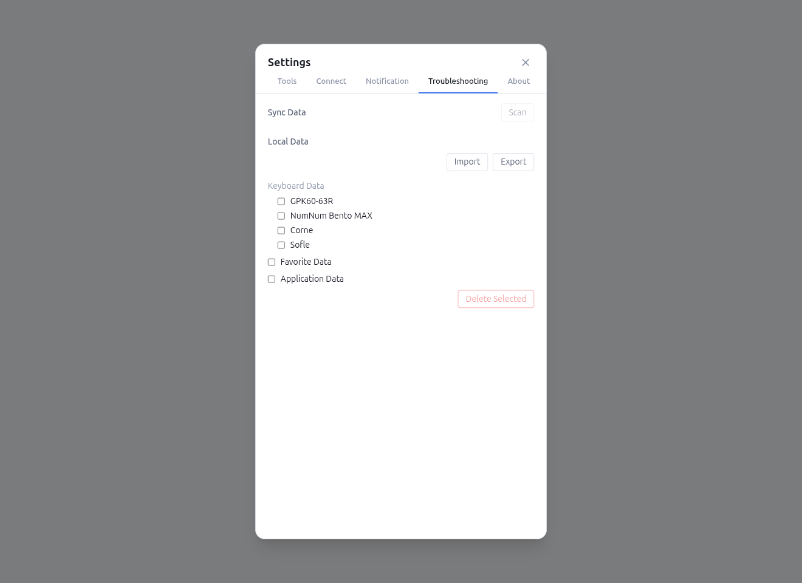

設定モーダル (デバイス選択画面) のトラブルシューティングタブでは以下の機能を提供します:

- **Scan Remote Data**: Google Drive の全同期ファイルをスキャンし、件数と詳細を表示
- **キーボード別リセット**: 特定のキーボード同期データを選択して Google Drive から削除
- **Local Data**: ローカルデータのインポート/エクスポート、または選択したローカルターゲット (キーボードデータ、お気に入り、アプリ設定) のリセット

#### 設定 — デフォルト

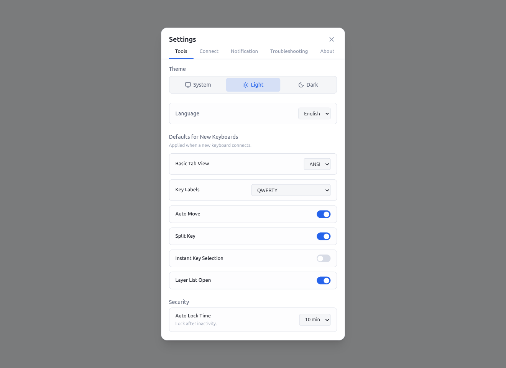

設定モーダルの Tools タブには、新しいキーボード接続時の初期設定を行う**デフォルト**セクションがあります:

- **Keyboard Layout**: デフォルトの表示レイアウト (QWERTY、Dvorak など)
- **Auto Advance**: デフォルトの自動移動動作
- **Layer Panel Open**: レイヤーパネルを展開または折りたたんだ状態で開始するか
- **Basic View Type**: Basic タブのデフォルトビュータイプ (ANSI/ISO/List)
- **Split Key Mode**: デフォルトの分割キー表示モード

---

## 7. Pipette Hub

[Pipette Hub](https://pipette-hub-worker.keymaps.workers.dev/) は、キーマップやお気に入り設定をアップロードして共有できるコミュニティキーマップギャラリーです。

### 7.1 Hub のセットアップ

Hub 機能を使用するには Google アカウント認証が必要です。先に Google アカウントの認証を済ませてください。デバイス選択画面の **設定** モーダル (歯車アイコン) で設定します:

1. **データ** タブで Google アカウントセクションの **Connect** をクリックして Google アカウントでサインイン
2. 同じデータタブ内の **Pipette Hub** セクションまでスクロール — **Connected** と表示されていることを確認
3. **Display Name** を設定 — Hub の投稿に表示される名前です
4. アップロードしたキーマップは **My Posts** リストに表示されます

### 7.2 キーマップのアップロード

キーマップを Hub にアップロードする手順:

1. キーボードを接続し、キーマップエディタの設定ボタン (歯車アイコン) を開く
2. **Data** タブに切り替える
3. 現在の状態をラベル付きで保存 (例: "Default")

4. 保存したスナップショットの **Upload** ボタンをクリック
5. アップロード完了後、エントリに **Uploaded** ステータスと **Open in Browser**、**Update**、**Remove** ボタンが表示されます

- **Open in Browser**: このキーマップの Hub ページをブラウザで開く
- **Update**: 現在のキーボード状態で Hub の投稿を更新
- **Remove**: Hub からキーマップを削除

### 7.3 お気に入りエントリのアップロード

個別のお気に入りエントリ (Tap Dance、Macro、Combo、Key Override、Alt Repeat Key) も Hub にアップロードできます:

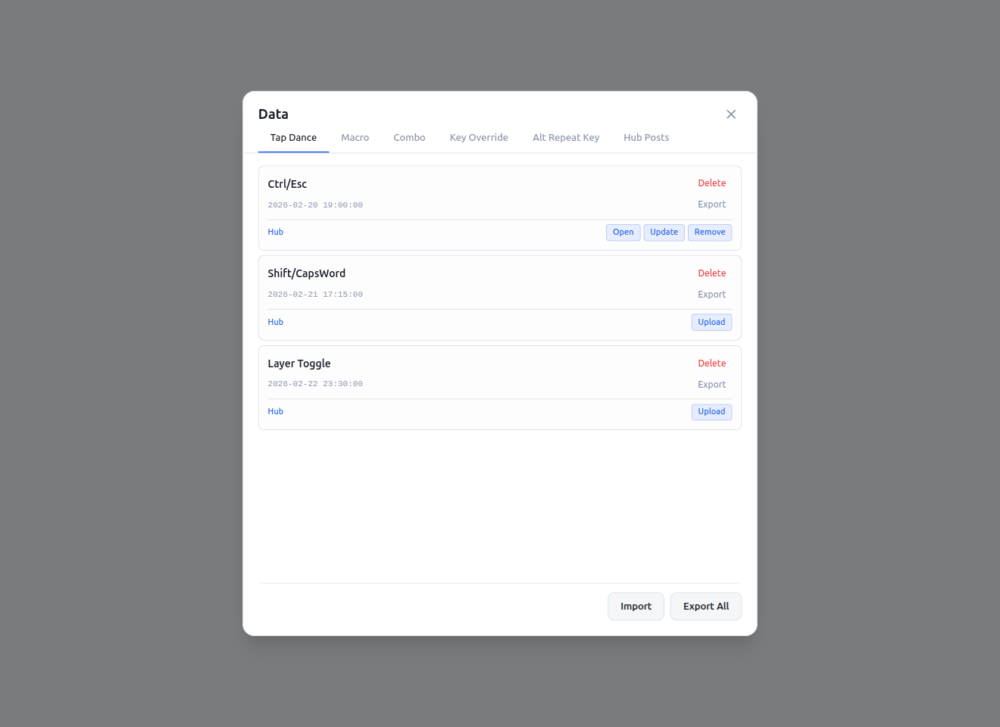

1. インラインお気に入りパネルのあるエディタモーダル、またはデバイス選択画面のデータモーダルを開きます
2. お気に入りリストの各エントリに、Hub 接続時は **Upload to Hub** ボタンが表示されます
3. **Upload to Hub** をクリックして設定を共有します
4. アップロード後、**Open in Browser**、**Update on Hub**、**Remove from Hub** ボタンが表示されます
5. Hub にアップロード済みのお気に入りをリネームすると、Hub 上のタイトルも自動的に更新されます

> **Note**: アップロードには Display Name の設定が必要です。Display Name が未設定の場合、Upload ボタンの代わりに警告が表示されます。

### 7.4 Hub ウェブサイト

[Pipette Hub ウェブサイト](https://pipette-hub-worker.keymaps.workers.dev/) では、アップロードされたキーマップがギャラリー形式で表示されます。

- コミュニティのキーマップを閲覧
- キーボード名で検索
- `.vil`、`.c`、`.pdf`、`.pipette` 形式でダウンロード

#### 個別キーマップページ

キーマップカードをクリックすると、キーボードレイアウトの詳細ページが開きます。

- アップロードされたキーマップの全レイヤー (Layer 0〜3) を表示
- Tap Dance、Macro、Combo、Alt Repeat Key、Key Override の設定を確認
- **Copy URL** や **Share on X** で他の人と共有
- 各種形式 (`.pdf`、`.c`、`.vil`、`.pipette`) でダウンロード

Hub 認証の詳細は [Data Guide](Data.md) を参照してください。

---

## 8. ステータスバー

画面下部のステータスバーには接続情報と操作ボタンが表示されます。

- **デバイス名**: 接続中のキーボード名を表示
- **ロードラベル**: 読み込んだスナップショットのラベル名 (スナップショット読み込み時のみ表示)
- **Auto Advance**: キー割り当て後に次のキーに自動移動する機能の状態 (有効時のみ表示)
- **Key Tester**: Matrix Tester モードの状態 (有効時かつタイピングテストが非アクティブ時のみ表示)
- **Typing Test**: タイピングテストモードの状態 (有効時のみ表示)
- **Locked / Unlocked**: キーボードのロック状態 (一部の危険なキーコードの誤設定を防止)
- **Sync ステータス**: クラウド同期の状態 (同期設定時のみ表示)
- **Hub 接続状態**: Pipette Hub の接続状態 (Hub 設定時のみ表示)
- **Disconnect ボタン**: キーボードとの接続を切断し、デバイス選択画面に戻ります
