# Pipette Operation Guide

[日本語版はこちら](OPERATION-GUIDE.ja.md)

This document explains how to use the Pipette desktop application.
Screenshots were taken using a GPK60-63R keyboard unless otherwise noted.

---

## 1. Device Connection

### 1.1 Device Selection Screen

When you launch the app, a list of connected Vial-compatible keyboards is displayed.

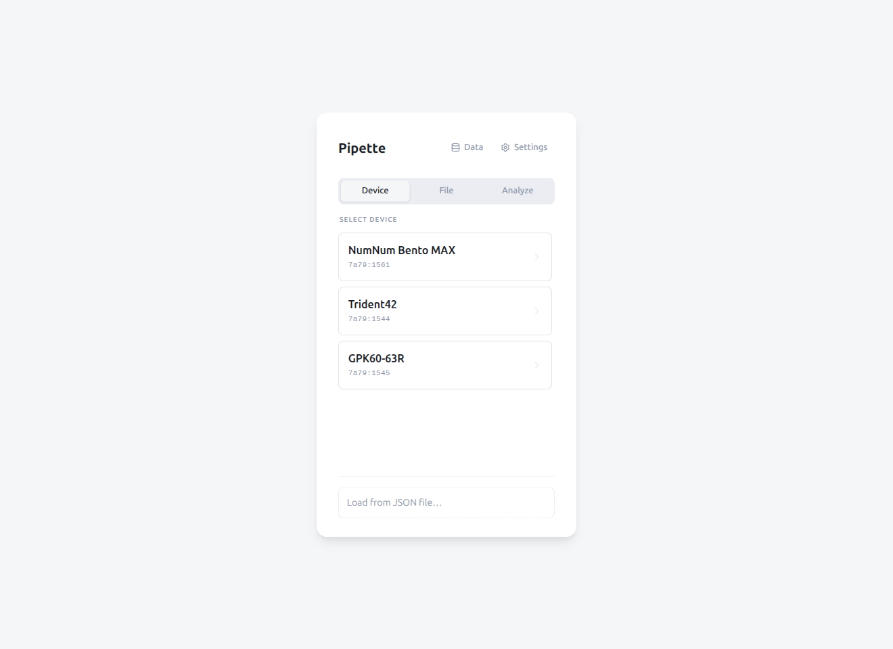

- USB-connected keyboards are automatically detected
- If multiple keyboards are connected, select one from the list
- On Linux, udev rules may need to be configured if no devices are found

**File Tab**

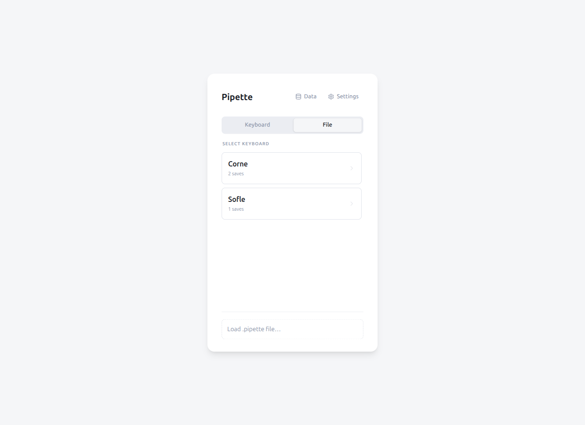

The File tab allows offline editing of `.pipette` files without a physical keyboard connected:

- Browse previously saved keyboards and select an entry to load
- Load an external `.pipette` file from disk
- A virtual keyboard is created from the embedded definition in the file
- An unsaved changes indicator is shown when edits have not been saved

> **Use case:** You want to tweak your keyboard's keymap, but the keyboard isn't with you right now. If you've previously saved its data, you can load it from the File tab, make your edits offline, and later connect the keyboard and load the modified data to apply your changes.

**Feature Availability: Device vs File Mode**

| Feature | Device (USB) | File (.pipette) |
|---------|:------------:|:---------------:|
| Keymap editing | Yes | Yes |
| Macro / Tap Dance editing | Yes | Yes |
| Combo / Key Override / Alt Repeat Key | Yes | Yes |
| QMK Settings | Yes (device) | Yes (local data) |
| Typing Test | Yes | Yes |
| Export (.vil / .c / .pdf) | Yes | Yes |
| Lighting control | Yes | No |
| Matrix Tester | Yes | No |
| Lock / Unlock | Yes | No |
| Snapshot save / load | Yes | No |
| Hub upload | Yes | No |
| JSON sideload | Yes | No |
| Device probe (Keyboard tab) | Yes | No |
| Cloud Sync | Yes | No |

### 1.2 Connecting a Keyboard

Click a keyboard name in the list to open the keymap editor. A connecting overlay shows loading progress while the keyboard data is read.

If Cloud Sync is configured, sync progress is also displayed during connection (favorites first, then keyboard-specific data).

### 1.3 Data

The Data button on the device selection screen opens the Data panel for centralized management of keyboards, favorites, sync data, and Hub posts.

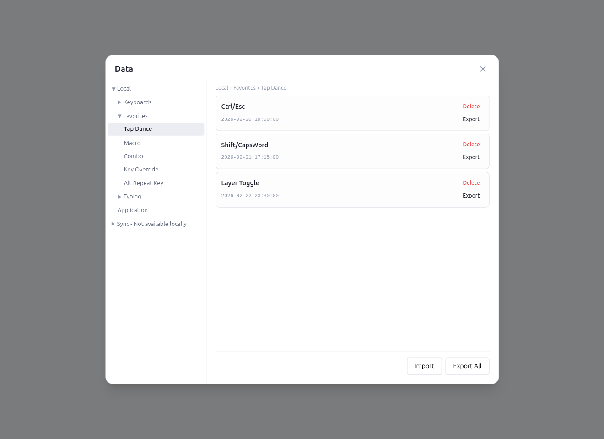

The left sidebar provides a **tree navigation** with the following structure:

- **Local**
  - **Keyboards**: Browse saved keyboard snapshots. Click a keyboard to view, load, export, or delete entries
  - **Favorites**: Tap Dance, Macro, Combo, Key Override, Alt Repeat Key — each type shows its saved entries with rename, delete, export, and Hub actions
  - **Application**: Import/export local data or reset selected targets (keyboard data, favorites, app settings)
- **Sync** (when Cloud Sync is configured): Lists keyboards that exist only in Google Drive (not yet downloaded on this device). Each entry is labeled with the keyboard's real name, resolved from the synced name index rather than from the raw UID. Click a remote-only keyboard to download it on demand — a spinner is shown while fetching, and a failure message appears inline if the download cannot complete. Once downloaded, the keyboard moves into the **Local › Keyboards** branch. To clean up orphaned encrypted files that can no longer be decrypted, use **Undecryptable Files** in the Settings **Data** tab instead (see §6.1)
- **Hub** (when Hub is connected): Manage Hub posts grouped by keyboard name

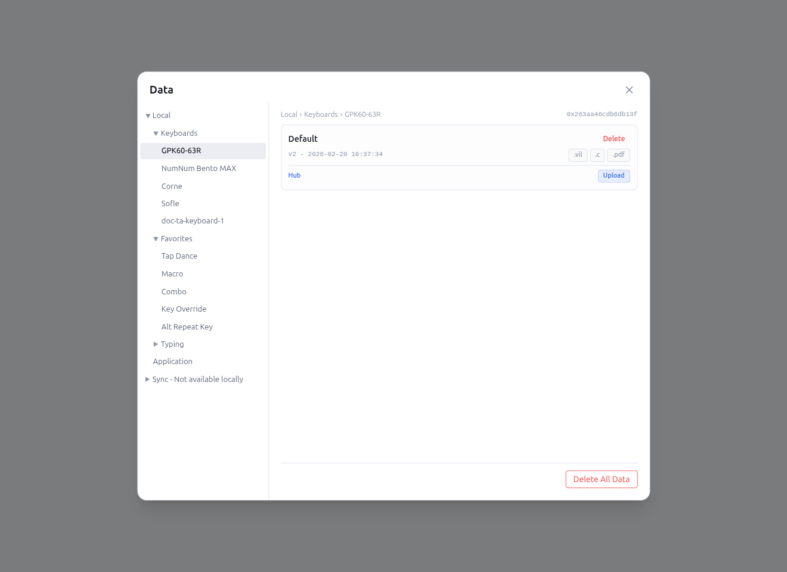

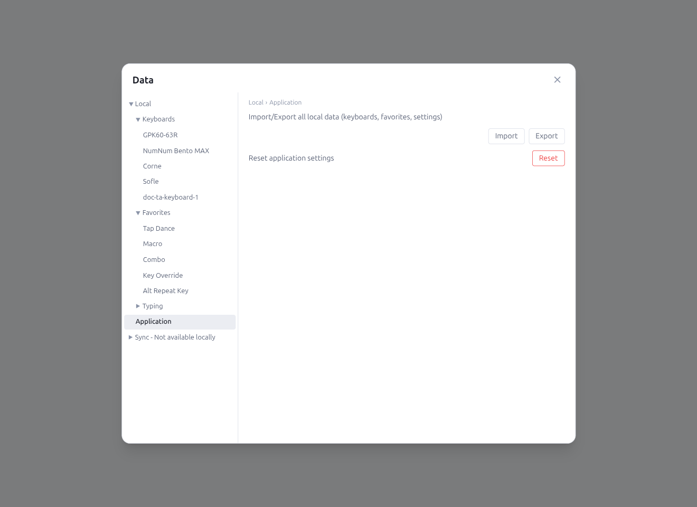

Per-entry actions in the favorites list:
- Click to rename, delete, or **Export** individual entries
- **Hub actions**: When Hub is connected, each entry shows **Upload to Hub** / **Update on Hub** / **Remove from Hub** buttons
- **Import** / **Export All** buttons at the footer for bulk operations

A **breadcrumb navigation** at the top of the content area shows the current path (e.g., "Local › Favorites › Tap Dance")

---

## 2. Keymap Editor

### 2.1 Screen Layout

The keymap editor consists of two main areas: the keyboard layout display and the keycode palette.

- Top area: Physical keyboard layout (shows the current keycode assigned to each key)
- Left side: Toolbar (zoom, undo/redo, etc.)
- Bottom area: Keycode palette (tabbed interface) with overlay panel toggle
- Right side (when open): Keycodes Overlay Panel (tools, save, layout options)
- Bottom bar: Status bar

### 2.2 Changing Keys

1. Click a key on the keyboard layout to select it
2. Click a keycode from the keycode palette to assign it
3. The key display updates immediately
4. Changes are automatically sent to the keyboard

- Ctrl+click to select multiple keys
- Shift+click for range selection
- Press Escape to deselect all keys

**Instant Key Selection** controls how keycode assignment behaves:

- **ON** (default): A single click on a keycode immediately assigns it and closes the selection. Fast workflow for quick edits.
- **OFF**: A single click selects a keycode (highlighted), double-click or press Enter to confirm and assign. A hint is shown at the bottom of the palette. Useful when you want to browse keycodes before committing.

This setting can be toggled per-keyboard in the Keycodes Overlay Panel (§3.14), and the global default can be set in Settings → Defaults (§6.1).

### 2.3 Layer Switching

Layer switching buttons are located on the left side of the keyboard layout.

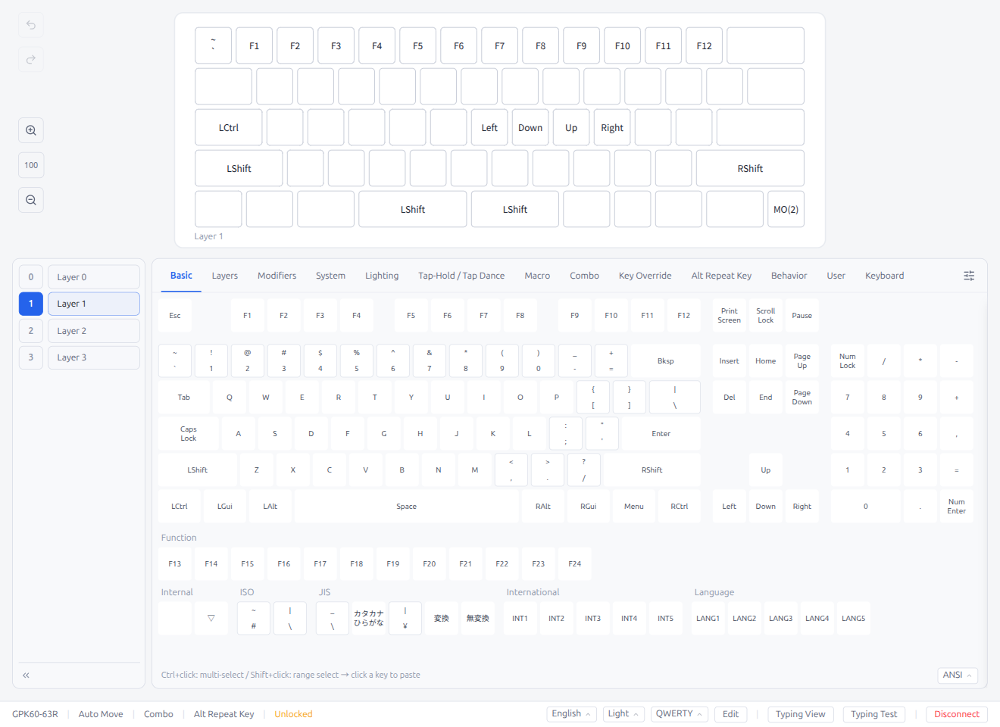

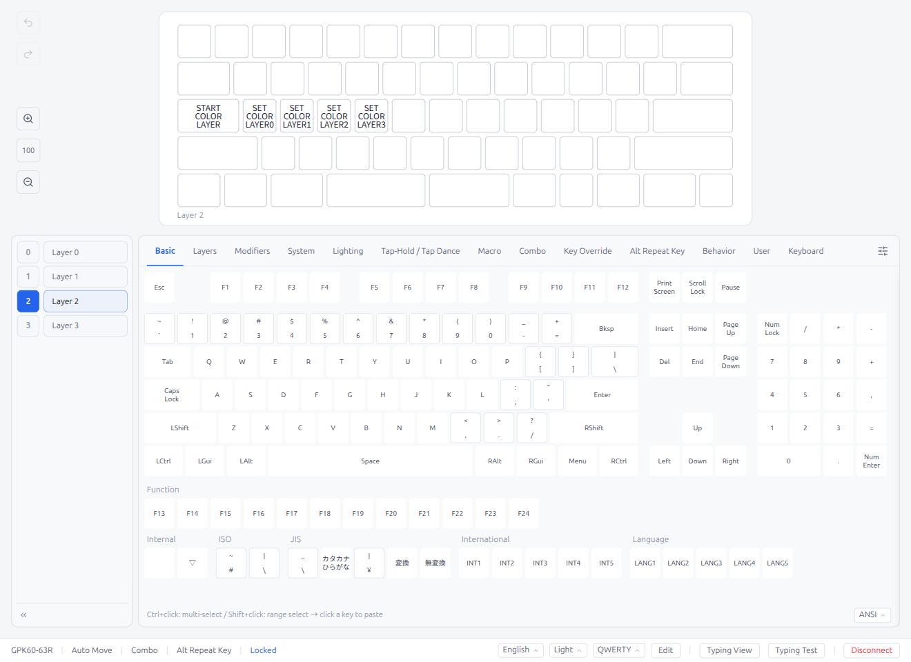

- Click layer number buttons to switch between layers
- Layer 0 is the default layer
- The number of available layers depends on the keyboard configuration

The layer panel can be collapsed to save space:

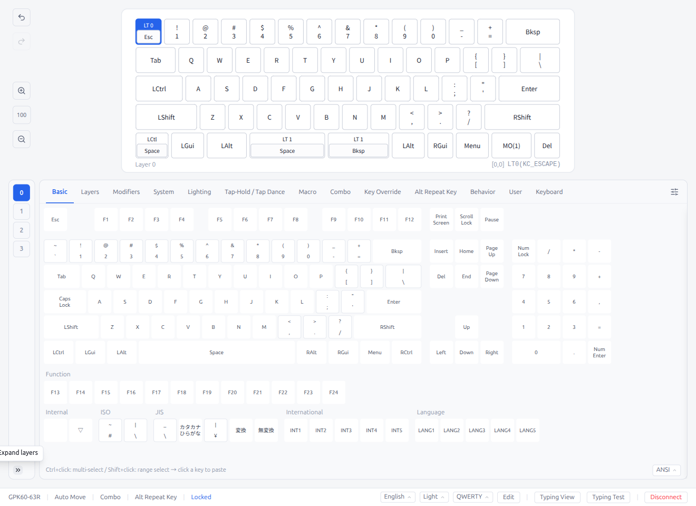

Click the collapse button (chevron) to minimize the layer panel to just numbers. Click the expand button to restore full layer names.

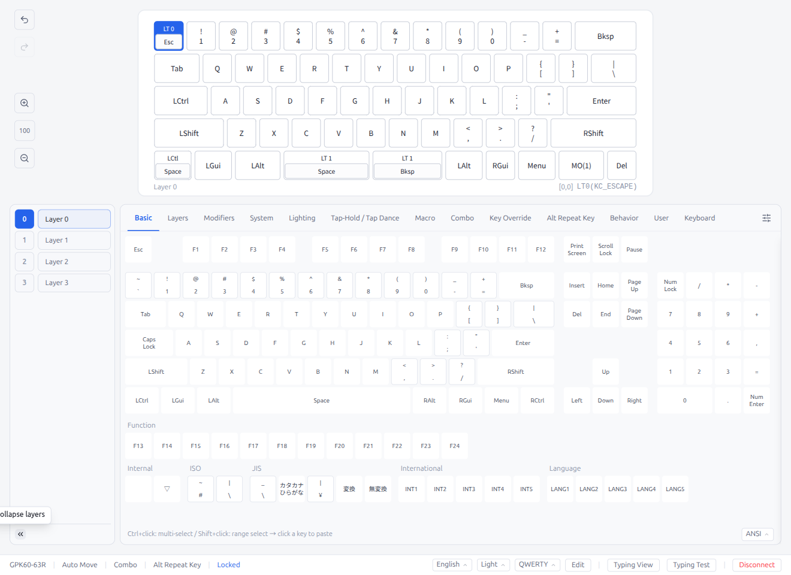

### 2.4 Key Popover

Double-click a key on the keyboard layout to open the Key Popover — a quick way to search and assign keycodes without scrolling through the palette.

**Key Tab**

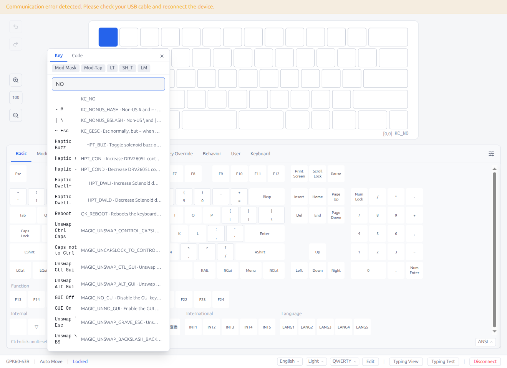

- The search input is pre-filled with the current keycode name
- Type to search by name, keycode name, or alias — results are ranked by relevance
- Click a result to assign it immediately
- The popover also appears when double-clicking key fields in detail editors (Tap Dance, Combo, Key Override, etc.)

**Code Tab**

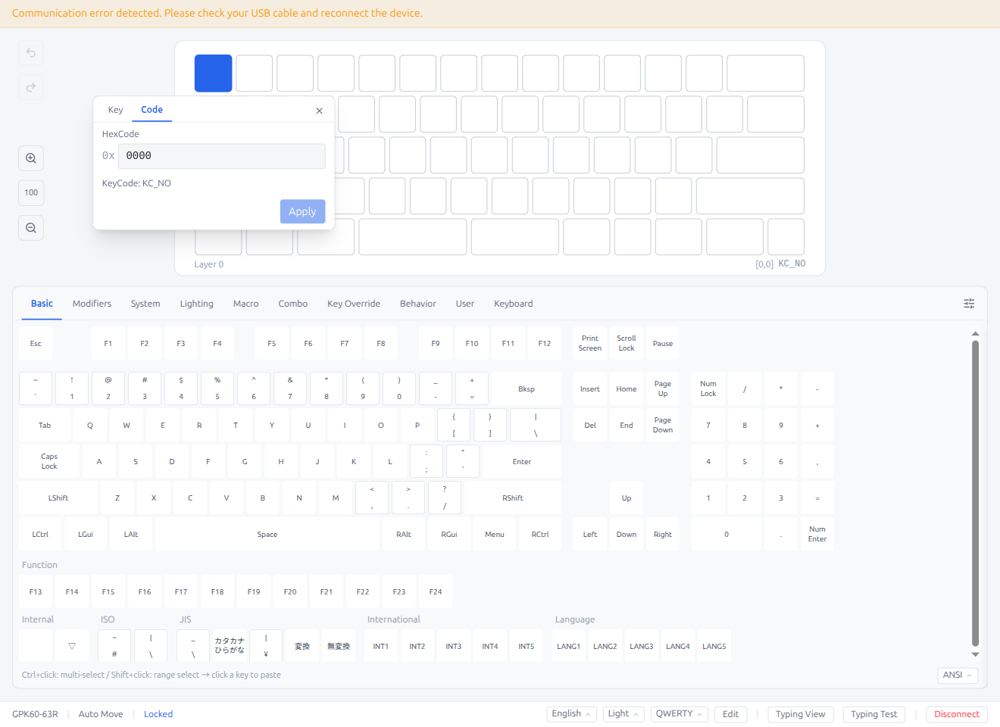

- Enter a keycode value directly in hexadecimal (e.g., `0x0029` for Escape)
- The resolved keycode name is displayed below the hex input
- Click **Apply** to assign the entered keycode

**Wrapper Modes**

The mode buttons at the top of the popover let you build composite keycodes:

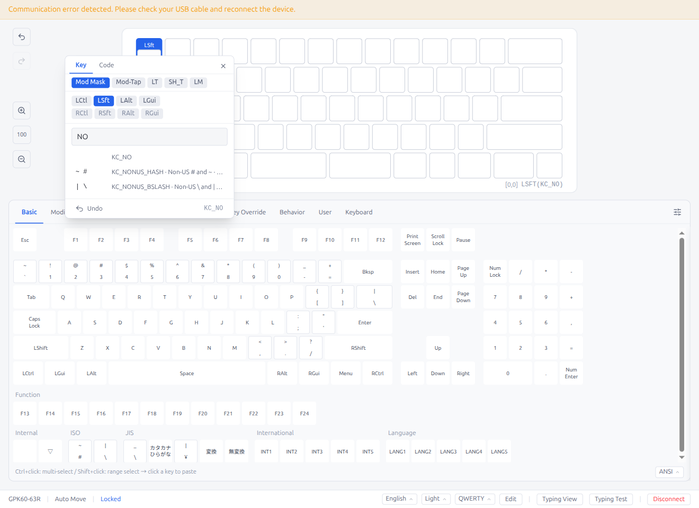

- **Mod Mask**: Combine a modifier with a key (e.g., `LSFT(KC_ESCAPE)`)
- **Mod-Tap**: Modifier on hold, key on tap (e.g., `LSFT_T(KC_ESCAPE)`)

Both modes show the modifier checkbox strip to select Left/Right Ctrl, Shift, Alt, or GUI. Left and Right modifiers cannot be mixed — selecting one side disables the other.

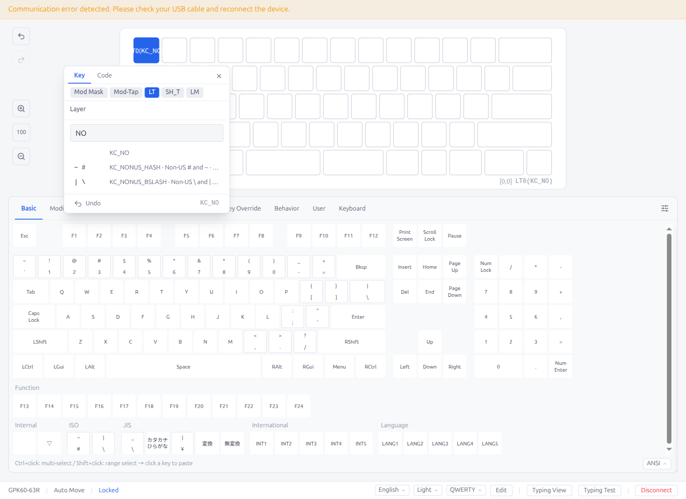

- **LT**: Layer-Tap — activate a layer on hold, send a key on tap (e.g., `LT0(KC_ESCAPE)`). A layer selector appears to choose the target layer.
- **SH_T**: Swap Hands Tap — swap hands on hold, send a key on tap (e.g., `SH_T(KC_ESCAPE)`)
- **LM**: Layer-Mod — activate a layer with modifiers (e.g., `LM(0, MOD_LSFT)`). Shows both the layer selector and the modifier checkbox strip.

Click an active mode button to toggle it off and revert to a basic keycode.

**Undo / Redo**: The popover footer shows context-sensitive **Undo** and **Redo** buttons. Undo displays the previous keycode and reverts to it; Redo displays the next keycode and re-applies it. These buttons only appear when the most recent undo/redo history entry matches the key currently open in the popover (i.e., the last single change). For multi-step history navigation, use the toolbar buttons or keyboard shortcuts (see §4.2).

**Confirmation**: Press **Enter** to confirm the current selection and close the popover. Press **Escape** or click outside the popover to close it without changes.

### 2.5 Layout Options

Some keyboards support multiple physical layouts (e.g., split backspace, ISO enter, different bottom row configurations). When a keyboard has layout options, a Layout Options button (grid icon) appears at the right end of the keycode palette tab bar.

- Click the grid icon to open the Layout Options panel
- **Checkbox options**: Toggle a layout variant on or off (e.g., "Macro Pad", "Split Backspace", "ISO Enter")
- **Dropdown options**: Select from multiple layout variants (e.g., "Bottom Section" with Full Grid / Macro Pad / Arrow Keys choices)
- Changes are applied immediately — the keyboard layout display updates in real time to reflect the selected options

- Selecting a different option updates the visible keys on the keyboard layout
- Layout options are saved to the keyboard and persist across sessions
- Click outside the panel or press Escape to close it

> **Note**: The Layout Options button only appears for keyboards that define multiple layout variants. Most keyboards with a single fixed layout do not show this button. Screenshots in this section were taken using a dummy JSON definition loaded via "Load from JSON file".

---

## 3. Keycode Palette

Select keycodes from different categories using the tabbed palette at the bottom of the screen.

### 3.1 Basic

Standard character keys, function keys, modifier keys, and navigation keys. The Basic tab supports four view types, selectable from the Keycodes Overlay Panel (§3.14):

**ANSI Keyboard View** (default)

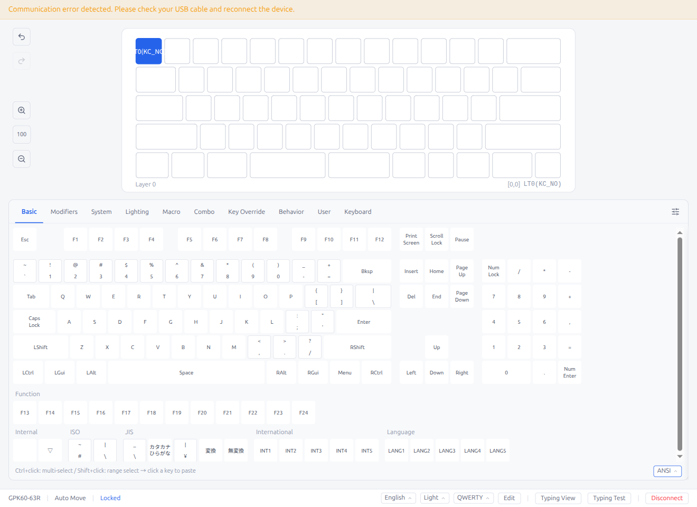

Displays keycodes as an ANSI keyboard layout. Click a key on the visual keyboard to assign it.

**ISO Keyboard View**

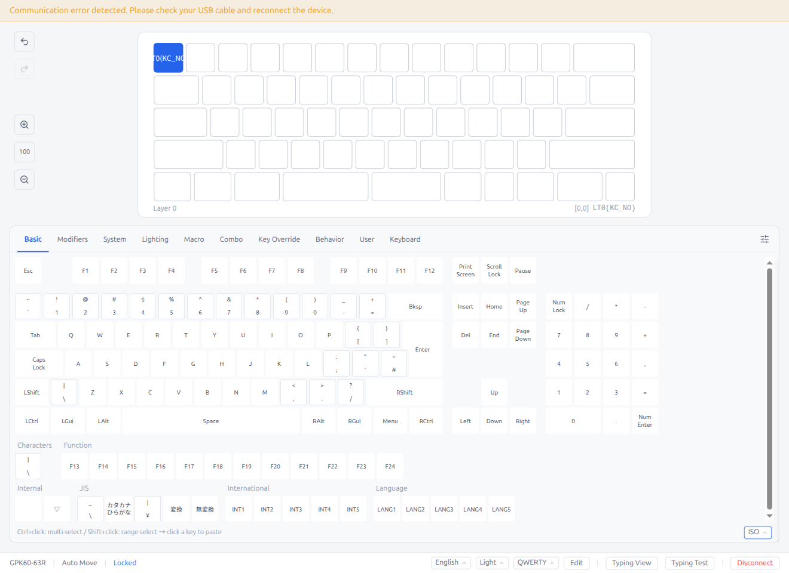

Displays keycodes as an ISO keyboard layout with the ISO-specific keys.

**JIS Keyboard View**

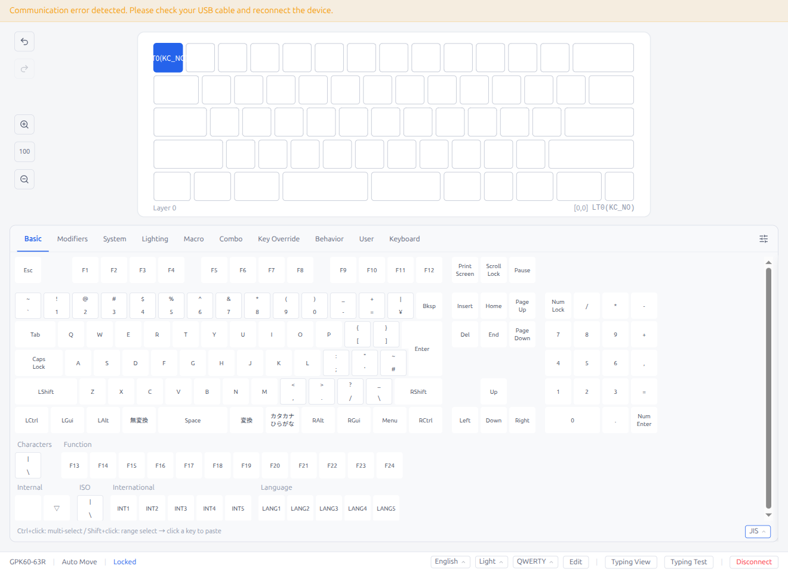

Displays keycodes as a JIS keyboard layout with JIS-specific keys (Yen, Ro, Henkan, Muhenkan, Katakana/Hiragana).

**List View**

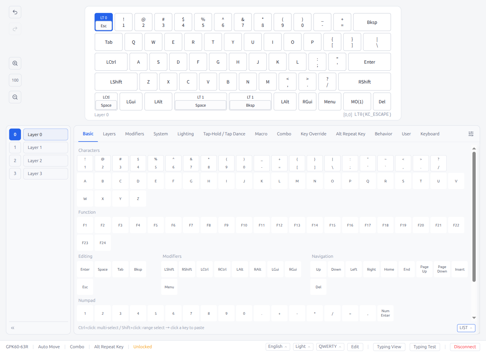

Displays keycodes in the traditional scrollable list format.

All views include:
- Character keys (A-Z, 0-9, symbols)
- Function keys (F1-F24)
- Editing keys (Enter, Tab, Backspace, Delete)
- Navigation keys (arrows, Home, End, PageUp/Down)
- Numpad keys
- International keys (KC_INT1–KC_INT5)
- Language keys (KC_LANG1–KC_LANG5)

### 3.2 Layers

Keycodes for layer operations.

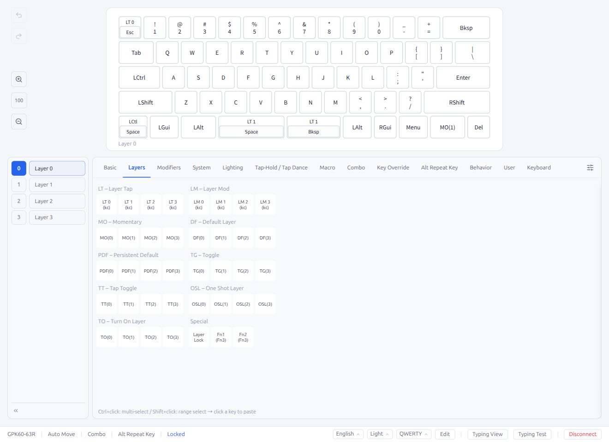

- **MO(n)**: Momentarily activate layer n while held
- **DF(n)**: Set default layer to n
- **TG(n)**: Toggle layer n
- **LT(n, kc)**: Layer on hold, keycode on tap
- **OSL(n)**: Activate layer n for the next keypress only
- **TO(n)**: Switch to layer n

### 3.3 Modifiers

Keycodes for modifier key combinations and tap behavior settings.

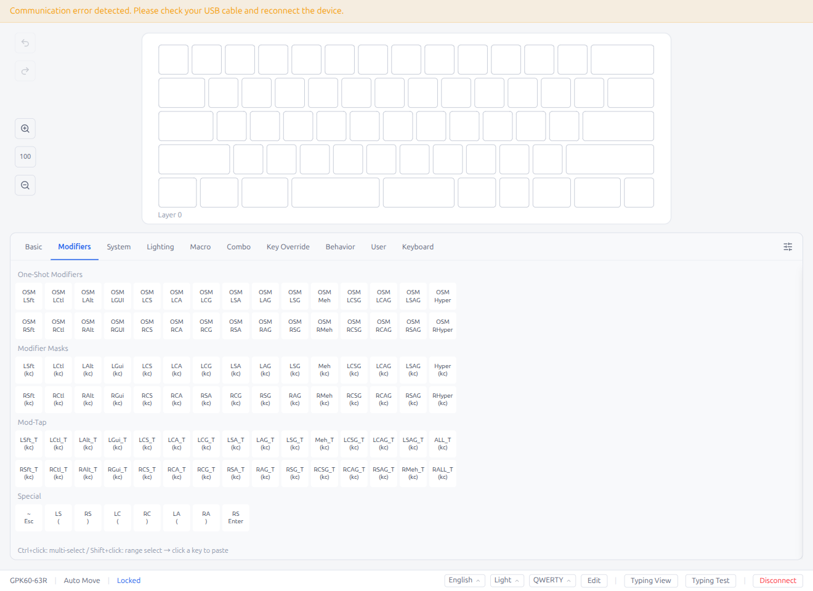

- **One-Shot Modifier (OSM)**: Activate modifier for the next keypress only
- **Mod-Tap**: Modifier on hold, regular key on tap
- **Mod Mask**: Modifier key combinations

### 3.4 System

Keycodes for mouse control, media playback, system utilities, and audio/haptic feedback.

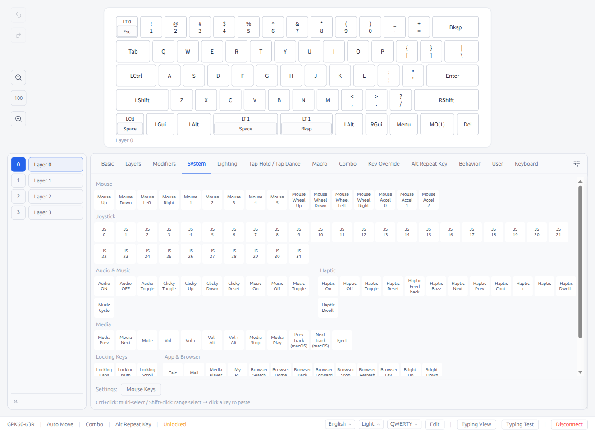

- **Mouse**: buttons, movement, and scrolling
- **Joystick**: axis and button keycodes
- **Audio**: audio toggle and control keycodes
- **Haptic**: haptic feedback toggle and control keycodes
- **Media Playback**: play/stop/volume/track controls
- **Locking Keys**: Locking Caps Lock, Num Lock, Scroll Lock
- **App / Browser**: application launcher and browser navigation keys
- **System Control**: system power, sleep, wake
- **Boot**: enter bootloader mode (QK_BOOT)

> **Note**: The MIDI tab is only displayed for MIDI-capable keyboards. When available, it appears between System and Lighting.

### 3.5 Lighting

Keycodes for backlight and RGB lighting controls.

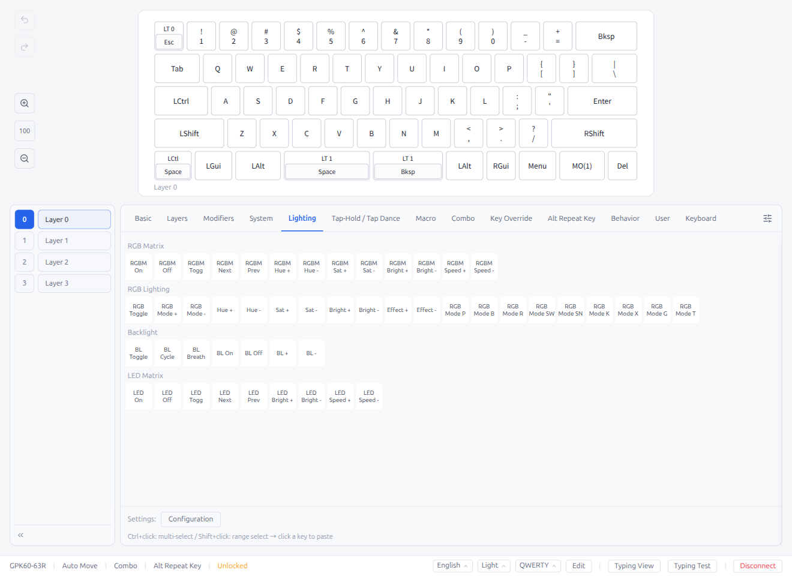

- RGB Matrix controls
- RGB Lighting controls
- Backlight controls
- LED Matrix controls

### 3.6 Tap-Hold / Tap Dance

Keycodes that assign different actions to tap and hold.

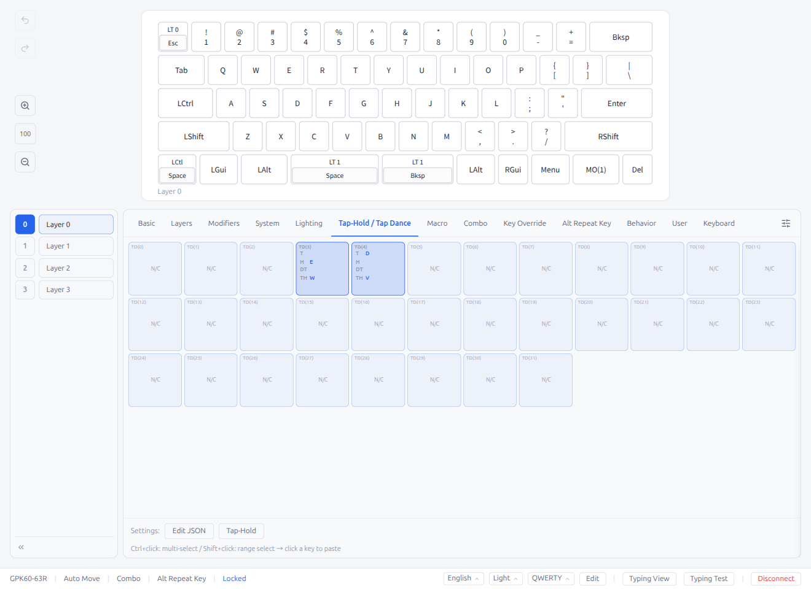

The Tap Dance section displays a **tile grid preview** showing all entries at a glance:

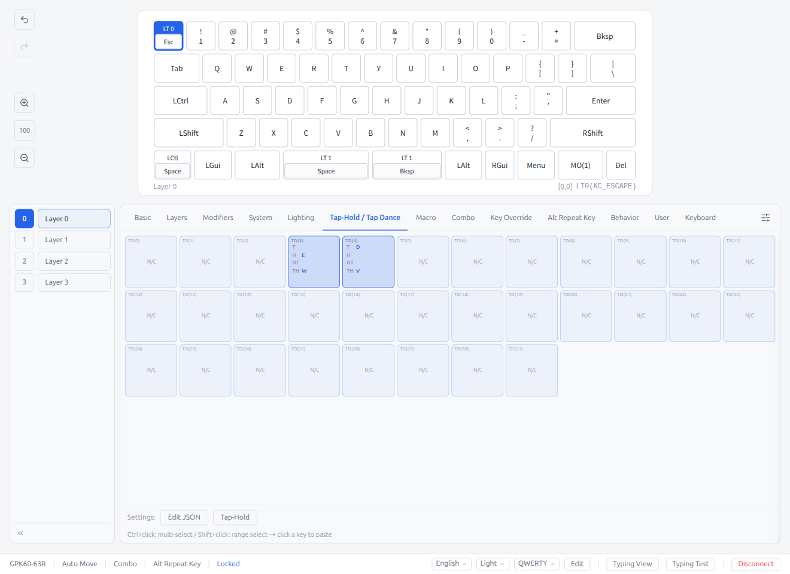

- Each tile shows the entry number and a summary of configured actions
- Configured entries display their tap/hold actions; unconfigured tiles show the number only
- Click a tile to open the Tap Dance edit modal directly to that entry
- Configure tap, hold, double-tap, and other actions for each entry
- **Edit JSON** button at the bottom opens a JSON editor for bulk editing all entries (see §5.6)

### 3.7 Macro

Macro keycodes.

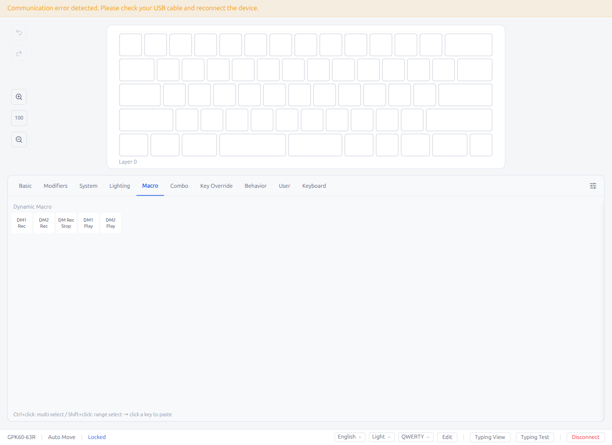

The Macro section displays a **tile grid preview** showing all entries at a glance:

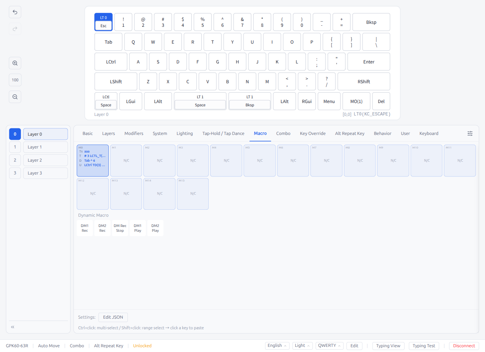

- Each tile shows the macro number and a preview of the recorded sequence
- Configured entries display a summary of key actions; unconfigured tiles show the number only
- Click a tile to open the Macro edit modal directly to that entry
- Record sequences of key inputs as macros
- **Edit JSON** button at the bottom opens a JSON editor for bulk editing all entries (see §5.6)

#### Macro Edit Modal — List Mode and Edit Mode

Opening a macro action brings up the Macro Modal with two display modes that share the same row:

- **List mode** (default): The action's keycodes are shown as clickable tiles followed by a dashed **add slot**. Single-click a keycode tile to switch that index into edit mode. Single-click the dashed add slot to select it; double-click the dashed slot to open the keycode popover with an empty query (mirrors the keymap editor). The pencil "edit" icon from earlier versions is gone — clicking is the only affordance
- **Edit mode**: The keycode picker stays visible below the row. Each keycode tile shows a hover **X** button to delete that index, and the Tap row exposes a **Close** button to leave edit mode. There is no per-action Save button; every selection in the picker or the keycode popover commits immediately. Deleting the selected index shifts the selection so the edit session continues rather than exiting. An outside-click handler exits edit mode on any click outside the picker, the macro action list, the footer, and the key popover — so the session ends when you press Close, or when you click away into the wider app (the modal backdrop, the title area, etc.)

Empty keycode actions are tolerated while editing; they are normalized out silently when the macro is saved or exported to a favorite.

#### Recording Lock

While the built-in recorder is capturing keystrokes, the Macro Modal enters a strict disabled state to prevent accidental edits:

- The Add Action select, Text Editor toggle, Clear, Revert, and bottom **Save** buttons are all disabled
- Every existing MacroActionItem and its KeycodeField is disabled (native `disabled` attribute — Tab / hover / click are all suppressed)
- The inline favorites panel is made invisible with its width preserved, so the layout does not jump
- The modal's top-right Close button and backdrop click are inert — the modal cannot be dismissed until recording stops
- The footer (Clear / Revert / Save row) is also hidden while you are inside the per-action edit mode, since each picker/popover click already commits; re-open list mode to see the footer again

### 3.8 Combo

Combo keycodes for simultaneous key-press combinations.

The Combo tab displays a **tile grid preview** showing all entries. A note reads: "These features apply to the entire keyboard, not just the current layer."

- Each tile shows the combo number and a summary (e.g., "A + B → C")
- Click a tile to open the Combo edit modal directly to that entry (§5.2)
- Combo keycodes (CMB_000–CMB_031) can be assigned to keys for triggering combos
- **Settings: Configuration** button at the bottom opens a settings modal for combo-related timeout configuration (e.g., Combo time out period)
- **Edit JSON** button at the bottom opens a JSON editor for bulk editing all entries (see §5.6)

### 3.9 Key Override

Key Override keycodes for replacing key outputs when specific modifiers are held.

The Key Override tab displays a **tile grid preview** showing all entries and a settings area.

- Each tile shows the override number and a summary
- Click a tile to open the Key Override edit modal directly to that entry (§5.3)
- **Edit JSON** button at the bottom opens a JSON editor for bulk editing all entries (see §5.6)

### 3.10 Alt Repeat Key

Alt Repeat Key keycodes for context-aware alternate repeat key bindings.

The Alt Repeat Key tab displays a **tile grid preview** showing all entries and a settings area.

- Each tile shows the entry number and a summary
- Click a tile to open the Alt Repeat Key edit modal directly to that entry (§5.4)
- **Edit JSON** button at the bottom opens a JSON editor for bulk editing all entries (see §5.6)

### 3.11 Behavior

Keycodes for advanced QMK behavior features.

- **Magic**: Magic keycodes for swapping and toggling keyboard behaviors
- **Mode**: NKRO toggle, mode switching keycodes
- **Auto Shift**: Auto Shift toggle and configuration keycodes
- **Swap Hands**: Swap Hands keycodes and Swap Hands Tap variants
- **Caps Word**: Caps Word toggle

### 3.12 User

User-defined keycodes.

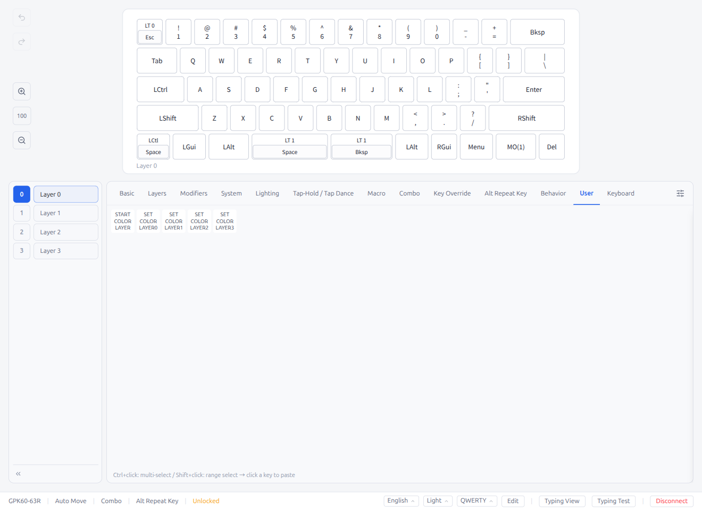

- Custom keycodes defined in firmware (e.g., `CUSTOM_1`, `CUSTOM_2`)
- When exporting `keymap.c`, custom keycodes use their configured names instead of generic `USER00`/`USER01` identifiers, and an `enum custom_keycodes` block is generated automatically

### 3.13 Keyboard (Device Picker)

The Keyboard tab lets you copy keycodes from other connected keyboards or from saved files.

> **Use case:** While editing a keyboard, you wonder how another keyboard's keymap is set up — but that keyboard isn't connected right now. If you've previously saved its data (via the Save panel), you can load it from the **File** source in this tab to browse its keymap and copy keycodes directly into your current layout.

**Device List**

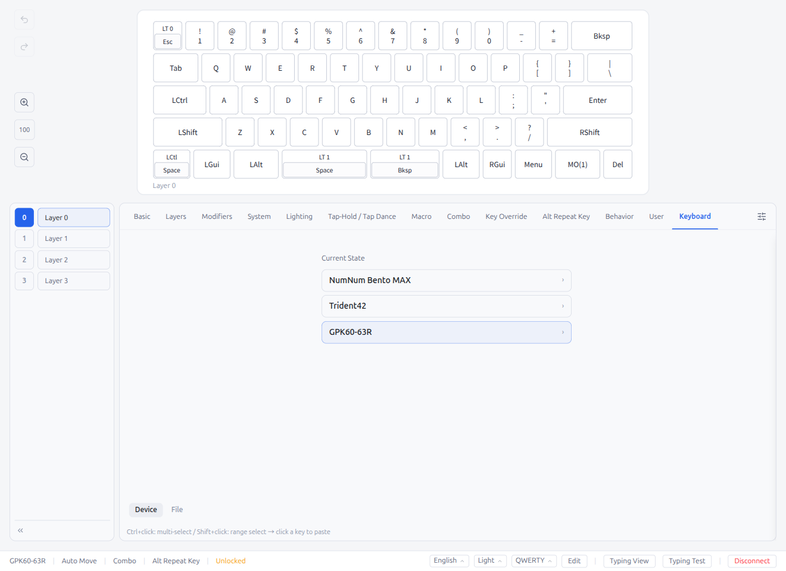

When you open the Keyboard tab, a list of all connected Vial-compatible keyboards is displayed. This list updates in real time as you plug in or unplug devices.

- Click a device to load its keymap — the currently connected keyboard shows its live keymap instantly; other devices are probed via a temporary USB connection

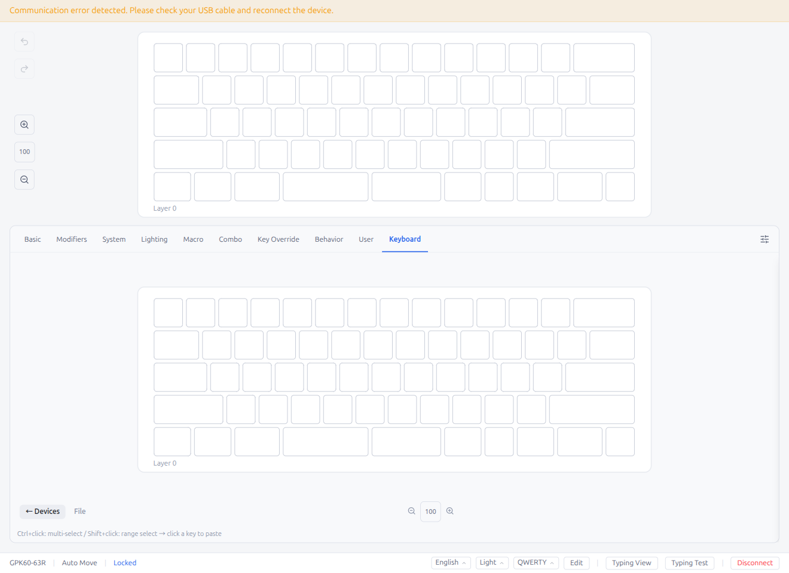

- Once loaded, click any key on the displayed keyboard to assign that keycode to the selected key on the main keymap
- Use Ctrl+click for multi-select, Shift+click for range select
- Layer buttons at the bottom right let you browse different layers
- Zoom controls (+ / numeric input / −) adjust the picker keyboard size (30%–200%). When viewing another keyboard, its saved zoom level is loaded automatically
- Press Escape to clear the picker selection

**File Source**

Click the **File** button at the bottom to switch to the file source. This shows saved keyboard snapshots and allows loading `.pipette` files — the same keycode picking workflow applies.

> **Note**: Only V2 format (`.pipette`) files are supported in the key picker. If a legacy V1 format file is selected, a warning is displayed prompting you to connect the keyboard and open the keymap to migrate the data.

**Composite Keycodes**

When clicking a composite key (e.g., `LT1(KC_SPC)`) in the picker, the full keycode is assigned as-is. Inner/outer parts are not split — the complete keycode is copied to the target key.

> **Note**: The Keyboard tab is hidden when editing the inner part of a mask key (e.g., choosing the `KC_SPC` inside `LT1(KC_SPC)`), since composite keycodes cannot be assigned to the inner byte.

### 3.14 Keycodes Overlay Panel

The Keycodes Overlay Panel provides quick access to editor tools and save functions. Toggle it with the panel button at the right end of the keycode tab bar.

**Settings Tab**

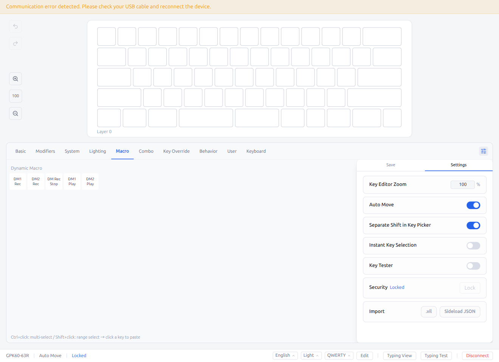

- **Basic View Type**: Switch between ANSI keyboard, ISO keyboard, JIS keyboard, and List views for the Basic tab
- **Keyboard Layout**: Select the display layout for key labels (QWERTY, Dvorak, etc.)
- **Auto Advance**: Toggle automatic advancement to the next key after assigning a keycode
- **Instant Key Selection**: Toggle instant key selection mode (see §2.2 for behavior details)
- **Separate Shift in Key Picker**: Toggle split display for combined keycodes (e.g., show Mod-Tap as two halves)
- **Key Tester**: Toggle Matrix Tester mode (supported keyboards only)
- **Security**: Shows lock status (Locked/Unlocked) with a Lock button
- **Import**: Restore from `.vil` files or sideload custom JSON definitions
- **Reset Keyboard Data**: Reset keyboard to factory defaults

**Save Tab**

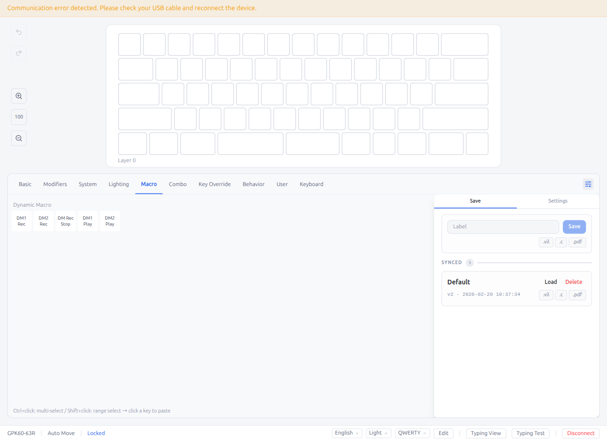

- **Export Current State**: Download keymap as `.vil`, `keymap.c`, PDF keymap cheat sheet, or PDF layout export (key outlines with summary pages for Tap Dance, Macro, Combo, Key Override, and Alt Repeat Key entries)
- **Save Current State**: Save a snapshot of the current keyboard state with a label
- **Synced Data**: List of saved snapshots with Load, Rename, Delete, and Export actions
- This is the same Save panel as the standalone editor settings (§6)

**Layout Tab** (when available)

Some keyboards support layout options (see §2.5). When available, a Layout tab appears as the first tab in the overlay panel, providing access to the same layout options.

---

## 4. Toolbar

The toolbar on the left side of the keymap editor provides the following features.

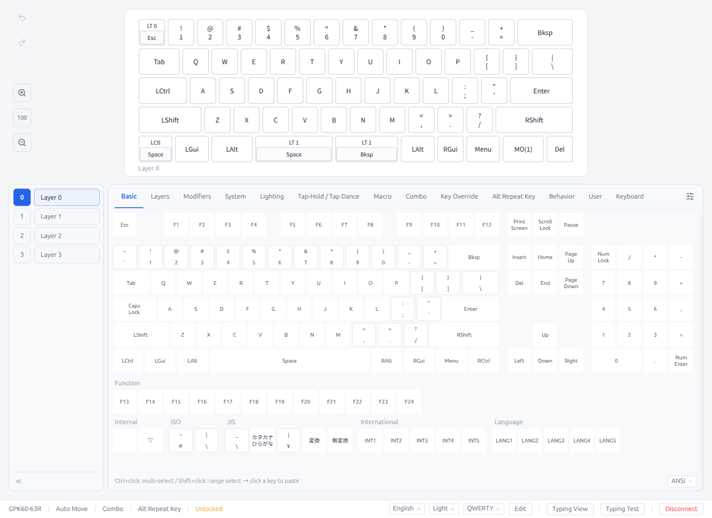

### 4.1 Zoom

Adjusts the keyboard layout display scale. Range: 30%–200% (default 100%).

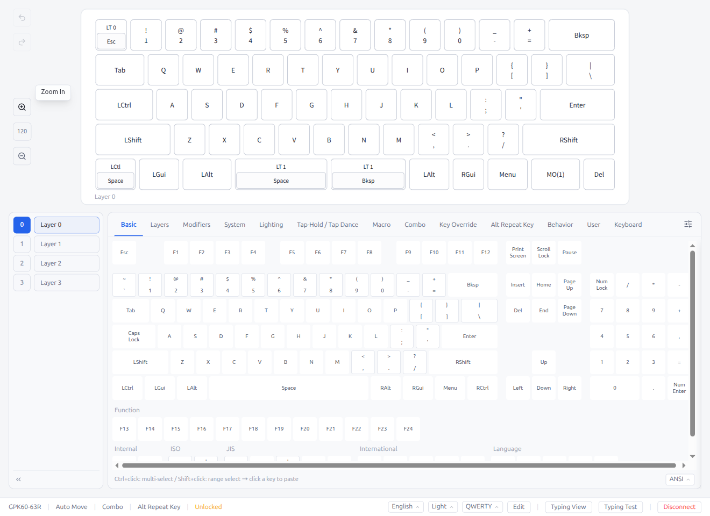

- (+) button to zoom in
- (-) button to zoom out
- Can also be adjusted in editor settings
- Zoom level is saved per keyboard and restored automatically on reconnect

### 4.2 Undo / Redo (Keymap History)

The keymap editor automatically records a history of keycode changes. You can navigate through this history to undo or redo changes.

| Method | Scope | How to use |
|--------|-------|------------|
| **Keyboard shortcuts** | Full history (up to Max Keymap History, default 100) | Ctrl/Cmd+Z (Undo), Ctrl+Y / Ctrl/Cmd+Shift+Z (Redo) |
| **Toolbar buttons** | Full history | Undo / Redo buttons in the left toolbar |
| **Popover buttons** | Last single change only (must match the open key) | Undo / Redo buttons in the popover footer (see §2.4) |

- History is cleared when switching keyboards or disconnecting
- The maximum history size can be configured in Settings → Defaults → **Max Keymap History** (see §6.1)
- All keymap mutation paths are tracked: single key edits, popover selections, mod-mask changes, paste, and copy-layer operations

### 4.3 Typing Test

A typing practice feature. Test your typing with the current keymap while viewing the keyboard layout below. The layout highlights key presses in real time, so you can verify that your physical keymap matches the on-screen display.

Click the **Typing Test** button in the status bar to enter typing test mode.

#### Modes

Three test modes are available, selectable from the mode tabs at the top:

**Words Mode**

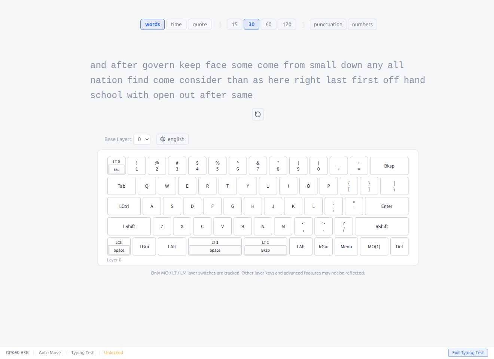

- Type a fixed number of random words (15 / 30 / 60 / 120)
- The test ends when all words are completed

**Time Mode**

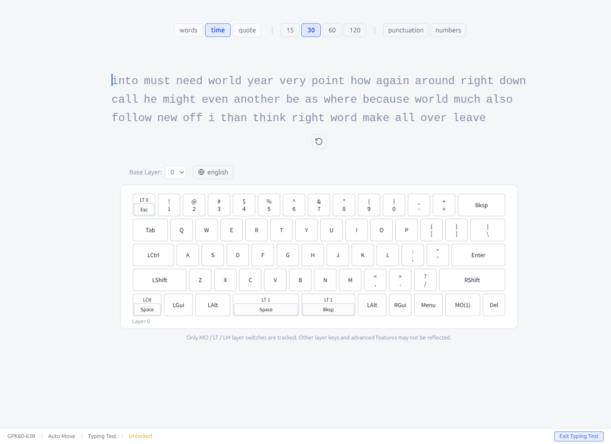

- Type as many words as possible within a time limit (15 / 30 / 60 / 120 seconds)
- A countdown timer shows remaining time

**Quote Mode**

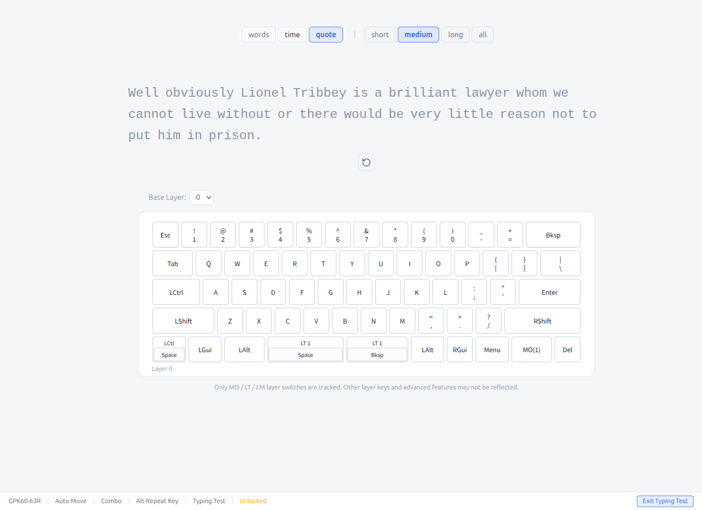

- Type a real-world quote (short / medium / long / all)
- The quote source is shown after completion

#### Options

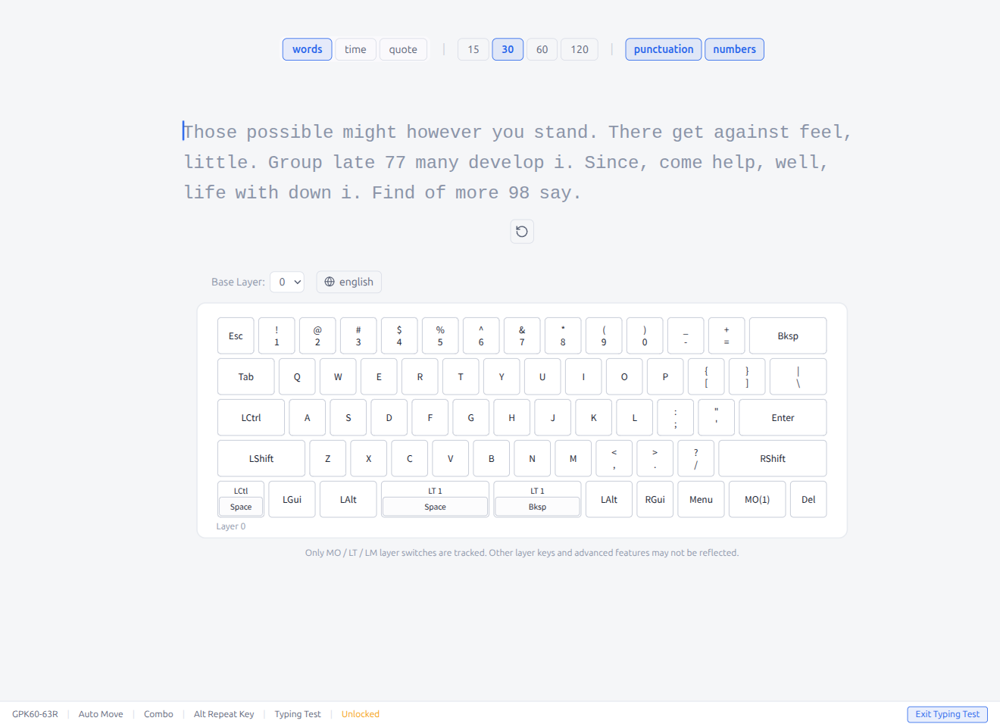

In Words and Time modes, you can toggle additional options:

- **Punctuation**: Adds punctuation marks (commas, periods, etc.) to the word list
- **Numbers**: Adds numbers to the word list

These toggles are not available in Quote mode, which uses the original text as-is.

#### During a Test

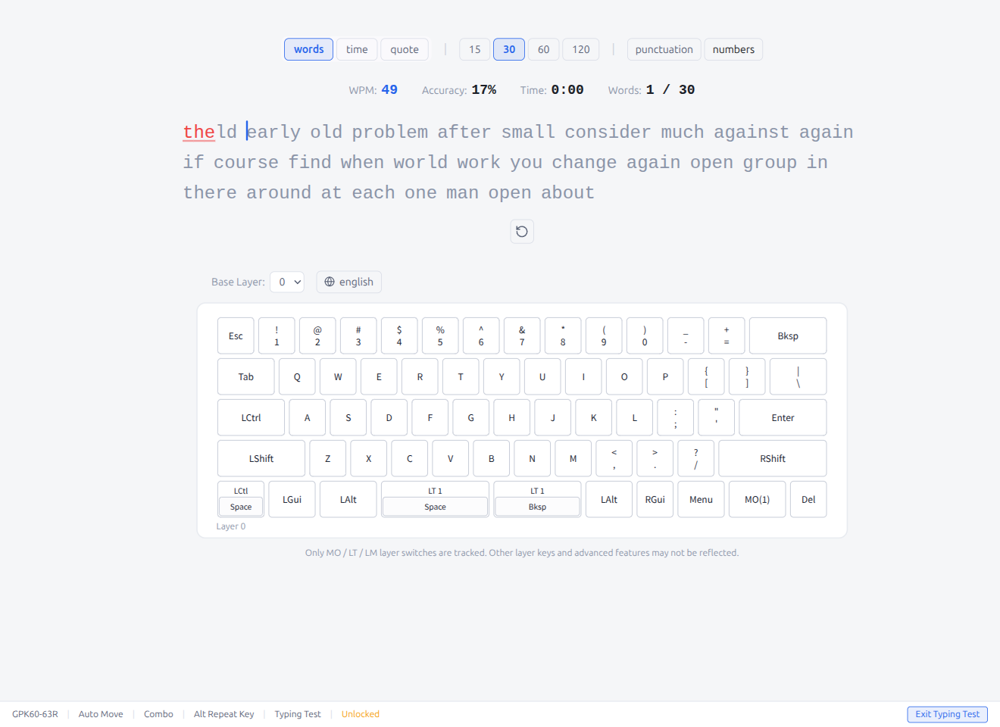

While typing, the following stats are displayed in real time:

- **WPM**: Words Per Minute (current typing speed)
- **Accuracy**: Percentage of correctly typed characters
- **Time**: Elapsed time (or remaining time in Time mode)
- **Words**: Current word / total words

Correctly typed words turn green. Incorrect characters are highlighted in red with an underline. The cursor advances as you type, and words scroll automatically.

- Press the restart button (↺) to restart the test at any time
- Press Escape to exit typing test mode
- The status bar's Disconnect button is hidden while Typing Test is active. To disconnect, first return to the editor with Escape or the Typing Test button
- The keyboard layout below the test area shows key presses in real time via the Vial matrix tester protocol

#### Typing View (View-Only Mode)

Typing View displays only the keyboard layout in a compact, resizable window — ideal for overlaying on top of other applications while practicing.

Click the **Typing View** button in the status bar (visible when Typing Test is not active) to enter view-only mode.

- The window shows only the keyboard layout with real-time key press highlighting
- The toolbar, keycode palette, typing test UI, and status bar are hidden
- The window maintains its aspect ratio when resized

**Controls Panel**

Click anywhere on the keyboard area to toggle the controls panel (bottom-right popup):

- **Base**: Select which layer to display (when the keyboard has multiple layers)
- **top**: Keep the window above other windows (always-on-top; not available on Wayland)
- **Default Size**: Reset the window to its default calculated size
- **Fit Size**: Adjust the window height to match the current width while preserving the aspect ratio
- **Exit Typing View**: Return to the full editor

Press Escape or click the keyboard area again to close the panel. A hint text appears at the bottom when hovering over the window. The window size and always-on-top preference are saved per keyboard.

> **Note**: Auto-lock is suspended while in Typing View mode. If the keyboard is disconnected while in view-only mode, the window automatically restores to its normal size.

#### View Mode Memory and Auto-Restore

The last view mode (Editor / Typing Test / Typing View) is remembered per keyboard and automatically restored the next time you connect that keyboard:

- **Editor**: The editor view is shown as usual
- **Typing Test**: Typing Test mode is re-entered automatically. If the keyboard is locked, the Unlock dialog appears first and the test starts after unlocking
- **Typing View**: The compact view-only window is re-entered automatically. If the keyboard is locked, the Unlock dialog appears first

View mode is stored per keyboard alongside preferences like keyboard layout, zoom scale, and window size. When Pipette Hub sync is enabled, view mode is synced to other devices as well (see §7).

---

## 5. Detail Setting Editors

Open detail setting modals from their dedicated keycode tabs. Lighting opens via a **Settings: Configuration** button at the bottom of its tab; Combo, Key Override, and Alt Repeat Key detail editors open by clicking an entry on their respective tabs.

### 5.1 Lighting Settings

Open from the **Settings: Configuration** button on the Lighting tab. Configure RGB lighting colors and effects.

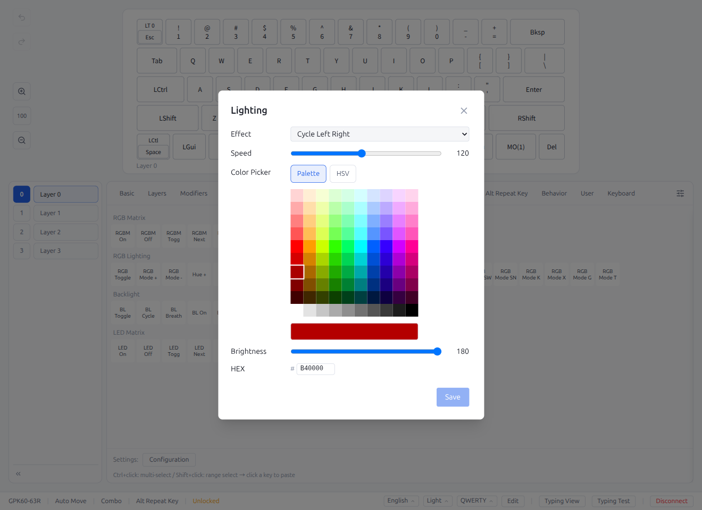

- Select colors with the HSV color picker
- Choose colors from preset palette
- Adjust effects and speed
- Click Save to apply

### 5.2 Combo

Configure simultaneous key press combinations to trigger different keys. The Combo tab displays an inline tile grid; clicking an entry opens the detail editor modal directly.

**Tile Grid (Combo tab)**

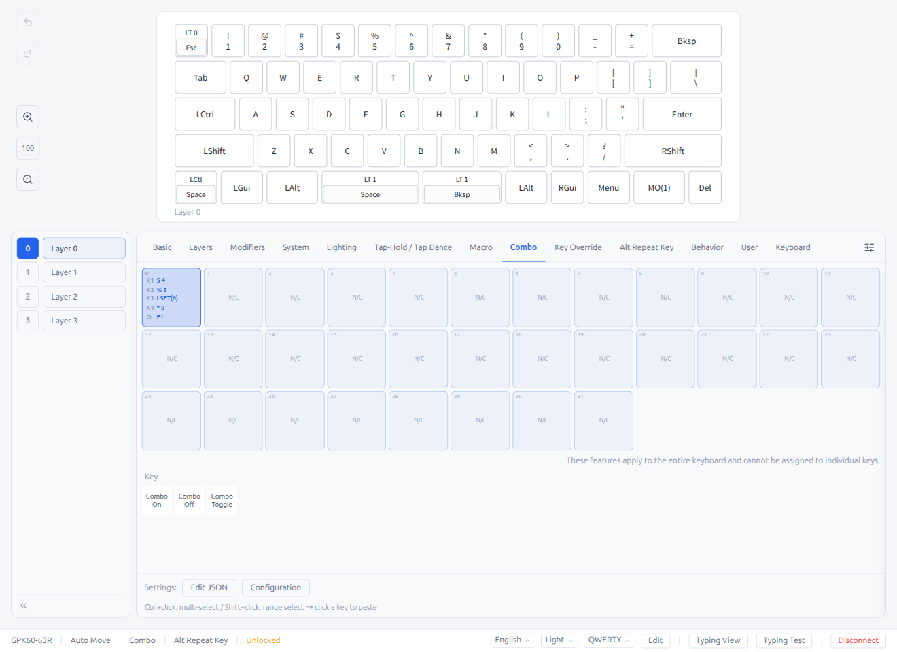

The Combo tab shows entries as a numbered list (0--31). Configured entries display a summary (e.g., "A + B → C"). Click an entry to open the detail editor. Combo keycodes (Combo On, Combo Off, Combo Toggle) are shown below the list. A **Settings: Configuration** button at the bottom opens a settings modal for QMK Combo timeout configuration (e.g., Combo time out period).

**Detail Editor**

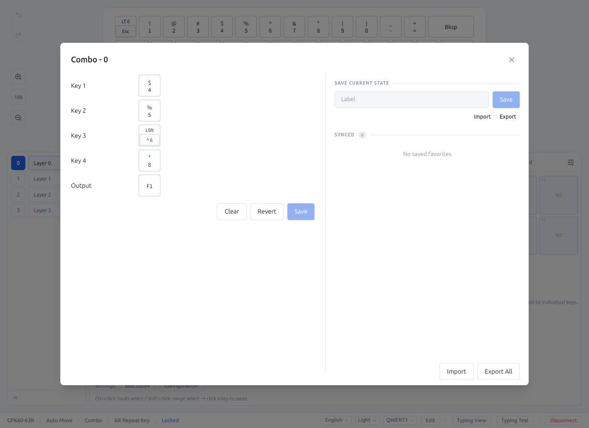

- Left panel: Combo editor with Key 1--4 and Output fields.
- Right panel: Inline favorites panel (Save Current State / Synced Data / Import / Export All)
- **Clear** resets all fields; **Revert** restores the last saved state. Both use two-step confirmation.
- **Save** writes changes to the keyboard

### 5.3 Key Override

Replace specific key inputs with different keys. The Key Override tab displays an inline tile grid; clicking an entry opens the detail editor modal directly.

**Tile Grid (Key Override tab)**

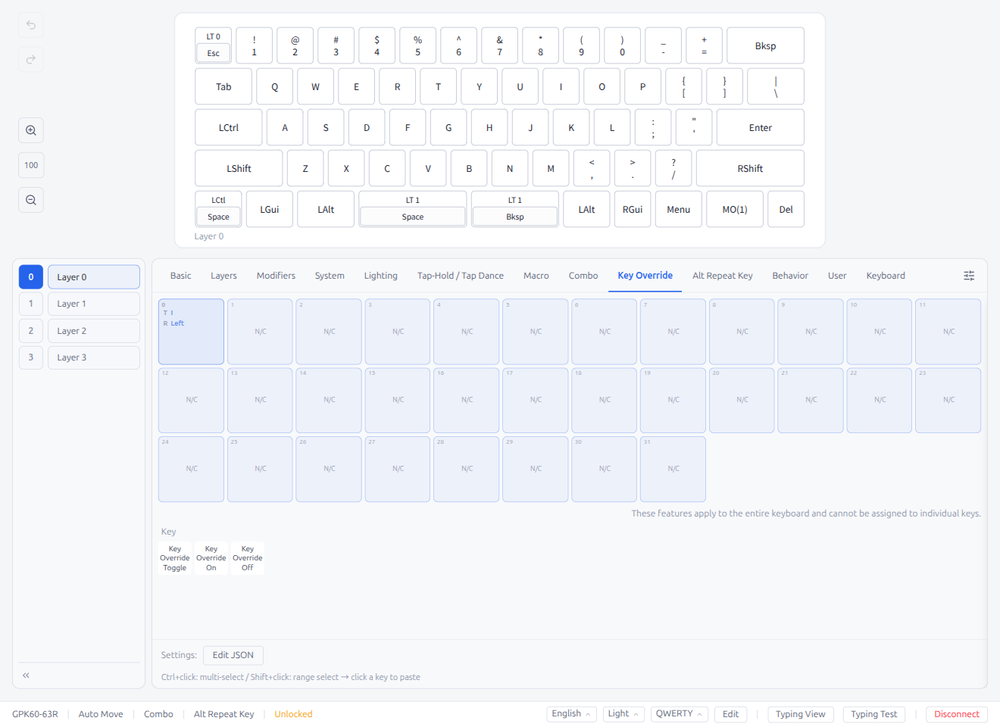

Shows entries as a numbered list. Configured entries display a summary. Click an entry to open the detail editor.

**Detail Editor**

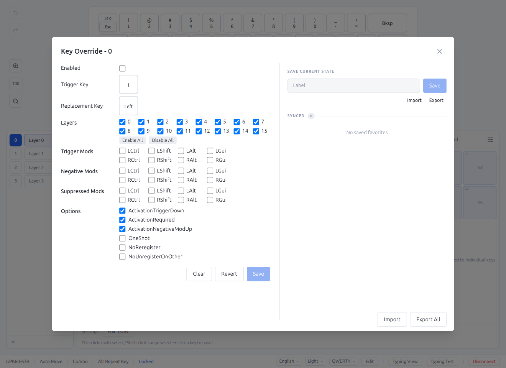

- Left panel: Trigger Key, Replacement Key, enabled toggle, layer and modifier options
- Right panel: Inline favorites panel (Save Current State / Synced Data / Import / Export All)
- **Clear** resets all fields; **Revert** restores the last saved state. Both use two-step confirmation.
- **Save** writes changes to the keyboard

### 5.4 Alt Repeat Key

Configure alternative actions for the Repeat Key. The Alt Repeat Key tab displays an inline tile grid; clicking an entry opens the detail editor modal directly.

**Tile Grid (Alt Repeat Key tab)**

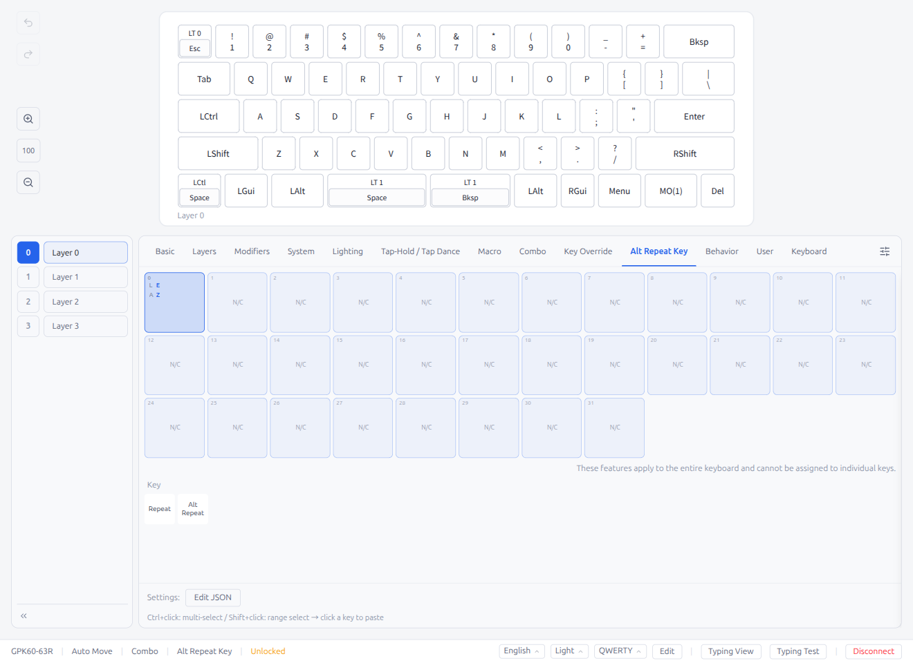

Shows entries as a numbered list. Configured entries display a summary. Click an entry to open the detail editor.

**Detail Editor**

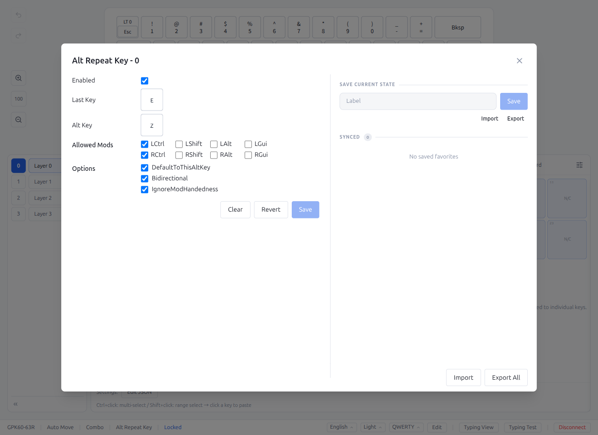

- Left panel: Last Key, Alt Key, enabled toggle, Allowed Mods, Options (DefaultToThisAltKey, Bidirectional, IgnoreModHandedness)
- Right panel: Inline favorites panel (Save Current State / Synced Data / Import / Export All)
- **Clear** resets all fields; **Revert** restores the last saved state. Both use two-step confirmation.
- **Save** writes changes to the keyboard

### 5.5 Favorites

Each editor modal (Tap Dance, Macro, Combo, Key Override, Alt Repeat Key) includes an inline **Favorites panel** on the right side of the editor.

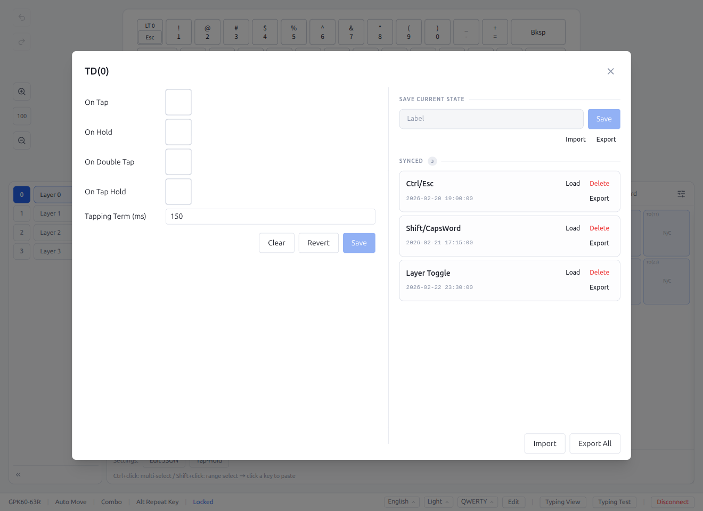

The inline favorites panel provides:

- **Save Current State**: Enter a label and click Save to store the current entry configuration
  - **Import** / **Export** buttons: Import a `.pipette-fav` file to apply to the current entry, or export the current entry settings as a `.pipette-fav` file without saving to the store. Inline "Imported" / "Exported" feedback is shown after each action.
- **Synced Data**: Previously saved entries are listed with Load, Rename, Delete, and Export actions
- **Import** / **Export All**: Footer buttons for bulk import/export of favorites

Within the Synced Data list:

- **Load**: Apply a saved configuration to the current entry
- **Rename**: Change the label of a saved entry (also synced to Hub if the entry is uploaded)
- **Delete**: Remove a saved entry
- **Export**: Download an individual saved entry as a file

When Pipette Hub is connected, each saved entry also shows Hub actions:

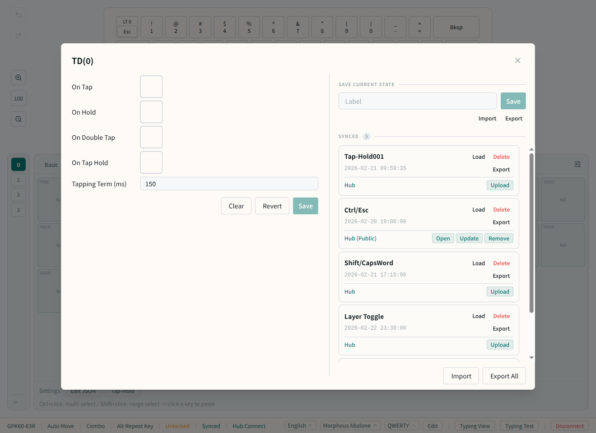

- **Upload to Hub**: Upload the favorite entry to Pipette Hub as a feature post
- **Update on Hub**: Re-upload the latest configuration to update the existing Hub post
- **Remove from Hub**: Delete the entry from Pipette Hub (two-step confirmation)
- **Open in Browser**: Open the individual Hub post page in your browser

### 5.6 JSON Editor

Each feature tab (Tap Dance, Macro, Combo, Key Override, Alt Repeat Key) provides an **Edit JSON** button at the bottom of the tab. This opens a JSON editor modal for bulk editing all entries as raw JSON text.

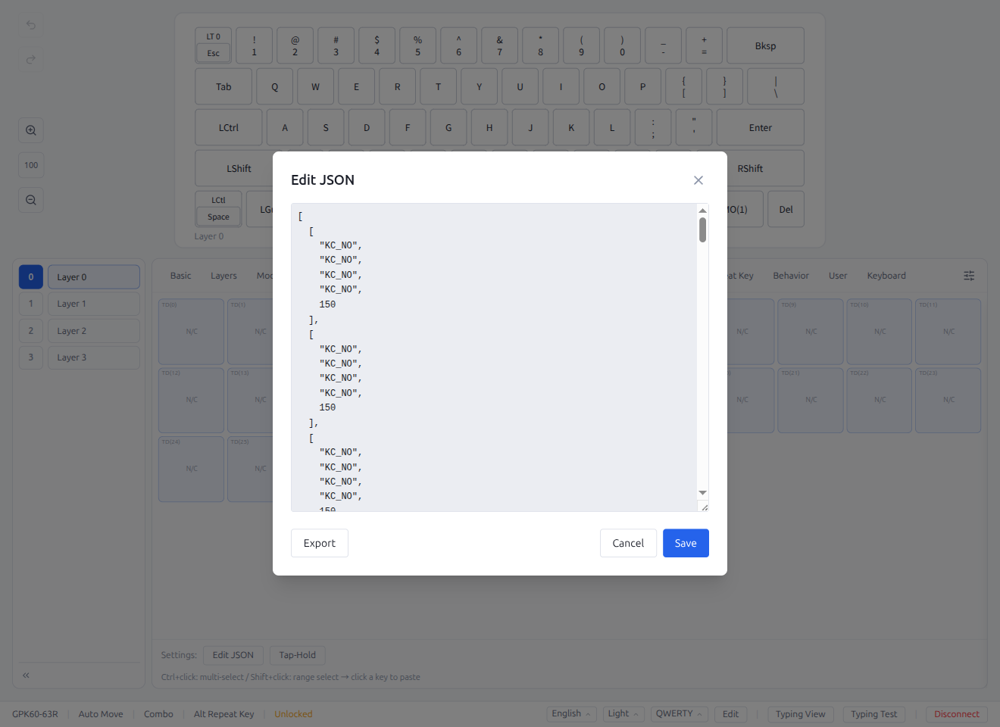

- **Text area**: Edit all entries as a JSON array. Changes are validated in real time — parse errors are shown below the editor
- **Export** (left): Save the current JSON as a `.pipette-fav` file for backup or sharing
- **Cancel** (right): Close without saving
- **Save** (right): Apply the parsed JSON and write changes to the keyboard

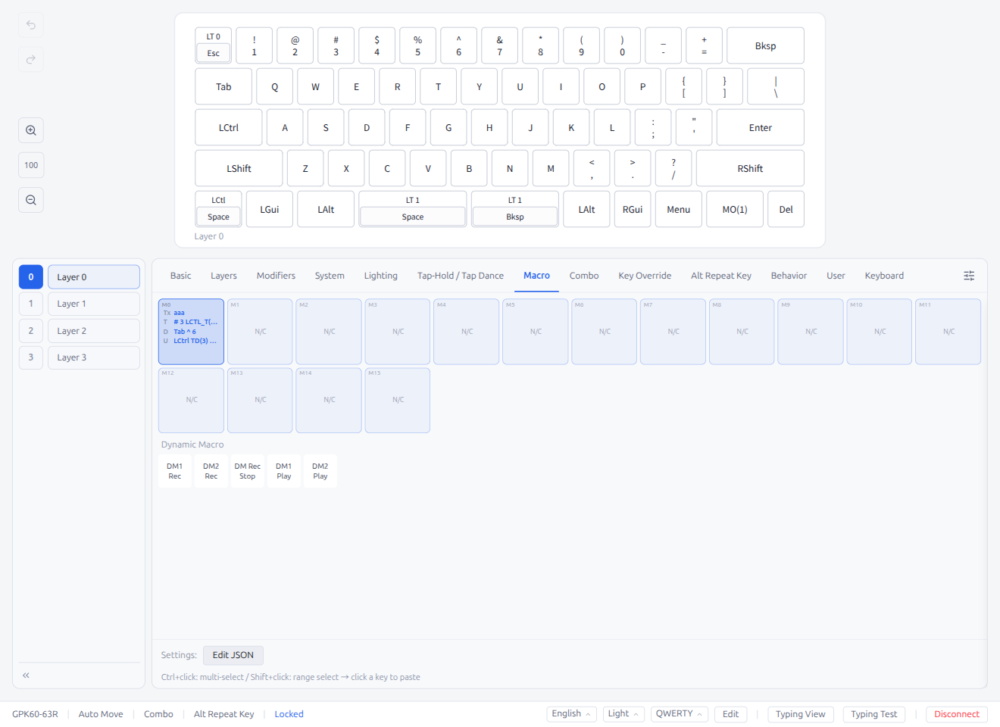

For Macros, a warning is displayed indicating that keyboard unlock is required to save changes.

> **Note**: The JSON editor modifies all entries at once. Use with caution — invalid JSON will be rejected, but valid JSON with incorrect values may cause unexpected behavior.

> **Note**: Favorites are not tied to a specific keyboard — saved entries can be loaded on any compatible keyboard. When Cloud Sync is enabled, favorites are also synced across devices (see §6.1). Favorites can also be managed from the Data modal on the device selection screen (see §1.3).

---

## 6. Editor Settings Panel

Open the editor settings panel from the save button (floppy disk icon) in the keycode tab bar, or use the Save tab in the Keycodes Overlay Panel (§3.14).

The editor settings panel now provides a single **Save** panel with the following features:

- **Export Current State**: Download keymap as `.vil`, `keymap.c`, PDF keymap cheat sheet, or PDF layout export (key outlines with summary pages for Tap Dance, Macro, Combo, Key Override, and Alt Repeat Key entries). An "Exported" inline feedback message appears after a successful export.
- **Save Current State**: Save a snapshot of the current keyboard state with a label. Enter a name in the Label field and click Save. If the Label field is left empty, the Save button is disabled. Saved snapshots appear in the Synced Data list below and can be loaded or deleted later
- **Synced Data**: List of saved snapshots. Click to load, rename, or delete entries
- **Reset Keyboard Data**: Reset keyboard to factory defaults (use with caution)

> **Note**: Tool settings (keyboard layout, auto advance, key tester, security) have moved to the Keycodes Overlay Panel (§3.14). Zoom is available in the toolbar (§4.1). Layer settings are now managed directly via the layer panel on the left side of the editor.

### 6.1 Cloud Sync (Google Drive appDataFolder)

Pipette can sync your saved snapshots, favorites, and per-keyboard settings across multiple devices via Google Drive.

Sync is configured in the **Settings** modal (gear icon on the device selection screen), under the **Data** tab:

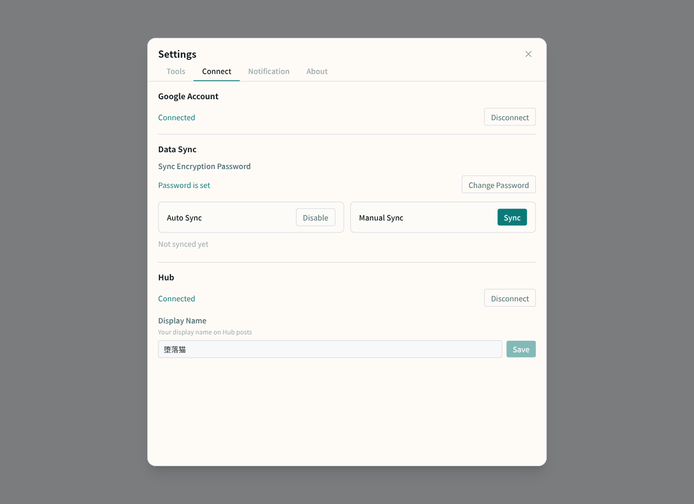

The Data tab contains the following sections: Google Account, Data Sync, and Pipette Hub. Additional troubleshooting and data management options are available in the Data panel (§1.3).

#### Google Account

- Click **Connect** to sign in with your Google account
- Click **Disconnect** to sign out. If Pipette Hub is also connected, a warning confirms that Hub will be disconnected as well

#### Sync Encryption Password

- Set a password to encrypt all synced data (required). A strength indicator helps you choose a strong password
- If a password already exists on the server (set from another device), a hint is shown asking you to enter the same password
- **Change Password**: Click **Change Password** to re-encrypt all synced files with a new password. No data is deleted — existing files are decrypted and re-encrypted in place

**Change Password error conditions**

When a password change cannot proceed, Pipette shows a localized message instead of the raw error. The common cases are listed below; other underlying errors (network, Drive) may appear as their own messages.

Credential failures (the 5 reasons come from the same typed `SyncCredentialFailureReason` set used for readiness — only 3 of them surface in **Sync Status** below):

| Reason | Message | Trigger |
|--------|---------|---------|
| `unauthenticated` | "Please sign in to Google before changing the password." | Not signed in with Google |
| `noPasswordFile` | "No saved password to change. Set a password first." | No local sync password has ever been set |
| `decryptFailed` | "Couldn't read the existing password (OS keychain rejected it)." | The OS keychain entry is unreadable (keychain reset, profile move, etc.) |
| `keystoreUnavailable` | "OS keychain is not available; password cannot be changed here." | `safeStorage.isEncryptionAvailable()` returns false (typical on headless Linux without a keyring) |
| `remoteCheckFailed` | "Couldn't reach Google Drive to verify the current password." | Network or Drive outage — retry later |

Operational errors (shown as the message directly, no reason code):

| Message | Trigger |
|---------|---------|
| "Cannot change password while sync is in progress." | A sync is already running — wait for it to finish |
| "New password must be different from the current password." | The new password matches the existing one |
| "Some files cannot be decrypted. Please scan and delete undecryptable files first." | Drive has files the current password cannot decrypt — use **Undecryptable Files** first |
| "Sync password does not match. Please check your encryption password." | The current password fails to decrypt the remote password check — reconfirm the password you are providing |

#### Sync Controls

- **Auto Sync**: Toggle automatic sync on or off. When enabled, changes sync automatically with a 10-second debounce and periodic 3-minute polling
- **Sync**: Manually sync favorites and connected keyboard data. Only favorites and the currently connected keyboard are synced (not all keyboards)

#### Sync Status

- Displays current sync progress with the sync unit name and an item counter (current / total)
- Shows error or partial-sync details if any units failed

**Readiness reasons**

If sync cannot run because the client is not ready, a specific readiness reason is shown in place of the generic "Not synced yet" label. Only three reasons surface here; detailed keystore failures (`decryptFailed`, `keystoreUnavailable`) come through the password set/change flow instead.

| Reason | Message |
|--------|---------|
| `unauthenticated` | "Sign in to Google to sync." |
| `noPasswordFile` | "Set a sync password to start syncing." |
| `remoteCheckFailed` | "Couldn't reach Google Drive — sync is paused." |

#### Undecryptable Files

- Files that cannot be decrypted with the current password or are otherwise unreadable (e.g., encrypted with a forgotten previous password)
- Click **Scan** to detect undecryptable files, select the ones to remove, then click **Delete Selected** to permanently delete them from Google Drive

#### Sync Unavailable Alert

- Displayed when the sync backend cannot be reached. Click **Retry** to attempt reconnection

#### Data Storage

Synced data is stored in [Google Drive appDataFolder](https://developers.google.com/workspace/drive/api/guides/appdata) — a hidden, app-specific folder that only Pipette can access. Your personal Drive files are never touched.

See the [Data Guide](Data.md) for details on what is synced and how your data is protected.

#### Data Management

Troubleshooting and data management functions are available in the **Data** panel (see §1.3):

- **Local > Application**: Import/export local data or reset selected targets (keyboard data, favorites, app settings)
- **Sync**: List remote-only keyboards by real name and download any one on demand (see §1.3). To delete encrypted files that cannot be decrypted, use the **Undecryptable Files** section above

#### Settings — Defaults

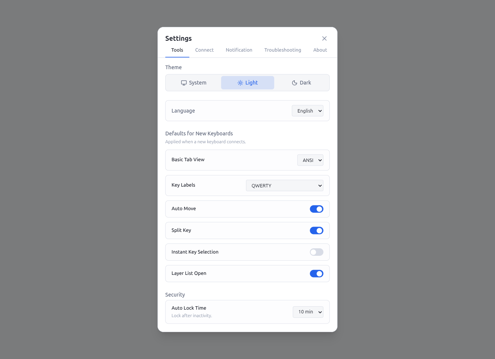

The Tools tab in the Settings modal includes a **Defaults** section for setting initial preferences for new keyboard connections:

- **Keyboard Layout**: Default display layout (QWERTY, Dvorak, etc.)
- **Auto Advance**: Default auto-advance behavior
- **Instant Key Selection**: Default instant key selection behavior (see §2.2)
- **Layer Panel Open**: Whether the layer panel starts expanded or collapsed
- **Basic View Type**: Default view type for the Basic tab (ANSI/ISO/JIS/List)
- **Separate Shift in Key Picker**: Default setting for separating Shift in the key picker
- **Max Keymap History**: Maximum number of keymap changes to keep in the current keyboard's edit history (default: 100). History is cleared on disconnect or keyboard switch. See §4.2 for details.

---

## 7. Pipette Hub

[Pipette Hub](https://pipette-hub-worker.keymaps.workers.dev/) is a community keymap gallery where you can upload and share your keyboard configurations and favorite entries.

### 7.1 Hub Setup

Hub features require Google account authentication. Please complete Google account authentication first. Configure Hub in the **Settings** modal (gear icon on the device selection screen):

1. In the **Data** tab, click **Connect** under the Google Account section to sign in with your Google account
2. Scroll down to the **Pipette Hub** section in the same Data tab — it should show **Connected**
3. Set your **Display Name** — this name is shown on your Hub posts
4. Your uploaded keymaps appear in the **My Posts** list

### 7.2 Uploading a Keymap

To upload a keymap to Hub:

1. Connect to your keyboard and open the editor settings (gear icon in the keymap editor)
2. Switch to the **Data** tab
3. Save the current state with a label (e.g., "Default")

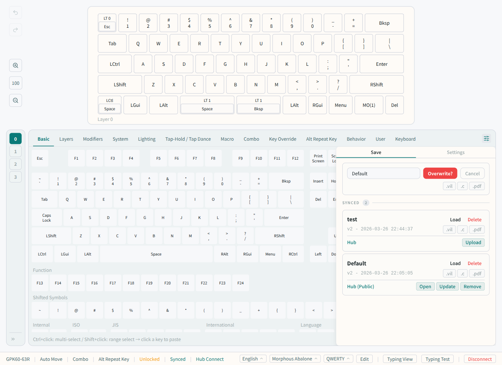

4. Click the **Upload** button on the saved snapshot entry
5. After uploading, the entry shows **Uploaded** status with **Open in Browser**, **Update**, and **Remove** buttons

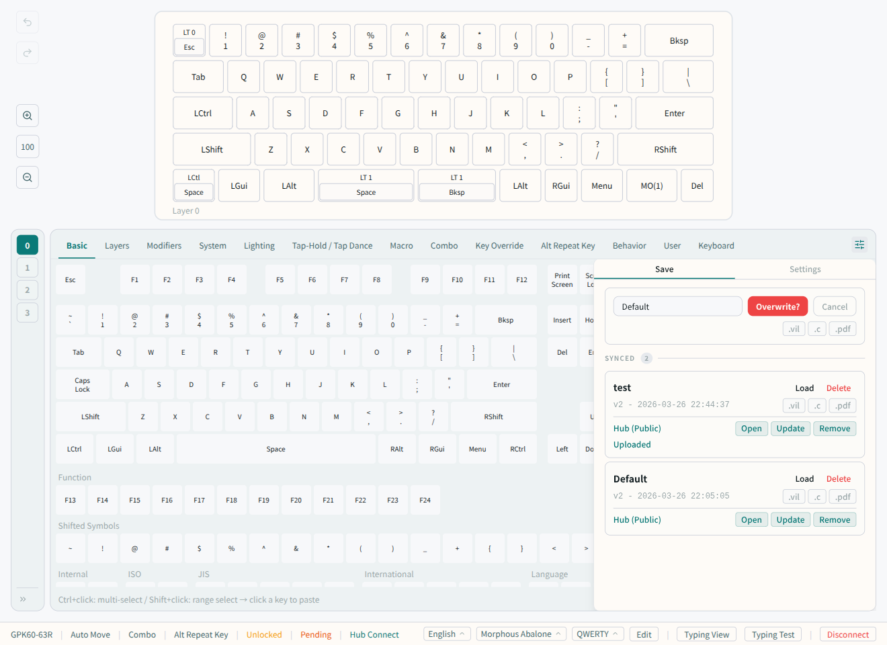

- **Open in Browser**: Opens the Hub page for this keymap
- **Update**: Re-uploads the current keyboard state to update the existing Hub post
- **Remove**: Removes the keymap from Hub

> **Note**: Hub uploads include a `.pipette` file alongside the standard export formats, allowing other users to load the full keyboard state directly.

### 7.3 Uploading Favorite Entries

Individual favorite entries (Tap Dance, Macro, Combo, Key Override, Alt Repeat Key) can also be uploaded to Hub:

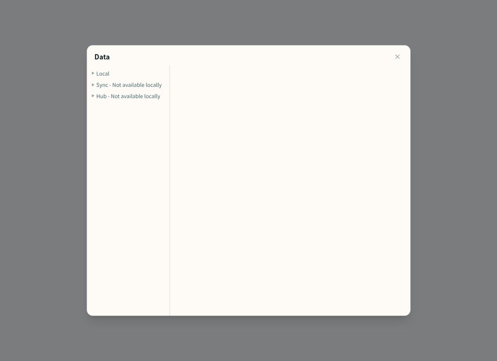

1. Open any editor modal with the inline favorites panel, or use the Data modal from the device selection screen
2. In the favorites list, each entry shows an **Upload to Hub** button when Hub is connected
3. Click **Upload to Hub** to share the configuration
4. After uploading, **Open in Browser**, **Update on Hub**, and **Remove from Hub** buttons appear
5. Renaming a favorite that is uploaded to Hub also updates the title on Hub automatically

> **Note**: A Display Name must be set before uploading. If no Display Name is configured, a warning is shown instead of the Upload button.

### 7.4 Hub Website

The [Pipette Hub website](https://pipette-hub-worker.keymaps.workers.dev/) displays uploaded keymaps in a gallery format.

- Browse uploaded keymaps from the community
- Search by keyboard name
- Download keymaps as `.vil`, `.c`, or `.pdf` files

#### Individual Keymap Page

Clicking a keymap card opens the detail page with a full keyboard layout visualization.

- View all layers (Layer 0–3) of the uploaded keymap
- Review Tap Dance, Macro, Combo, Alt Repeat Key, and Key Override configurations
- **Copy URL** or **Share on X** to share with others
- Download in various formats (`.pdf`, `.c`, `.vil`)

See the [Data Guide](Data.md) for details on how Hub authentication works.

---

## 8. Modal Interactions

Pipette applies a uniform set of keyboard and dismissal rules to every top-level modal (Settings, Data, Macro, QMK Settings, Tap Dance, Combo, Key Override, Alt Repeat Key, Notification, Language Selector, Layout Store, Editor Settings, Favorite Store, and the History Toggle dialog).

### Escape to Close

Pressing **Escape** closes the modal, with the following exceptions so that Escape never interrupts text entry:

- If the focused element is an `<input>`, `<textarea>`, `<select>`, or anything inside a `contenteditable` region, Escape is ignored (the element receives it instead)
- During an IME composition (e.g., Japanese input), Escape is ignored so the composition can be cancelled without dismissing the modal

### Unlock Dialog Protection

The Unlock Dialog (prompting for a physical key press after a boot-unlock keycode is invoked) **intercepts Escape before it reaches the parent modal**. Pressing Escape on top of an unlock prompt cannot leak through, preventing accidental dismissal of a half-configured Settings or Data modal by rapid Escape presses.

### Escape Suppression During Busy Flows

Escape-to-close is disabled while the containing modal is in a transient state that must complete:

- **Settings / Data modals**: disabled while a sync / troubleshooting flow is running
- **Macro Modal**: disabled while the recorder is actively capturing keystrokes (see §3.7 Recording Lock); the backdrop click and top-right Close button are also inert at the same time

---

## 9. Status Bar

The status bar at the bottom of the screen shows connection information and action buttons.

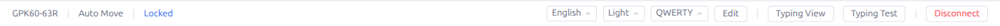

- **Device name**: Shows the name of the connected keyboard
- **Loaded label**: The label of the loaded snapshot (shown only when a snapshot is loaded)
- **Auto Advance**: Status of automatic key advancement after assigning a keycode (shown only when enabled)
- **Key Tester**: Toggle button for Matrix Tester mode (requires matrix tester support; hidden when Typing Test is active)
- **Typing View**: Toggle button to enter view-only mode — a compact window showing only the keyboard layout (see §4.3). Requires matrix tester support; hidden when Typing Test is active
- **Typing Test**: Toggle button for Typing Test mode (requires matrix tester support)
- **Locked / Unlocked**: Keyboard lock status (prevents accidental changes to dangerous keycodes)
- **Sync status**: Cloud sync status (shown only when sync is configured)
- **Hub connection**: Pipette Hub connection status (shown only when Hub is configured)
- **Disconnect button**: Disconnects from the keyboard and returns to the device selection screen (hidden while Typing Test is active)
