# Pipette Operation Guide

[日本語版はこちら](OPERATION-GUIDE.ja.md)

This document explains how to use the Pipette desktop application.
Screenshots were taken using a GPK60-63R keyboard unless otherwise noted.

---

## 1. Device Connection

### 1.1 Device Selection Screen

When you launch the app, a list of connected Vial-compatible keyboards is displayed.

- USB-connected keyboards are automatically detected
- If multiple keyboards are connected, select one from the list
- On Linux, udev rules may need to be configured if no devices are found

**File Tab**

The File tab allows offline editing of `.pipette` files without a physical keyboard connected:

- Browse previously saved keyboards and select an entry to load
- Load an external `.pipette` file from disk
- A virtual keyboard is created from the embedded definition in the file
- An unsaved changes indicator is shown when edits have not been saved

> **Use case:** You want to tweak your keyboard's keymap, but the keyboard isn't with you right now. If you've previously saved its data, you can load it from the File tab, make your edits offline, and later connect the keyboard and load the modified data to apply your changes.

**Feature Availability: Device vs File Mode**

| Feature | Device (USB) | File (.pipette) |
|---------|:------------:|:---------------:|
| Keymap editing | Yes | Yes |
| Macro / Tap Dance editing | Yes | Yes |
| Combo / Key Override / Alt Repeat Key | Yes | Yes |
| QMK Settings | Yes (device) | Yes (local data) |
| Typing Test | Yes | Yes |
| Export (.vil / .c / .pdf) | Yes | Yes |
| Lighting control | Yes | No |
| Matrix Tester | Yes | No |
| Lock / Unlock | Yes | No |
| Snapshot save / load | Yes | No |
| Hub upload | Yes | No |
| JSON sideload | Yes | No |
| Device probe (Keyboard tab) | Yes | No |
| Cloud Sync | Yes | No |

### 1.2 Connecting a Keyboard

Click a keyboard name in the list to open the keymap editor. A connecting overlay shows loading progress while the keyboard data is read.

If Cloud Sync is configured, sync progress is also displayed during connection (favorites first, then keyboard-specific data).

### 1.3 Data

The Data button on the device selection screen opens the Data panel for centralized management of keyboards, favorites, sync data, and Hub posts.

The left sidebar provides a **tree navigation** with the following structure:

- **Local**
  - **Keyboards**: Browse saved keyboard snapshots. Click a keyboard to view, load, export, or delete entries
  - **Favorites**: Tap Dance, Macro, Combo, Key Override, Alt Repeat Key — each type shows its saved entries with rename, delete, export, and Hub actions
  - **Application**: Import/export local data or reset selected targets (keyboard data, favorites, app settings)
- **Sync** (when Cloud Sync is configured): Lists keyboards that exist only in Google Drive (not yet downloaded on this device). Each entry is labeled with the keyboard's real name, resolved from the synced name index rather than from the raw UID. Click a remote-only keyboard to download it on demand — a spinner is shown while fetching, and a failure message appears inline if the download cannot complete. Once downloaded, the keyboard moves into the **Local › Keyboards** branch. To clean up orphaned encrypted files that can no longer be decrypted, use **Undecryptable Files** in the Settings **Data** tab instead (see §6.1)
- **Hub** (when Hub is connected): Manage Hub posts grouped by keyboard name

Per-entry actions in the favorites list:
- Click to rename, delete, or **Export** individual entries
- **Hub actions**: When Hub is connected, each entry shows **Upload to Hub** / **Update on Hub** / **Remove from Hub** buttons
- **Import** / **Export All** buttons at the footer for bulk operations

A **breadcrumb navigation** at the top of the content area shows the current path (e.g., "Local › Favorites › Tap Dance")

### 1.4 Analyze

The Analyze page shows how you actually type — per-key heatmaps, WPM trends, inter-keystroke intervals, hour-by-day activity, per-finger load, key-pair (bigram) timing, and per-layer usage. Data is recorded while you are in Typing View (the compact window opened from the status bar) and the Record toggle in the typing-test pane is set to Start. Typing-test results are recorded in the same stream.

**Access**

There are two entry points:

- **Analyze tab** on the device selection screen — open the page without connecting a keyboard. Useful for reviewing data from keyboards that are currently unplugged
- **View Analytics** button in the Typing Test pane — jumps to Analyze for the keyboard you are currently using, then returns to the typing view when you go back

**Keyboard selector**

The Keyboards select at the top of the filter row lists every keyboard that has recorded typing data — pick one to populate the charts. Keyboards with no data never appear in the list. The Back button at the bottom of the page returns to the previous view (e.g. the device selector).

**Analysis tabs**

The tab bar above the chart groups ten analyses by intent — overview, performance, behavior, load, and optimization:

| Group | Tab | What it shows |
|-------|-----|---------------|
| Overview | **Summary** | Today / last-7-days deltas, typing profile cards (Speed / Hand balance / SFB / Fatigue), goal streak record |
| Performance | **WPM** | Words-per-minute over time, or by hour of day |
| Performance | **Interval** | Keystroke interval percentiles (min / p25 / median / p75 / max), as a time series or a distribution |
| Behavior | **Activity** | Hour × day-of-week grid or sliding-month calendar, colored by keystrokes / WPM / sessions |
| Behavior | **By App** | Active-application breakdown — App Usage Distribution donut and WPM by App horizontal bars. Requires Monitor App data |
| Load | **Heatmap** | Press count per physical key, overlaid on the keymap (per layer). Requires a keymap snapshot in range |
| Load | **Ergonomics** | Per-finger keystroke totals, with a manual finger-assignment editor and a Learning curve view. Requires a snapshot |
| Load | **Bigrams** | Top key-pair counts, pair-interval ranking, and per-finger IKI bar chart |
| Load | **Layer** | Per-layer keystroke counts or layer-op activations |
| Optimization | **Layout Comparison** | Simulate how your recorded typing would land on alternative layouts (Colemak / Dvorak / etc.). Requires a snapshot |

The Heatmap, Ergonomics, Bigrams > Finger IKI, Layout Comparison, and Layer > Activations views need a keymap snapshot that overlaps the selected range. Pipette saves a snapshot automatically when typing recording is enabled on the keyboard; the empty state tells you when to start a recording session to capture one.

**Common filters**

The following filters are always available:

- **Keymap snapshots** — picks which recorded keymap to analyze against. Editing **From** / **To** stays inside the selected snapshot's active window so charts that need a snapshot (Heatmap / Ergonomics / Bigrams Finger IKI / Layer activations) never mix two layouts in one view. Snapshots are listed on the Keymap snapshot timeline so you can flip between recorded keymap revisions and "Current keymap" without leaving the page
- **From** / **To** — the time range to analyze. Both inputs are clamped to the active snapshot's window (or to the most recent 7 days when the keyboard has no snapshot recorded yet)
- **Device** — multi-select. Pick any combination of `This device` and remote-machine hashes to merge or isolate per-machine data. Hidden on the Interval tab when View is set to Distribution (distribution bins don't split by device)
- **App** — multi-select dropdown listing every active application name observed during the range. Defaults to **All apps** (no filter); selecting one or more apps narrows every chart except **By App** to minutes tagged with one of the chosen apps. The dropdown only populates after Monitor App has been enabled and at least one minute has been tagged with an app name. Persisted per keyboard

Individual tabs add their own filters above the chart (view mode, granularity, unit, etc.); those are described per tab in the sections below. The Heatmap tab keeps its **Normalize** / **Aggregate** / **Group** / **Top N** controls with the ranking row underneath the keyboard itself.

**Saved search conditions**

The bookmark icon in the panel header opens the **Saved search conditions** side panel. Save the active filters under a label, restore a saved set later, rename / delete entries, or export the current condition's chart data as CSV. Each saved entry shows a one-line summary of the filters (devices, apps, snapshot, range) under its label.

- Up to **50 entries per keyboard** — the panel surfaces a cap warning when you reach the limit; delete an existing entry to make room
- Synced via Cloud Sync (when enabled) so the same set is available on other signed-in machines
- Loading an entry written by a newer Pipette release shows an unsupported-version error rather than guessing at unknown fields

#### Summary

The Summary tab is the default landing view. It collects four read-only cards built from the same minute-bucket aggregates as the rest of the page, so you can scan the latest highs / averages / streaks before drilling into a specific tab.

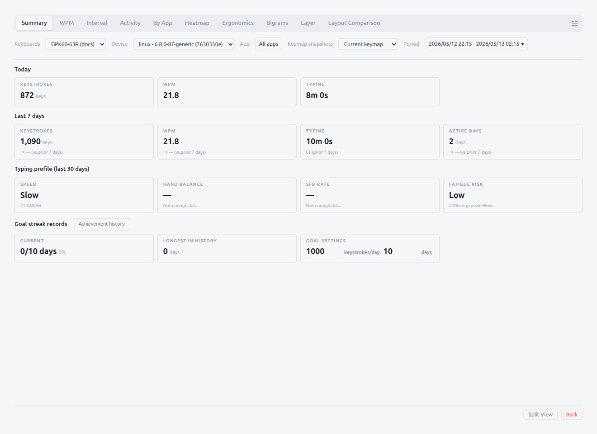

- **Today** — Keystrokes, WPM, Typing duration for the current local day
- **Last 7 days** — Keystrokes, WPM, Typing duration, Active days, each with a delta arrow comparing the prior 7 days. Insufficient prior data renders as `—`
- **Typing profile (last N days)** — Four qualitative read-outs computed over the recent window:
  - **Speed** — overall WPM bucketed into Slow (<30) / Medium (30–50) / Fast (≥50)
  - **Hand balance** — share of bigram keystrokes per hand. Within ±5% of 50/50 reads as Balanced
  - **SFB rate** — share of bigrams typed with the same finger. <4% Low / 4–8% Medium / ≥8% High
  - **Fatigue risk** — drop from peak hour to slowest hour WPM. Wider gap = higher risk
- **Goal streak record** — Current cycle progress (`current / goalDays`), longest historical streak, and editable Goal settings (consecutive days × keystrokes/day). Changing the goal clears the current cycle counter. The **Achievement history** button opens a modal that lists every completed cycle with period, goal, days, total keystrokes, and average per day

The Summary tab respects the App filter — selecting one or more apps narrows every card to minutes tagged with those apps.

#### Heatmap

The Heatmap tab counts every press per physical key and paints the result on the keymap layout, one layer at a time. It's useful for spotting over- or under-used keys per layer and for tuning the layout.

**Keymap panel**

Keys are tinted by press count (dim = low, saturated accent = high). When a keyboard has more than one layer, a layer toggle bar appears above the panel (**Layer 0**, **Layer 1**, …) and each button shows the per-layer count. Hovering a key opens a tooltip inside the chart with the bound keycode and the count; the tooltip never spills outside the heatmap frame.

**Ranking controls**

Below the heatmap is a ranking table. Four filters control what it shows:

- **Normalize** — `Absolute` (raw count), `Per hour` (count ÷ active hours), `Share of total` (% of total presses in range)
- **Aggregate** — `By cell` collapses every press of the same physical cell; `By character` collapses every press of the same keycode regardless of where on the keymap it sits
- **Group** — `All`, `Character`, `Modifier`, `Layer op`
- **Top N** — 10 / 20 / 30 / … / 100

Columns are **Key**, **Layer** (only when the group spans multiple layers), **Matrix**, **Count**.

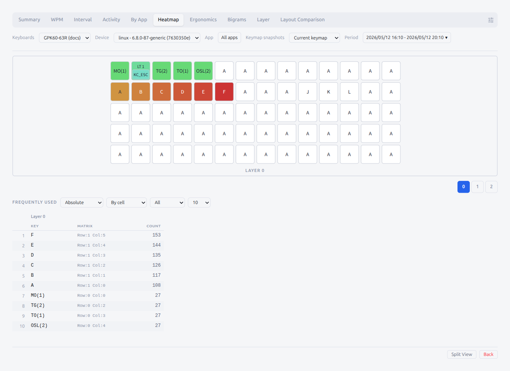

**Empty states**

- **No snapshot** — "No keymap snapshot recorded for this range. Start a record session to capture one."
- **No layout** — "Layout data not available for this snapshot." The snapshot exists but lacks KLE geometry
- **No activity** — "No key presses in this range." Ranking table only

#### WPM

The WPM tab charts Words Per Minute — keystrokes per minute divided by 5 — either as a time series or binned by hour of day.

**View Mode**

- **Time series** — WPM over the selected range as a line chart. A red dashed **Bksp %** line is always overlaid on a secondary right-hand axis (0–100 %) so speed and error rate sit together; click the Bksp legend entry to hide it if you only want the WPM line

  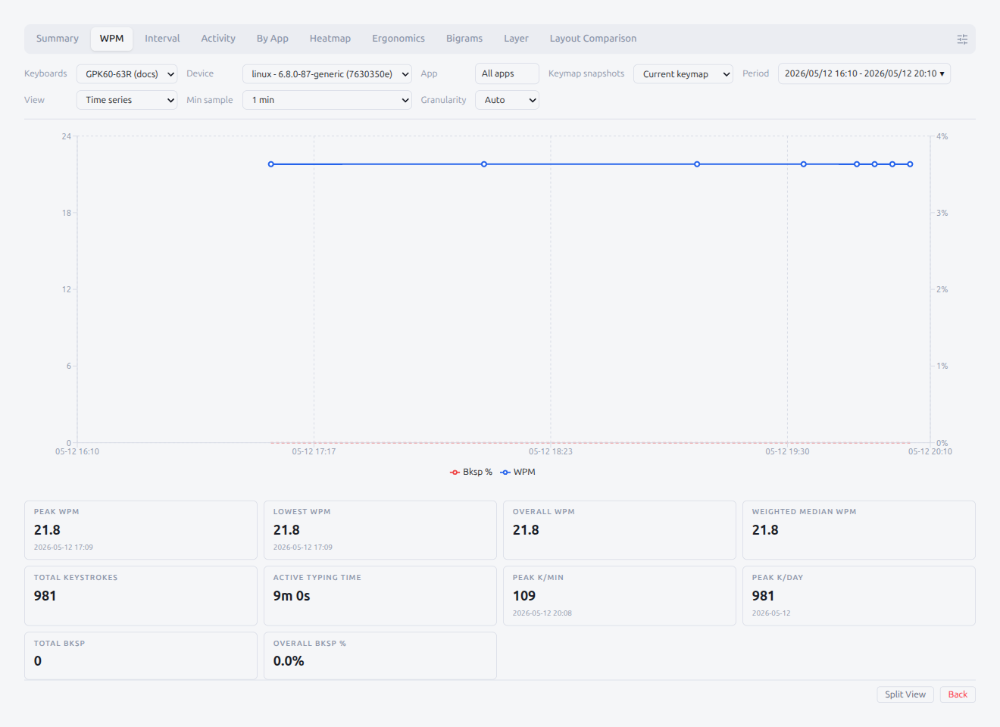

- **Time of day** — Bar chart of the 24 hours in the local day. Each bar is the average WPM for that hour across the range. Bars that did not meet **Min sample** render in a muted tone

  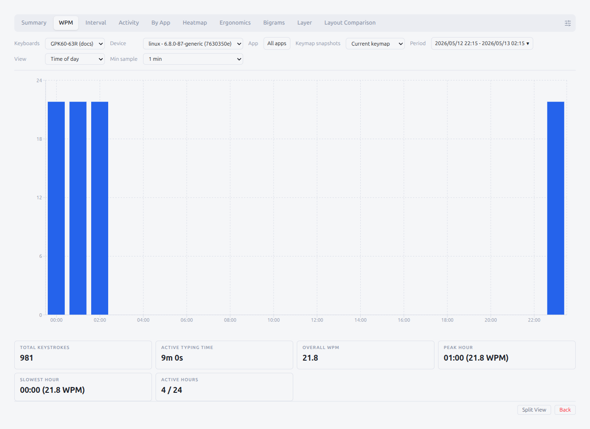

**Min sample** (both views)

`30s`, `1 min`, `2 min`, `5 min`. Minutes with fewer keystrokes than the chosen WPM-worth-of-keys threshold are dropped from the chart so very light sessions don't skew the line.

**Granularity** (Time series only)

Bucket width of the time series (`Auto`, `1 min`, `5 min`, … `1 week`, `1 month`).

**Summary cards**

- **Time series** — Total keystrokes, Active typing time, Overall WPM, Peak WPM, Lowest WPM, Weighted median WPM, Peak K/min, Peak K/day, Total Bksp, Overall Bksp %
- **Time of day** — Total keystrokes, Active typing time, Overall WPM, Peak hour, Slowest hour, Active hours (N / 24)

#### Interval

The Interval tab visualizes the time between consecutive keystrokes, either as percentile lines over time or as a distribution histogram.

**View Mode**

- **Time series** — Five percentile lines on a log-scale Y axis: **Min**, **p25**, **Median**, **p75**, **Max**. The Median line is drawn thickest. Click a legend entry to hide a line. The Y-axis label reads `sec (log)` or `ms (log)` depending on Display

  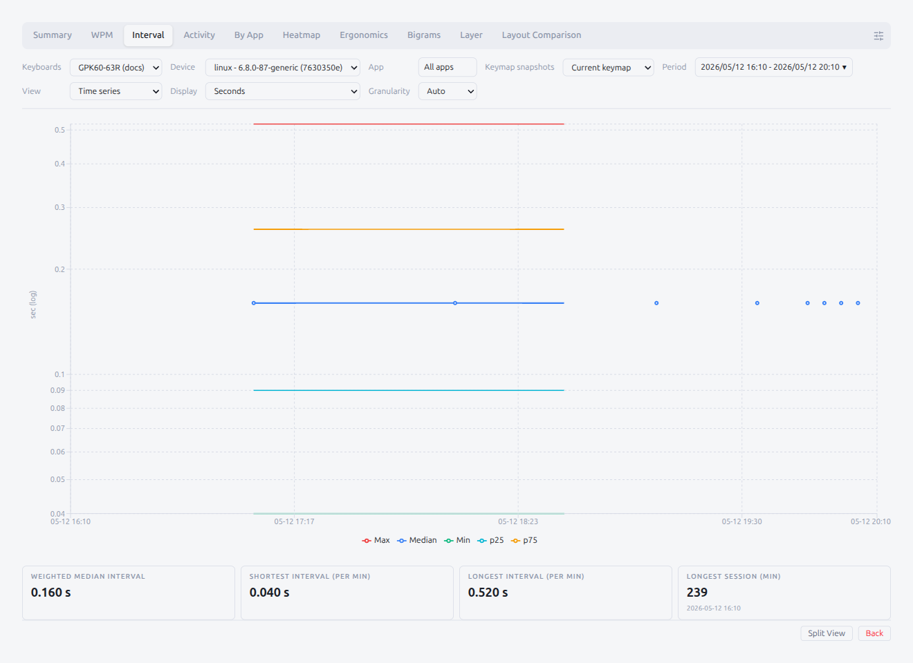

- **Distribution** — Bar chart of nine fixed bins (`<50ms`, `50-100ms`, `100-200ms`, `200-500ms`, `500ms-1s`, `1-2s`, `2-5s`, `5-10s`, `>10s`). Bars are colored by band: **Fast** (green, <200ms), **Normal** (blue, 200–500ms), **Slow** (orange, 500ms–2s), **Pause** (red, ≥2s). The **Device** filter is hidden in Distribution mode because bins are always computed from this device alone

  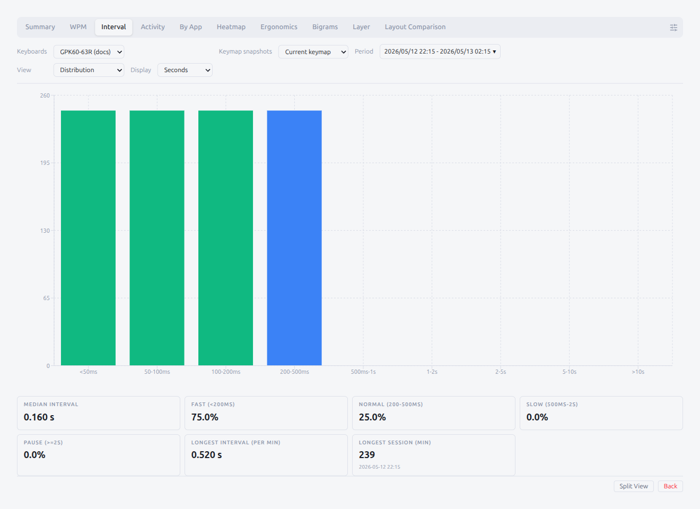

**Display** (both views)

`Seconds` / `Milliseconds`. Switches the unit used in tooltips and on the Y axis. The distribution bin labels stay in their native unit.

**Granularity** (Time series only)

Same options as WPM.

**Summary cards**

- **Time series** — Total keystrokes, Active typing time, Weighted median interval, Shortest interval (per min), Longest interval (per min)
- **Distribution** — Total keystrokes, Median interval, Fast (<200ms) share, Normal (200–500ms) share, Slow (500ms–2s) share, Pause (≥2s) share, Longest interval (per min), Longest session

#### Activity

The Activity tab groups typing by day-of-week × hour so you can see when you actually type. The filter row offers two orthogonal pickers: **View** (chart geometry) and **Metric** (what each cell measures).

**View**

- **Hour** — the historical 24 × 7 hour-of-day × day-of-week grid (or sessions histogram when Metric = Sessions). Driven by the top-level Period picker
- **Day** — sliding-window day calendar. Adds a **Range** selector (3 / 6 / 12 months) plus prev / next month cursor buttons so you can browse the month-by-month heatmap; the current month stops at today so future days stay blank

**Metric**

- **Keystrokes** — keystroke count. Empty cells are dim, the busiest cell is fully saturated. In Grid view a non-empty cell tooltip shows both the raw count and its share of the range total (e.g. `Mon 09:00 — 1,234 keys (5.2% of total)`)

  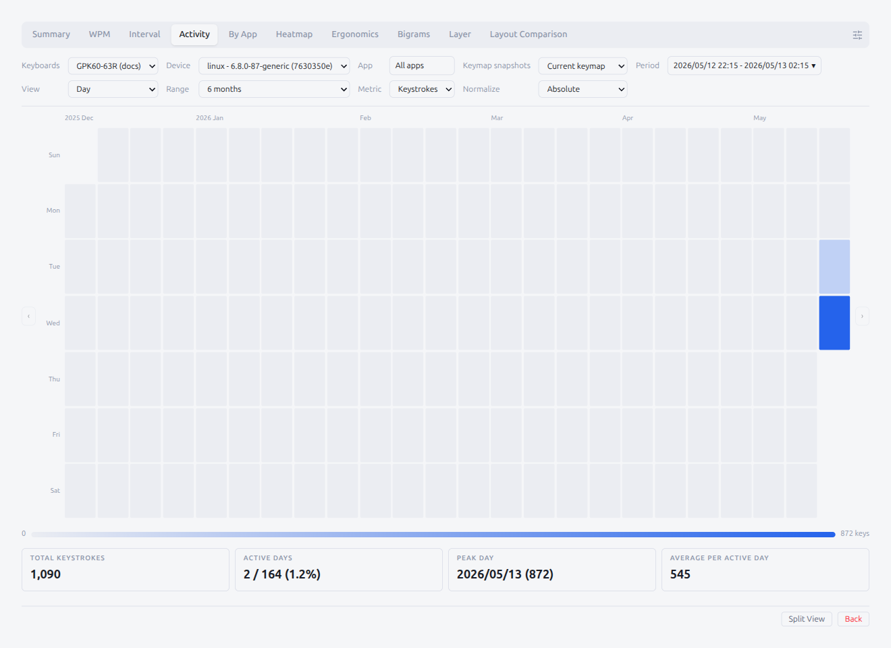

- **WPM** — average WPM per cell. In Grid view, cells that don't meet **Min sample** are desaturated instead of pinning the color scale
- **Sessions** — In Grid view this swaps to a histogram of session lengths in seven bins (`<5 min`, `5-15 min`, `15-30 min`, `30-60 min`, `1-2 h`, `2-4 h`, `>4 h`); in Calendar view each cell counts the **sessions whose start fell on that date** (not sessions active on that date)

**Day-only controls** (View = Day)

- **Normalize** — `Absolute` colors by the peak day in the rendered window, `Share of week` divides each cell by the column's weekly total, `Share of total` divides by the grand total of the rendered range
- **Range** — `3 months`, `6 months`, `12 months`. Sets the visible window relative to the cursor month
- **Prev / Next month buttons** — slide the visible window one month earlier or later. The current month is the right-most column; future days stay blank

  

Clicking a populated cell jumps the rest of the Analyze pane to that single day. The snapshot picker auto-selects the snapshot that contains the date so dependent tabs (Heatmap, Ergonomics, Layer activations) stay aligned with the keymap that was active.

**Min sample** (View = Grid, Metric = WPM)

Same options as the WPM tab.

**Peak records**

Four stat cards above the grid summarize the peaks across the selected range: Peak WPM, Peak K/min, Peak K/day, Longest session (min). They stay visible for every metric so you always see the overall highs at a glance.

**Summary cards**

Under the grid, the summary depends on the metric:

- **Keystrokes** — Total keystrokes, Active typing time, Busiest day, Busiest hour, Peak cell, Active cells (N / 168). The count context under each card also carries its share of the range total (e.g. `800 keys (40.0%)`)
- **WPM** — Total keystrokes, Active typing time, Overall WPM, Peak cell, Slowest cell, Active cells (N / 168)
- **Sessions** — Session count, Total duration, Mean duration, Median duration, Longest session, Shortest session

#### Ergonomics

The Ergonomics tab reports the physical load of your typing — per finger, per hand, per row — based on the key → finger assignment in the snapshot keymap.

Like Heatmap, this view needs a keymap snapshot that overlaps the range.

**Sections**

Three bar charts stack vertically:

1. **Finger Load** — 10 vertical bars, one per finger from left pinky to right pinky
2. **Hand Balance** — 2 horizontal bars (Left / Right)
3. **Row Usage** — 6 horizontal bars (Function / Number / Top / Home / Bottom / Thumb)

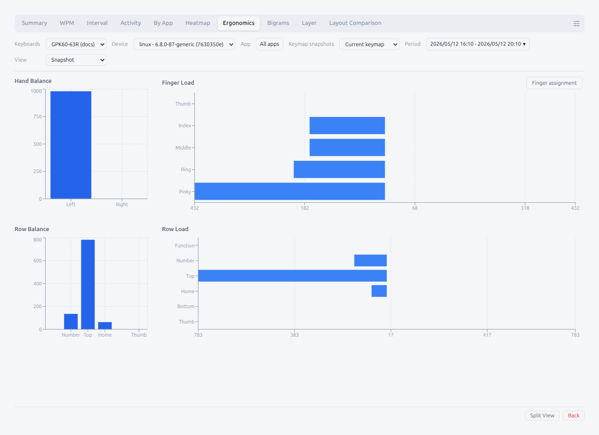

**Finger assignment**

Each key is auto-assigned to a finger based on the layout's KLE metadata (column position and the standard column-to-finger mapping). Click the **Finger assignment** button at the top of the tab to override any key manually:

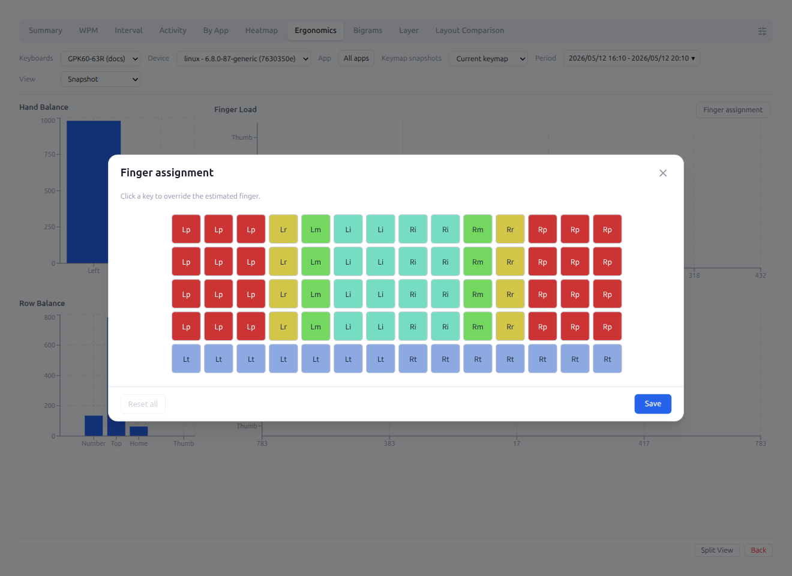

- Each key shows a short finger code (`Lp`, `Lr`, `Lm`, `Li`, `Lt` / `Rt`, `Ri`, `Rm`, `Rr`, `Rp`). Manually overridden keys are prefixed with `*`
- Click a key → popover to pick a finger
- **Save** persists the overrides; **Reset all** clears every override (disabled when there are none). **Reset to estimate** in the per-key popover clears just that key
- Overrides apply immediately once you close the modal — Finger Load, Hand Balance, and Row Usage all recompute

**Learning curve**

Set the **View** filter to **Learning curve** to swap the four-pane snapshot for a weekly / monthly trend chart. The view buckets per-day matrix counts into the chosen **Period** (week / month) and folds each bucket into three sub-scores plus a composite score:

- **Finger load** — how evenly the 10 fingers share the load (1 = perfectly even, 0 = one-finger lock-in)
- **Hand balance** — how close the left / right split is to 50 / 50
- **Home row stay** — fraction of keystrokes on the home row

The bold line is the composite **Overall** score (weighted mean of the three sub-scores); the dashed lines are the individual sub-scores. The summary cards at the top show the latest bucket's overall score, the delta against the prior buckets, and the qualified bucket count (a bucket is qualified once its keystroke total clears the min-sample threshold; below-threshold buckets stay visible but are flagged in the tooltip).

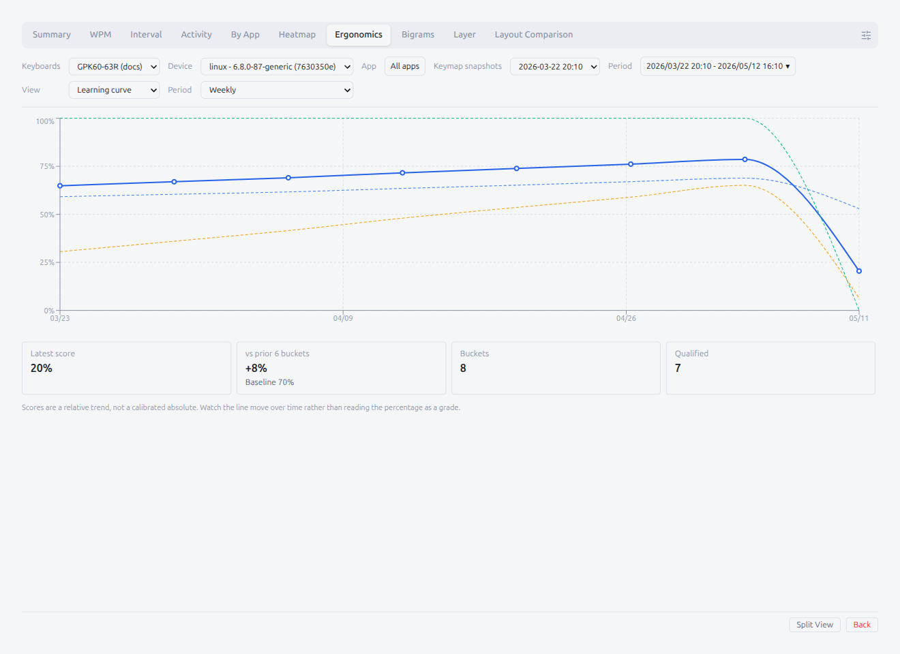

> The composite score is a **relative trend indicator**, not a calibrated absolute metric. The weights are heuristic and finger-stddev is sensitive to layout choices. Read the curve as "is my distribution improving over time?" rather than as a numeric grade.

**Empty states**

- **No snapshot** — same message as Heatmap
- **No layout** — "Layout data not available for this snapshot."
- **No activity** — "No keystrokes recorded in this range."
- **No data** (Learning curve only) — "Not enough matrix activity in this range. Type more or widen the period filter."

#### Bigrams

The Bigrams tab analyzes consecutive key-press pairs (bigrams) and the inter-key interval (IKI) between them. Bigrams are aggregated per minute as the typing happens, so the tab works over any selected range without re-scanning raw events.

**Quadrant layout**

The view is a 3-quadrant grid; each quadrant has its own list-size selector (10 / 20 / 30 / … / 100). Bars are rendered with recharts so tooltips track the cursor.

| Quadrant | What it shows |
|----------|---------------|
| **Top pairs** | Pair ranking by total occurrence count. Click the **Count** or **Avg IKI** column to flip the sort |
| **Pair interval** | Pair ranking by average IKI (slowest first). Click any of **Count**, **Avg IKI**, or **p95** to re-sort. The Avg interval threshold (see Common filters) hides faster-than-threshold pairs |
| **Finger IKI** | Per-(from-finger → to-finger) average IKI bar chart. Bars are coloured blue for left-hand starts and red for right-hand starts. Same Avg interval threshold applies |

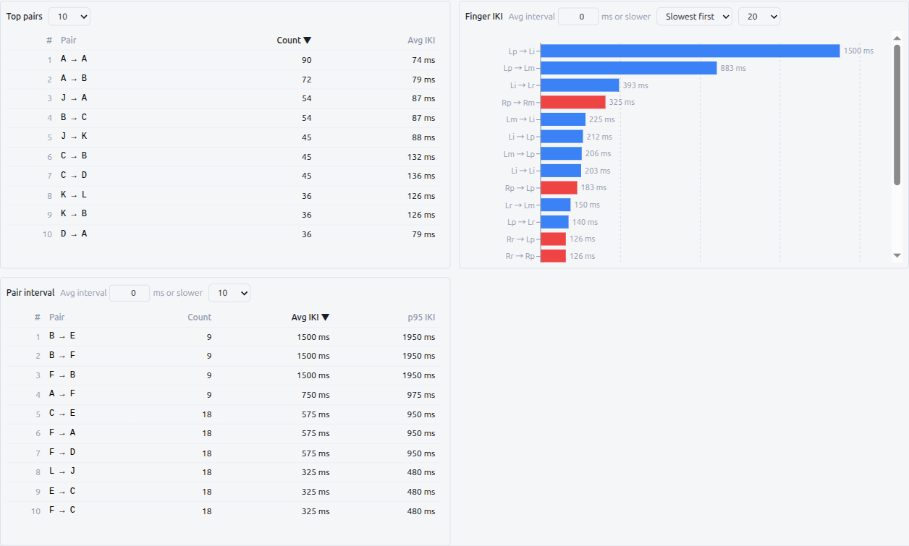

**Snapshot requirement**

Only the **Finger IKI** quadrant needs a keymap snapshot — it has to map each numeric keycode in the bigram pairs to a finger, which depends on the snapshot's keymap and layout. The Top pairs and Pair interval quadrants both render directly from the recorded pair counts and work without a snapshot.

**Common filters**

- **Range** — same `From` / `To` pickers as the rest of Analyze. The view re-aggregates over the chosen window
- **Device** — `This device` only or all synced devices, identical to the other tabs
- **Avg interval (ms or slower)** — minimum-IKI threshold rendered inline in both the Finger IKI and Slow pairs quadrant headers. Pairs whose average IKI is below the threshold are hidden in both quadrants at once (the input is shared, so editing it in one quadrant updates the other). `0` disables the filter; the value is persisted per keyboard via `PipetteSettings`. The IKI used for comparison is approximate (histogram bucket-center weighted average), so the cut-off is best treated as a coarse "ignore pairs faster than ~N ms" filter

**Empty states**

- **No bigram data** — "No bigram data in this range yet. Record some typing and try again." Shown when the range has no recorded pair activity
- **No snapshot (Finger IKI quadrant only)** — "Finger heatmap needs a keymap snapshot. Start a record session or pick a range with one." The other three quadrants still render
- **Threshold filtered everything out** — when **Avg interval** is set high enough that no pair survives, the Finger IKI and Pair interval quadrants both fall back to "No bigram data in this range yet." Lower the threshold to bring rows back

#### By App

The By App tab breaks the recorded data down by the active application name captured during typing. It only populates after Monitor App has been enabled in the Typing View and at least one minute has been tagged with an app name. This tab intentionally **ignores the App filter** — applying it would collapse the chart to a single slice / bar.

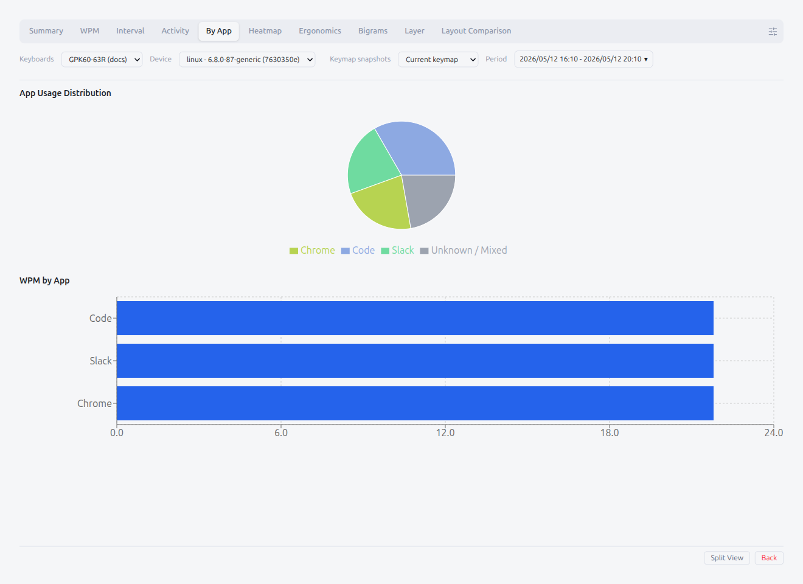

**App Usage Distribution** (donut)

Per-app share of total keystrokes for the selected range. Minutes tagged with multiple apps fold into an `Unknown / Mixed` slice; minutes that pre-date Monitor App or were captured while it was disabled go to `Other`. Hover for the tooltip with the per-slice keystrokes count and share percentage.

**WPM by App** (horizontal bars)

Per-app median WPM as a horizontal bar chart, ranked by share of activity. Bars below the configured min-sample threshold render in a muted tone. Hover for the per-bar WPM and keystroke count.

**Empty state**

- "No app data — turn on Monitor App and start REC to populate this chart." Shown when no app-tagged minutes exist in the range

#### Layout Comparison

The Layout Comparison simulates how your recorded typing would land on a different keyboard layout — Colemak, Dvorak, Colemak DH, and 30+ others — without touching your firmware. Pick a candidate from the dropdown and the tab folds your matrix activity through that layout's character map to show how your finger / hand / row workload would shift.

**Pickers**

- **Current layout** — what character convention to interpret your recorded events with. Defaults to QWERTY; change it if your firmware fires keycodes for a different layout natively
- **Compare to** — the candidate layout to simulate against. Picks are persisted per keyboard so the comparison reopens to the same target after a reload

**Panels**

Once a target is picked, all three panels render at once so you can read the spatial, per-finger, and tabular views together without flipping a sub-view:

| Panel | What it shows |
|-------|---------------|
| **Heatmap diff** (top, full width) | Per-physical-key delta painted over the keyboard. Red shades where the candidate sends more activity to that key, blue shades where it sends less |
| **Finger diff** (bottom-left) | Per-finger signed delta bar chart. Red bars mark fingers that take more load on the candidate, green bars mark fingers that take less |
| **Metric table** (bottom-right) | Side-by-side share-of-events table with finger load (per finger), hand balance (left / right), row distribution, and home-row stay rate |

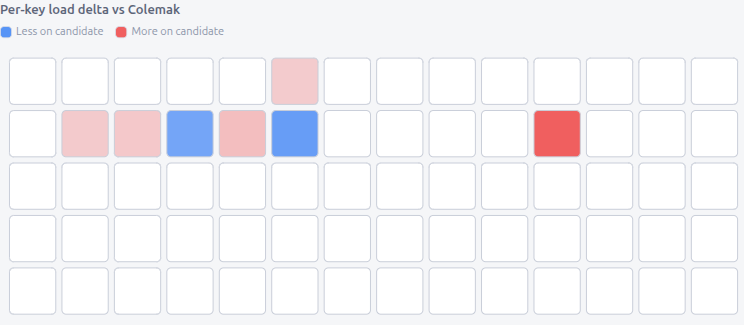

**Skip-rate warning**

Some events can't be mapped onto a candidate — for example, when the source character has no equivalent on the target layout, or the firmware hasn't bound the candidate's keycode anywhere. When that share rises above 5% the view shows a warning so you know the metrics are approximate.

**Empty states**

- **No snapshot** — same empty state as the rest of the snapshot-bound tabs. Start a record session in the chosen range to capture one
- **No target picked** — the empty hint stays until you pick a comparison layout from the dropdown
- **Fetch error** — generic "failed to compute the layout comparison" message; reload or pick a smaller range and retry

The Layer tab breaks usage down by keyboard layer.

**View Mode**

- **Keystrokes** — sums every press at the layer that was active at the time. Reflects `MO`, `LT`, `TG`, and any other layer op live, because the active layer is recorded when the press happens. Works with or without a keymap snapshot

  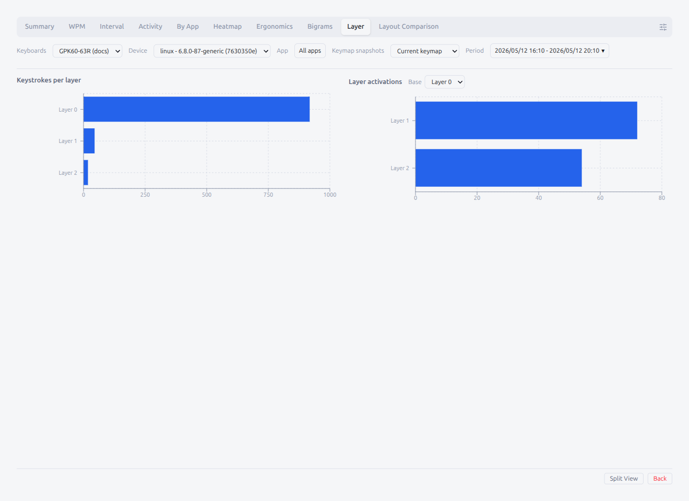

- **Activations** — counts how many times each layer was *reached* through a layer-op keycode. Requires a keymap snapshot so the layer-op target can be resolved:
  - `MO` / `TG` / `TO` / `DF` / `PDF` / `OSL` / `TT` — counted on press
  - `LT` / `LM` — counted only on hold (so a tapped `LT0(KC_ESC)` doesn't look like a layer transition)

  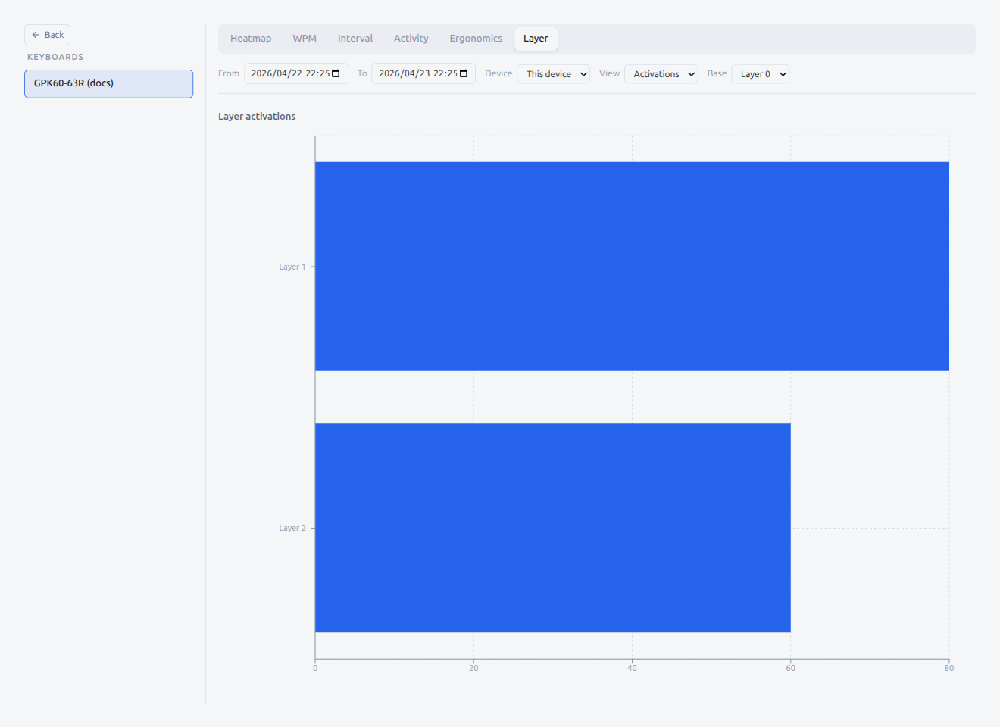

**Base Layer**

Appears only in Activations mode on keyboards with two or more layers. Selects the layer you are analyzing from — that layer is dropped from the bar list so a "hold the same layer you're already on" press (e.g., `LT0(KC_ESC)` while base = 0) doesn't show up as a transition.

**Layer names**

If you have named layers in the layer panel (see §2.3), the name is appended to the axis label (e.g., `Layer 0 · Base`) so you can tell layers apart without counting.

**Empty states**

- **Keystrokes, no activity** — nothing pressed in range
- **Activations, no activity** — no layer-op keys pressed in range
- **Activations, no snapshot** — "Layer activations need a keymap snapshot. Start a record session in this range to capture one." Keystrokes mode keeps working without a snapshot

#### CSV Export

The **Export** button on the panel header opens a category-pick modal that writes the chart data for the active filters as a `.csv` file. Eight categories can be ticked independently:

- **Heatmap** — per-cell press counts (snapshot-bound)
- **WPM** — per-bucket WPM time series
- **Interval** — per-bucket interval percentiles
- **Activity** — hour × day-of-week or day-cell counts depending on the View setting
- **Ergonomics** — per-finger / per-hand / per-row totals (snapshot-bound)
- **Bigrams** — Top pairs / Pair interval / Finger IKI rows
- **Layout Comparison** — per-finger / row / hand deltas (snapshot-bound)
- **Layer** — per-layer keystroke or activation counts

The modal lists the active conditions (Device, App, Keymap, Period) above the category list so the file you save is unambiguous about which slice it captures. Heatmap, Ergonomics, and Layout Comparison entries are unavailable when the range has no overlapping snapshot — the modal shows a "snapshot missing" notice for those categories. Manual finger overrides are noted next to the Ergonomics row.

---

## 2. Keymap Editor

### 2.1 Screen Layout

The keymap editor consists of two main areas: the keyboard layout display and the keycode palette.

- Top area: Physical keyboard layout (shows the current keycode assigned to each key)
- Left side: Toolbar (zoom, undo/redo, etc.)
- Bottom area: Keycode palette (tabbed interface) with overlay panel toggle
- Right side (when open): Keycodes Overlay Panel (tools, save, layout options)
- Bottom bar: Status bar

### 2.2 Changing Keys

1. Click a key on the keyboard layout to select it
2. Click a keycode from the keycode palette to assign it
3. The key display updates immediately
4. Changes are automatically sent to the keyboard

- Ctrl+click to select multiple keys
- Shift+click for range selection
- Press Escape to deselect all keys

**Instant Key Selection** controls how keycode assignment behaves:

- **ON** (default): A single click on a keycode immediately assigns it and closes the selection. Fast workflow for quick edits.
- **OFF**: A single click selects a keycode (highlighted), double-click or press Enter to confirm and assign. A hint is shown at the bottom of the palette. Useful when you want to browse keycodes before committing.

This setting can be toggled per-keyboard in the Keycodes Overlay Panel (§3.14), and the global default can be set in Settings → Defaults (§6.1).

### 2.3 Layer Switching

Layer switching buttons are located on the left side of the keyboard layout.

- Click layer number buttons to switch between layers
- Layer 0 is the default layer
- The number of available layers depends on the keyboard configuration

The layer panel can be collapsed to save space:

Click the collapse button (chevron) to minimize the layer panel to just numbers. Click the expand button to restore full layer names.

### 2.4 Key Popover

Double-click a key on the keyboard layout to open the Key Popover — a quick way to search and assign keycodes without scrolling through the palette.

**Key Tab**

- The search input is pre-filled with the current keycode name
- Type to search by name, keycode name, or alias — results are ranked by relevance
- Click a result to assign it immediately
- The popover also appears when double-clicking key fields in detail editors (Tap Dance, Combo, Key Override, etc.)

**Code Tab**

- Enter a keycode value directly in hexadecimal (e.g., `0x0029` for Escape)
- The resolved keycode name is displayed below the hex input
- Click **Apply** to assign the entered keycode

**Wrapper Modes**

The mode buttons at the top of the popover let you build composite keycodes:

- **Mod Mask**: Combine a modifier with a key (e.g., `LSFT(KC_ESCAPE)`)
- **Mod-Tap**: Modifier on hold, key on tap (e.g., `LSFT_T(KC_ESCAPE)`)

Both modes show the modifier checkbox strip to select Left/Right Ctrl, Shift, Alt, or GUI. Left and Right modifiers cannot be mixed — selecting one side disables the other.

- **LT**: Layer-Tap — activate a layer on hold, send a key on tap (e.g., `LT0(KC_ESCAPE)`). A layer selector appears to choose the target layer.
- **SH_T**: Swap Hands Tap — swap hands on hold, send a key on tap (e.g., `SH_T(KC_ESCAPE)`)
- **LM**: Layer-Mod — activate a layer with modifiers (e.g., `LM(0, MOD_LSFT)`). Shows both the layer selector and the modifier checkbox strip.

Click an active mode button to toggle it off and revert to a basic keycode.

**Undo / Redo**: The popover footer shows context-sensitive **Undo** and **Redo** buttons. Undo displays the previous keycode and reverts to it; Redo displays the next keycode and re-applies it. These buttons only appear when the most recent undo/redo history entry matches the key currently open in the popover (i.e., the last single change). For multi-step history navigation, use the toolbar buttons or keyboard shortcuts (see §4.2).

**Confirmation**: Press **Enter** to confirm the current selection and close the popover. Press **Escape** or click outside the popover to close it without changes.

### 2.5 Layout Options

Some keyboards support multiple physical layouts (e.g., split backspace, ISO enter, different bottom row configurations). When a keyboard has layout options, a Layout Options button (grid icon) appears at the right end of the keycode palette tab bar.

- Click the grid icon to open the Layout Options panel
- **Checkbox options**: Toggle a layout variant on or off (e.g., "Macro Pad", "Split Backspace", "ISO Enter")
- **Dropdown options**: Select from multiple layout variants (e.g., "Bottom Section" with Full Grid / Macro Pad / Arrow Keys choices)
- Changes are applied immediately — the keyboard layout display updates in real time to reflect the selected options

- Selecting a different option updates the visible keys on the keyboard layout
- Layout options are saved to the keyboard and persist across sessions
- Click outside the panel or press Escape to close it

> **Note**: The Layout Options button only appears for keyboards that define multiple layout variants. Most keyboards with a single fixed layout do not show this button. Screenshots in this section were taken using a dummy JSON definition loaded via "Load from JSON file".

---

## 3. Keycode Palette

Select keycodes from different categories using the tabbed palette at the bottom of the screen.

### 3.1 Basic

Standard character keys, function keys, modifier keys, and navigation keys. The Basic tab supports four view types, selectable from the Keycodes Overlay Panel (§3.14):

**ANSI Keyboard View** (default)

Displays keycodes as an ANSI keyboard layout. Click a key on the visual keyboard to assign it.

**ISO Keyboard View**

Displays keycodes as an ISO keyboard layout with the ISO-specific keys.

**JIS Keyboard View**

Displays keycodes as a JIS keyboard layout with JIS-specific keys (Yen, Ro, Henkan, Muhenkan, Katakana/Hiragana).

**List View**

Displays keycodes in the traditional scrollable list format.

All views include:
- Character keys (A-Z, 0-9, symbols)
- Function keys (F1-F24)
- Editing keys (Enter, Tab, Backspace, Delete)
- Navigation keys (arrows, Home, End, PageUp/Down)
- Numpad keys
- International keys (KC_INT1–KC_INT5)
- Language keys (KC_LANG1–KC_LANG5)

### 3.2 Layers

Keycodes for layer operations.

- **MO(n)**: Momentarily activate layer n while held
- **DF(n)**: Set default layer to n
- **TG(n)**: Toggle layer n
- **LT(n, kc)**: Layer on hold, keycode on tap
- **OSL(n)**: Activate layer n for the next keypress only
- **TO(n)**: Switch to layer n

### 3.3 Modifiers

Keycodes for modifier key combinations and tap behavior settings.

- **One-Shot Modifier (OSM)**: Activate modifier for the next keypress only
- **Mod-Tap**: Modifier on hold, regular key on tap
- **Mod Mask**: Modifier key combinations

### 3.4 System

Keycodes for mouse control, media playback, system utilities, and audio/haptic feedback.

- **Mouse**: buttons, movement, and scrolling
- **Joystick**: axis and button keycodes
- **Audio**: audio toggle and control keycodes
- **Haptic**: haptic feedback toggle and control keycodes
- **Media Playback**: play/stop/volume/track controls
- **Locking Keys**: Locking Caps Lock, Num Lock, Scroll Lock
- **App / Browser**: application launcher and browser navigation keys
- **System Control**: system power, sleep, wake
- **Boot**: enter bootloader mode (QK_BOOT)

> **Note**: The MIDI tab is only displayed for MIDI-capable keyboards. When available, it appears between System and Lighting.

### 3.5 Lighting

Keycodes for backlight and RGB lighting controls.

- RGB Matrix controls
- RGB Lighting controls
- Backlight controls
- LED Matrix controls

### 3.6 Tap-Hold / Tap Dance

Keycodes that assign different actions to tap and hold.

The Tap Dance section displays a **tile grid preview** showing all entries at a glance:

- Each tile shows the entry number and a summary of configured actions
- Configured entries display their tap/hold actions; unconfigured tiles show the number only
- Click a tile to open the Tap Dance edit modal directly to that entry
- Configure tap, hold, double-tap, and other actions for each entry
- **Edit JSON** button at the bottom opens a JSON editor for bulk editing all entries (see §5.6)

### 3.7 Macro

Macro keycodes.

The Macro section displays a **tile grid preview** showing all entries at a glance:

- Each tile shows the macro number and a preview of the recorded sequence
- Configured entries display a summary of key actions; unconfigured tiles show the number only
- Click a tile to open the Macro edit modal directly to that entry
- Record sequences of key inputs as macros
- **Edit JSON** button at the bottom opens a JSON editor for bulk editing all entries (see §5.6)

#### Macro Edit Modal — List Mode and Edit Mode

Opening a macro action brings up the Macro Modal with two display modes that share the same row:

- **List mode** (default): The action's keycodes are shown as clickable tiles followed by a dashed **add slot**. Single-click a keycode tile to switch that index into edit mode. Single-click the dashed add slot to select it; double-click the dashed slot to open the keycode popover with an empty query (mirrors the keymap editor). The pencil "edit" icon from earlier versions is gone — clicking is the only affordance
- **Edit mode**: The keycode picker stays visible below the row. Each keycode tile shows a hover **X** button to delete that index, and the Tap row exposes a **Close** button to leave edit mode. Picker and popover selections are **staged** — they update the row visually but are not committed until you press the bottom **Save** button or **Enter**. The footer also shows a **Revert** ConfirmButton when you are editing an action that already existed (it is hidden when you just added the action via Add Action, since there is nothing prior to revert to). Save and Revert are disabled until a pick actually changes something. Pressing **Escape**, the per-row **Close** button, **Revert**, or clicking outside the picker / action list / footer / key popover rolls back the entire in-flight edit — including newly-appended Add-keycode slots or an entirely newly-added action — and leaves edit mode. Deleting a slot during edit shifts the selection so the session continues rather than exiting.

Empty keycode actions are tolerated while editing; they are normalized out silently when the macro is saved or exported to a favorite.

#### Recording Lock

While the built-in recorder is capturing keystrokes, the Macro Modal enters a strict disabled state to prevent accidental edits:

- The Add Action select, Text Editor toggle, Clear, Revert, and bottom **Save** buttons are all disabled
- Every existing MacroActionItem and its KeycodeField is disabled (native `disabled` attribute — Tab / hover / click are all suppressed)
- The inline favorites panel is made invisible with its width preserved, so the layout does not jump
- The modal's top-right Close button and backdrop click are inert — the modal cannot be dismissed until recording stops
- The list-mode footer's Clear / Revert / Save buttons remain visible but disabled during recording. In per-action edit mode the list-level Clear / Revert are hidden, but the edit-mode Save (and Revert, for existing edits) are kept visible and disabled so you can see the affordance

### 3.8 Combo

Combo keycodes for simultaneous key-press combinations.

The Combo tab displays a **tile grid preview** showing all entries. A note reads: "These features apply to the entire keyboard, not just the current layer."

- Each tile shows the combo number and a summary (e.g., "A + B → C")
- Click a tile to open the Combo edit modal directly to that entry (§5.2)
- Combo keycodes (CMB_000–CMB_031) can be assigned to keys for triggering combos
- **Settings: Configuration** button at the bottom opens a settings modal for combo-related timeout configuration (e.g., Combo time out period)
- **Edit JSON** button at the bottom opens a JSON editor for bulk editing all entries (see §5.6)

### 3.9 Key Override

Key Override keycodes for replacing key outputs when specific modifiers are held.

The Key Override tab displays a **tile grid preview** showing all entries and a settings area.

- Each tile shows the override number and a summary
- Click a tile to open the Key Override edit modal directly to that entry (§5.3)
- **Edit JSON** button at the bottom opens a JSON editor for bulk editing all entries (see §5.6)

### 3.10 Alt Repeat Key

Alt Repeat Key keycodes for context-aware alternate repeat key bindings.

The Alt Repeat Key tab displays a **tile grid preview** showing all entries and a settings area.

- Each tile shows the entry number and a summary
- Click a tile to open the Alt Repeat Key edit modal directly to that entry (§5.4)
- **Edit JSON** button at the bottom opens a JSON editor for bulk editing all entries (see §5.6)

### 3.11 Behavior

Keycodes for advanced QMK behavior features.

- **Magic**: Magic keycodes for swapping and toggling keyboard behaviors
- **Mode**: NKRO toggle, mode switching keycodes
- **Auto Shift**: Auto Shift toggle and configuration keycodes
- **Swap Hands**: Swap Hands keycodes and Swap Hands Tap variants
- **Caps Word**: Caps Word toggle

### 3.12 User

User-defined keycodes.

- Custom keycodes defined in firmware (e.g., `CUSTOM_1`, `CUSTOM_2`)
- When exporting `keymap.c`, custom keycodes use their configured names instead of generic `USER00`/`USER01` identifiers, and an `enum custom_keycodes` block is generated automatically

### 3.13 Keyboard (Device Picker)

The Keyboard tab lets you copy keycodes from other connected keyboards or from saved files.

> **Use case:** While editing a keyboard, you wonder how another keyboard's keymap is set up — but that keyboard isn't connected right now. If you've previously saved its data (via the Save panel), you can load it from the **File** source in this tab to browse its keymap and copy keycodes directly into your current layout.

**Device List**

When you open the Keyboard tab, a list of all connected Vial-compatible keyboards is displayed. This list updates in real time as you plug in or unplug devices.

- Click a device to load its keymap — the currently connected keyboard shows its live keymap instantly; other devices are probed via a temporary USB connection

- Once loaded, click any key on the displayed keyboard to assign that keycode to the selected key on the main keymap
- Use Ctrl+click for multi-select, Shift+click for range select
- Layer buttons at the bottom right let you browse different layers
- Zoom controls (+ / numeric input / −) adjust the picker keyboard size (30%–200%). When viewing another keyboard, its saved zoom level is loaded automatically
- Press Escape to clear the picker selection

**File Source**

Click the **File** button at the bottom to switch to the file source. This shows saved keyboard snapshots and allows loading `.pipette` files — the same keycode picking workflow applies.

> **Note**: Only V2 format (`.pipette`) files are supported in the key picker. If a legacy V1 format file is selected, a warning is displayed prompting you to connect the keyboard and open the keymap to migrate the data.

**Composite Keycodes**

When clicking a composite key (e.g., `LT1(KC_SPC)`) in the picker, the full keycode is assigned as-is. Inner/outer parts are not split — the complete keycode is copied to the target key.

> **Note**: The Keyboard tab is hidden when editing the inner part of a mask key (e.g., choosing the `KC_SPC` inside `LT1(KC_SPC)`), since composite keycodes cannot be assigned to the inner byte.

### 3.14 Keycodes Overlay Panel

The Keycodes Overlay Panel provides quick access to editor tools and save functions. Toggle it with the panel button at the right end of the keycode tab bar.

**Settings Tab**

- **Basic View Type**: Switch between ANSI keyboard, ISO keyboard, JIS keyboard, and List views for the Basic tab
- **Keyboard Layout**: Select the display layout for key labels. The dropdown reflects the installed Key Labels store (see §6.2); reorder it by dragging rows in the Key Labels modal
- **Auto Advance**: Toggle automatic advancement to the next key after assigning a keycode
- **Instant Key Selection**: Toggle instant key selection mode (see §2.2 for behavior details)
- **Separate Shift in Key Picker**: Toggle split display for combined keycodes (e.g., show Mod-Tap as two halves)
- **Key Tester**: Toggle Matrix Tester mode (supported keyboards only)
- **Security**: Shows lock status (Locked/Unlocked) with a Lock button
- **Import**: Restore from `.vil` files or sideload custom JSON definitions
- **Reset Keyboard Data**: Reset keyboard to factory defaults

**Save Tab**

- **Export Current State**: Download keymap as `.vil`, `keymap.c`, PDF keymap cheat sheet, or PDF layout export (key outlines with summary pages for Tap Dance, Macro, Combo, Key Override, and Alt Repeat Key entries)
- **Save Current State**: Save a snapshot of the current keyboard state with a label
- **Synced Data**: List of saved snapshots with Load, Rename, Delete, and Export actions
- This is the same Save panel as the standalone editor settings (§6)

**Layout Tab** (when available)

Some keyboards support layout options (see §2.5). When available, a Layout tab appears as the first tab in the overlay panel, providing access to the same layout options.

---

## 4. Toolbar

The toolbar on the left side of the keymap editor provides the following features.

### 4.1 Zoom

Adjusts the keyboard layout display scale. Range: 30%–200% (default 100%).

- (+) button to zoom in
- (-) button to zoom out
- Can also be adjusted in editor settings
- Zoom level is saved per keyboard and restored automatically on reconnect

### 4.2 Undo / Redo (Keymap History)

The keymap editor automatically records a history of keycode changes. You can navigate through this history to undo or redo changes.

| Method | Scope | How to use |
|--------|-------|------------|
| **Keyboard shortcuts** | Full history (up to Max Keymap History, default 100) | Ctrl/Cmd+Z (Undo), Ctrl+Y / Ctrl/Cmd+Shift+Z (Redo) |
| **Toolbar buttons** | Full history | Undo / Redo buttons in the left toolbar |
| **Popover buttons** | Last single change only (must match the open key) | Undo / Redo buttons in the popover footer (see §2.4) |

- History is cleared when switching keyboards or disconnecting
- The maximum history size can be configured in Settings → Defaults → **Max Keymap History** (see §6.1)
- All keymap mutation paths are tracked: single key edits, popover selections, mod-mask changes, paste, and copy-layer operations

### 4.3 Typing Test

A typing practice feature. Test your typing with the current keymap while viewing the keyboard layout below. The layout highlights key presses in real time, so you can verify that your physical keymap matches the on-screen display.

Click the **Typing Test** button in the status bar to enter typing test mode.

#### Modes

Three test modes are available, selectable from the mode tabs at the top:

**Words Mode**

- Type a fixed number of random words (15 / 30 / 60 / 120)
- The test ends when all words are completed

**Time Mode**

- Type as many words as possible within a time limit (15 / 30 / 60 / 120 seconds)
- A countdown timer shows remaining time

**Quote Mode**

- Type a real-world quote (short / medium / long / all)
- The quote source is shown after completion

#### Options

In Words and Time modes, you can toggle additional options:

- **Punctuation**: Adds punctuation marks (commas, periods, etc.) to the word list
- **Numbers**: Adds numbers to the word list

These toggles are not available in Quote mode, which uses the original text as-is.

#### During a Test

While typing, the following stats are displayed in real time:

- **WPM**: Words Per Minute (current typing speed)
- **Accuracy**: Percentage of correctly typed characters
- **Time**: Elapsed time (or remaining time in Time mode)
- **Words**: Current word / total words

Correctly typed words turn green. Incorrect characters are highlighted in red with an underline. The cursor advances as you type, and words scroll automatically.

- Press the restart button (↺) to restart the test at any time
- Press Escape to exit typing test mode
- The status bar's Disconnect button is hidden while Typing Test is active. To disconnect, first return to the editor with Escape or the Typing Test button
- The keyboard layout below the test area shows key presses in real time via the Vial matrix tester protocol

#### Typing View (View-Only Mode)

Typing View displays only the keyboard layout in a compact, resizable window — ideal for overlaying on top of other applications while practicing.

Click the **Typing View** button in the status bar (visible when Typing Test is not active) to enter view-only mode.

- The window shows only the keyboard layout with real-time key press highlighting
- The toolbar, keycode palette, typing test UI, and status bar are hidden
- The window maintains its aspect ratio when resized

**Menu Pane**

Click anywhere on the keyboard area to toggle the menu pane (bottom-right popup). The pane is split into **Window** and **REC** tabs at the top, with a shared **Base** layer selector and **Exit Typing View** button at the bottom.

**Window tab** (default)

- **Default Size**: Reset the window to its default calculated size
- **Fit Size**: Adjust the window height to match the current width while preserving the aspect ratio
- **Top**: Keep the window above other windows (always-on-top; not available on Wayland)

**REC tab**

Recording controls and the Monitor App toggle. Detailed in **Typing analytics recording** below.

**Shared controls** (visible in both tabs)

- **Base**: Select which layer to display (when the keyboard has multiple layers)
- **Exit Typing View**: Return to the full editor

Press Escape or click the keyboard area again to close the pane. A hint text appears at the bottom when hovering over the window. The window size, always-on-top preference, and the active menu tab are saved per keyboard.

> **Note**: Auto-lock is suspended while in Typing View mode. If the keyboard is disconnected while in view-only mode, the window automatically restores to its normal size.

#### Typing analytics recording

While Typing View is open, the **REC** tab in the Menu Pane records per-key and per-minute statistics that feed the Analyze page (§1.4). Recording stays off by default.

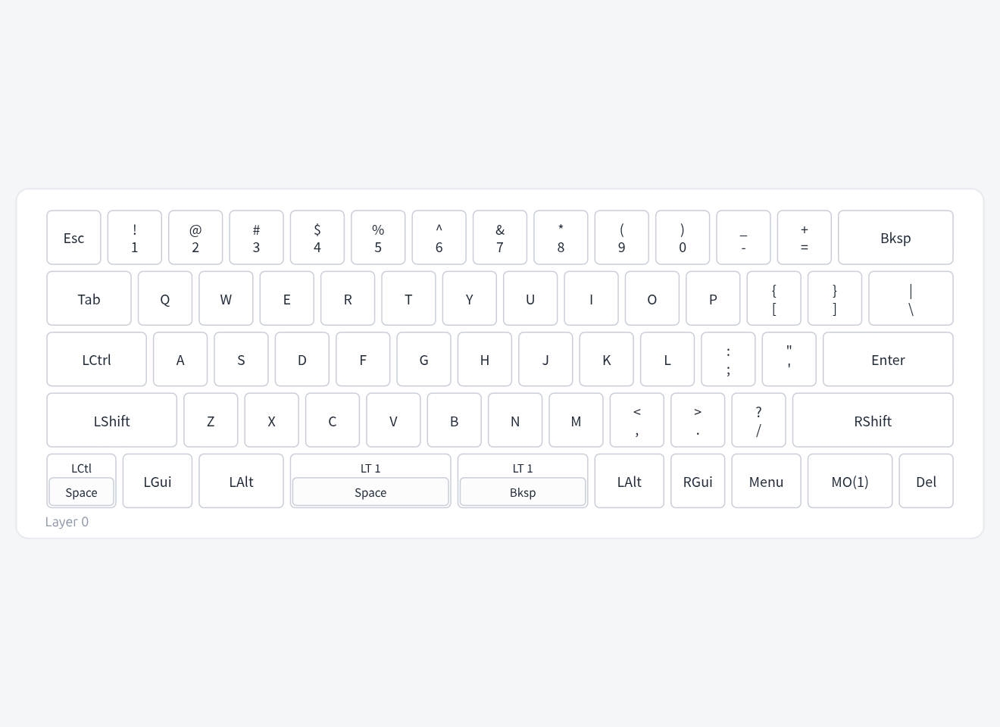

**Start / Stop**

Press the toggle once to start recording — the button shows **Start** while idle and **Stop** while recording. The Recording indicator appears at the top of the Typing View window so you can tell at a glance whether data is being captured.

The very first time you press Start, a consent dialog appears:

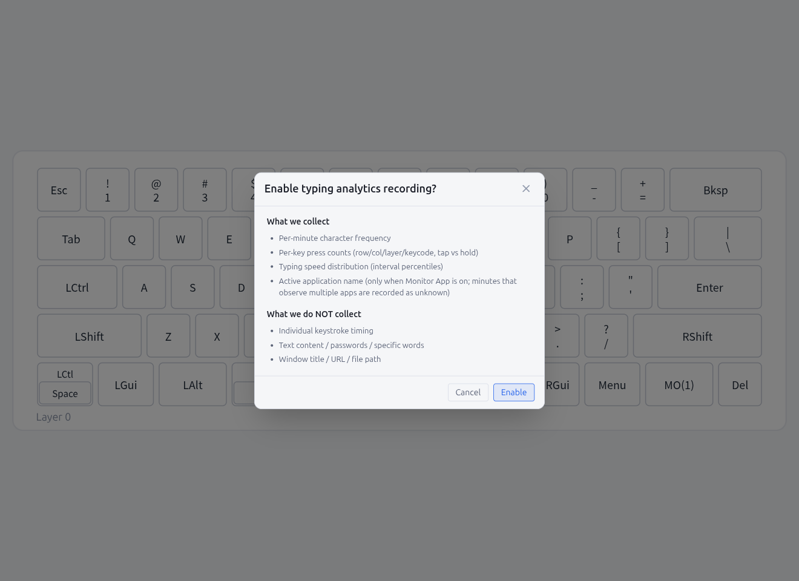

| Section | Items |
|---------|-------|
| **What we collect** | Per-minute character frequency · Per-key press counts (row / col / layer / keycode, tap vs hold) · Typing speed distribution (interval percentiles) · Active application name (only when Monitor App is on; minutes that observe multiple apps are recorded as unknown) |
| **What we do NOT collect** | Individual keystroke timing · Text content / passwords / specific words · Window title / URL / file path |

Click **Enable** to opt in — your consent is persisted in app settings (not synced) and the dialog never appears again. Click **Cancel** to back out without starting; you can press Start later to see the dialog again.

**Monitor App**

When the Monitor App toggle is on (and REC is in the Stop / recording state), Pipette resolves the foreground application name once per data flush so each minute can be tagged with the app that owned the keystrokes. Minutes that observed only one app carry that app's name; minutes that observed multiple apps are tagged as `Unknown / Mixed`. The tags drive the **App** filter and the **By App** tab in Analyze.

- The button is greyed out while REC is **Start** (not recording) state — turning it on without REC has no effect, so the UI funnels you through Start first
- The on/off state is global (AppConfig), not per-keyboard, and is **not** synced to other machines
- **Linux / Wayland**: requires the FocusedWindow GNOME Shell extension (see README). Without it, every minute is recorded as `null`
- **macOS**: requires the Accessibility permission (see README). Without it, every minute is recorded as `null`
- Turning Monitor App off keeps existing tags in the database; only newly recorded minutes go untagged

**View Analytics**

Jumps directly to the Analyze page for this keyboard so you can review the stream you just recorded. Going back returns you to Typing View.

#### View Mode Memory and Auto-Restore

The last view mode (Editor / Typing Test / Typing View) is remembered per keyboard and automatically restored the next time you connect that keyboard:

- **Editor**: The editor view is shown as usual
- **Typing Test**: Typing Test mode is re-entered automatically. If the keyboard is locked, the Unlock dialog appears first and the test starts after unlocking
- **Typing View**: The compact view-only window is re-entered automatically. If the keyboard is locked, the Unlock dialog appears first

View mode is stored per keyboard alongside preferences like keyboard layout, zoom scale, and window size. When Pipette Hub sync is enabled, view mode is synced to other devices as well (see §7).

---

## 5. Detail Setting Editors

Open detail setting modals from their dedicated keycode tabs. Lighting opens via a **Settings: Configuration** button at the bottom of its tab; Combo, Key Override, and Alt Repeat Key detail editors open by clicking an entry on their respective tabs.

### 5.1 Lighting Settings

Open from the **Settings: Configuration** button on the Lighting tab. Configure RGB lighting colors and effects.

- Select colors with the HSV color picker
- Choose colors from preset palette
- Adjust effects and speed
- Click Save to apply

### 5.2 Combo

Configure simultaneous key press combinations to trigger different keys. The Combo tab displays an inline tile grid; clicking an entry opens the detail editor modal directly.

**Tile Grid (Combo tab)**

The Combo tab shows entries as a numbered list (0--31). Configured entries display a summary (e.g., "A + B → C"). Click an entry to open the detail editor. Combo keycodes (Combo On, Combo Off, Combo Toggle) are shown below the list. A **Settings: Configuration** button at the bottom opens a settings modal for QMK Combo timeout configuration (e.g., Combo time out period).

**Detail Editor**

- Left panel: Combo editor with Key 1--4 and Output fields.
- Right panel: Inline favorites panel (Save Current State / Synced Data / Import / Export All)
- **Clear** resets all fields; **Revert** restores the last saved state. Both use two-step confirmation.
- **Save** writes changes to the keyboard

### 5.3 Key Override

Replace specific key inputs with different keys. The Key Override tab displays an inline tile grid; clicking an entry opens the detail editor modal directly.

**Tile Grid (Key Override tab)**

Shows entries as a numbered list. Configured entries display a summary. Click an entry to open the detail editor.

**Detail Editor**

- Left panel: Trigger Key, Replacement Key, enabled toggle, layer and modifier options
- Right panel: Inline favorites panel (Save Current State / Synced Data / Import / Export All)
- **Clear** resets all fields; **Revert** restores the last saved state. Both use two-step confirmation.
- **Save** writes changes to the keyboard

### 5.4 Alt Repeat Key

Configure alternative actions for the Repeat Key. The Alt Repeat Key tab displays an inline tile grid; clicking an entry opens the detail editor modal directly.

**Tile Grid (Alt Repeat Key tab)**

Shows entries as a numbered list. Configured entries display a summary. Click an entry to open the detail editor.

**Detail Editor**

- Left panel: Last Key, Alt Key, enabled toggle, Allowed Mods, Options (DefaultToThisAltKey, Bidirectional, IgnoreModHandedness)
- Right panel: Inline favorites panel (Save Current State / Synced Data / Import / Export All)
- **Clear** resets all fields; **Revert** restores the last saved state. Both use two-step confirmation.
- **Save** writes changes to the keyboard

### 5.5 Favorites

Each editor modal (Tap Dance, Macro, Combo, Key Override, Alt Repeat Key) includes an inline **Favorites panel** on the right side of the editor.

The inline favorites panel provides:

- **Save Current State**: Enter a label and click Save to store the current entry configuration
  - **Import** / **Export** buttons: Import a `.pipette-fav` file to apply to the current entry, or export the current entry settings as a `.pipette-fav` file without saving to the store. Inline "Imported" / "Exported" feedback is shown after each action.
- **Synced Data**: Previously saved entries are listed with Load, Rename, Delete, and Export actions
- **Import** / **Export All**: Footer buttons for bulk import/export of favorites

Within the Synced Data list:

- **Load**: Apply a saved configuration to the current entry
- **Rename**: Change the label of a saved entry (also synced to Hub if the entry is uploaded)
- **Delete**: Remove a saved entry
- **Export**: Download an individual saved entry as a file

When Pipette Hub is connected, each saved entry also shows Hub actions:

- **Upload to Hub**: Upload the favorite entry to Pipette Hub as a feature post
- **Update on Hub**: Re-upload the latest configuration to update the existing Hub post
- **Remove from Hub**: Delete the entry from Pipette Hub (two-step confirmation)
- **Open in Browser**: Open the individual Hub post page in your browser

### 5.6 JSON Editor

Each feature tab (Tap Dance, Macro, Combo, Key Override, Alt Repeat Key) provides an **Edit JSON** button at the bottom of the tab. This opens a JSON editor modal for bulk editing all entries as raw JSON text.

- **Text area**: Edit all entries as a JSON array. Changes are validated in real time — parse errors are shown below the editor
- **Export** (left): Save the current JSON as a `.pipette-fav` file for backup or sharing
- **Cancel** (right): Close without saving
- **Save** (right): Apply the parsed JSON and write changes to the keyboard

For Macros, a warning is displayed indicating that keyboard unlock is required to save changes.

> **Note**: The JSON editor modifies all entries at once. Use with caution — invalid JSON will be rejected, but valid JSON with incorrect values may cause unexpected behavior.

> **Note**: Favorites are not tied to a specific keyboard — saved entries can be loaded on any compatible keyboard. When Cloud Sync is enabled, favorites are also synced across devices (see §6.1). Favorites can also be managed from the Data modal on the device selection screen (see §1.3).

---

## 6. Editor Settings Panel

Open the editor settings panel from the save button (floppy disk icon) in the keycode tab bar, or use the Save tab in the Keycodes Overlay Panel (§3.14).

The editor settings panel now provides a single **Save** panel with the following features:

- **Export Current State**: Download keymap as `.vil`, `keymap.c`, PDF keymap cheat sheet, or PDF layout export (key outlines with summary pages for Tap Dance, Macro, Combo, Key Override, and Alt Repeat Key entries). An "Exported" inline feedback message appears after a successful export.
- **Save Current State**: Save a snapshot of the current keyboard state with a label. Enter a name in the Label field and click Save. If the Label field is left empty, the Save button is disabled. Saved snapshots appear in the Synced Data list below and can be loaded or deleted later
- **Synced Data**: List of saved snapshots. Click to load, rename, or delete entries
- **Reset Keyboard Data**: Reset keyboard to factory defaults (use with caution)

> **Note**: Tool settings (keyboard layout, auto advance, key tester, security) have moved to the Keycodes Overlay Panel (§3.14). Zoom is available in the toolbar (§4.1). Layer settings are now managed directly via the layer panel on the left side of the editor.

### 6.1 Cloud Sync (Google Drive appDataFolder)

Pipette can sync your saved snapshots, favorites, and per-keyboard settings across multiple devices via Google Drive.

Sync is configured in the **Settings** modal (gear icon on the device selection screen), under the **Data** tab:

The Data tab contains the following sections: Google Account, Data Sync, and Pipette Hub. Additional troubleshooting and data management options are available in the Data panel (§1.3).

#### Google Account

- Click **Connect** to sign in with your Google account
- Click **Disconnect** to sign out. If Pipette Hub is also connected, a warning confirms that Hub will be disconnected as well

#### Sync Encryption Password

- Set a password to encrypt all synced data (required). A strength indicator helps you choose a strong password
- If a password already exists on the server (set from another device), a hint is shown asking you to enter the same password
- **Change Password**: Click **Change Password** to re-encrypt all synced files with a new password. No data is deleted — existing files are decrypted and re-encrypted in place

**Change Password error conditions**

When a password change cannot proceed, Pipette shows a localized message instead of the raw error. The common cases are listed below; other underlying errors (network, Drive) may appear as their own messages.

Credential failures (the 5 reasons come from the same typed `SyncCredentialFailureReason` set used for readiness — only 3 of them surface in **Sync Status** below):

| Reason | Message | Trigger |
|--------|---------|---------|
| `unauthenticated` | "Please sign in to Google before changing the password." | Not signed in with Google |
| `noPasswordFile` | "No saved password to change. Set a password first." | No local sync password has ever been set |
| `decryptFailed` | "Couldn't read the existing password (OS keychain rejected it)." | The OS keychain entry is unreadable (keychain reset, profile move, etc.) |
| `keystoreUnavailable` | "OS keychain is not available; password cannot be changed here." | `safeStorage.isEncryptionAvailable()` returns false (typical on headless Linux without a keyring) |
| `remoteCheckFailed` | "Couldn't reach Google Drive to verify the current password." | Network or Drive outage — retry later |

Operational errors (shown as the message directly, no reason code):

| Message | Trigger |
|---------|---------|
| "Cannot change password while sync is in progress." | A sync is already running — wait for it to finish |
| "New password must be different from the current password." | The new password matches the existing one |
| "Some files cannot be decrypted. Please scan and delete undecryptable files first." | Drive has files the current password cannot decrypt — use **Undecryptable Files** first |
| "Sync password does not match. Please check your encryption password." | The current password fails to decrypt the remote password check — reconfirm the password you are providing |

#### Sync Controls

- **Auto Sync**: Toggle automatic sync on or off. When enabled, changes sync automatically with a 10-second debounce and periodic 3-minute polling
- **Sync**: Manually sync favorites and connected keyboard data. Only favorites and the currently connected keyboard are synced (not all keyboards)

#### Sync Status

- Displays current sync progress with the sync unit name and an item counter (current / total)
- Shows error or partial-sync details if any units failed

**Readiness reasons**

If sync cannot run because the client is not ready, a specific readiness reason is shown in place of the generic "Not synced yet" label. Only three reasons surface here; detailed keystore failures (`decryptFailed`, `keystoreUnavailable`) come through the password set/change flow instead.

| Reason | Message |
|--------|---------|
| `unauthenticated` | "Sign in to Google to sync." |
| `noPasswordFile` | "Set a sync password to start syncing." |
| `remoteCheckFailed` | "Couldn't reach Google Drive — sync is paused." |

#### Undecryptable Files

- Files that cannot be decrypted with the current password or are otherwise unreadable (e.g., encrypted with a forgotten previous password)
- Click **Scan** to detect undecryptable files, select the ones to remove, then click **Delete Selected** to permanently delete them from Google Drive

#### Sync Unavailable Alert

- Displayed when the sync backend cannot be reached. Click **Retry** to attempt reconnection

#### Data Storage

Synced data is stored in [Google Drive appDataFolder](https://developers.google.com/workspace/drive/api/guides/appdata) — a hidden, app-specific folder that only Pipette can access. Your personal Drive files are never touched.

See the [Data Guide](Data.md) for details on what is synced and how your data is protected.

#### Data Management

Troubleshooting and data management functions are available in the **Data** panel (see §1.3):

- **Local > Application**: Import/export local data or reset selected targets (keyboard data, favorites, app settings)
- **Sync**: List remote-only keyboards by real name and download any one on demand (see §1.3). To delete encrypted files that cannot be decrypted, use the **Undecryptable Files** section above

#### Settings — Defaults

The Tools tab in the Settings modal includes a **Defaults** section for setting initial preferences for new keyboard connections:

- **Keyboard Layout**: Default key labels for new keyboards. The dropdown lists every entry currently installed in the **Key Labels** store (see §6.2). QWERTY ships built-in; install more from Pipette Hub or import a `.json` via **Key Labels Manage**. The drop-down preserves the manual order set in the modal — drag a row up or down there and the dropdown follows
- **Auto Advance**: Default auto-advance behavior
- **Instant Key Selection**: Default instant key selection behavior (see §2.2)
- **Layer Panel Open**: Whether the layer panel starts expanded or collapsed
- **Basic View Type**: Default view type for the Basic tab (ANSI/ISO/JIS/List)
- **Separate Shift in Key Picker**: Default setting for separating Shift in the key picker
- **Max Keymap History**: Maximum number of keymap changes to keep in the current keyboard's edit history (default: 100). History is cleared on disconnect or keyboard switch. See §4.2 for details.

### 6.2 Key Labels Manage

The Tools tab also exposes a **Key Labels Manage** row (next to the Language picker). Click **Edit** to open the Key Labels modal, which manages every label set the app uses to render keycaps in the editor, the Analyze view, and the Layout Comparison.

QWERTY is built-in; every other label set (Dvorak, Colemak, French, Brazilian, …) is downloaded from Pipette Hub or imported from a local `.json` file. Installed entries sync across devices via Cloud Sync, so the same drag order and selection appear on every machine signed into the same account.

**Installed tab**

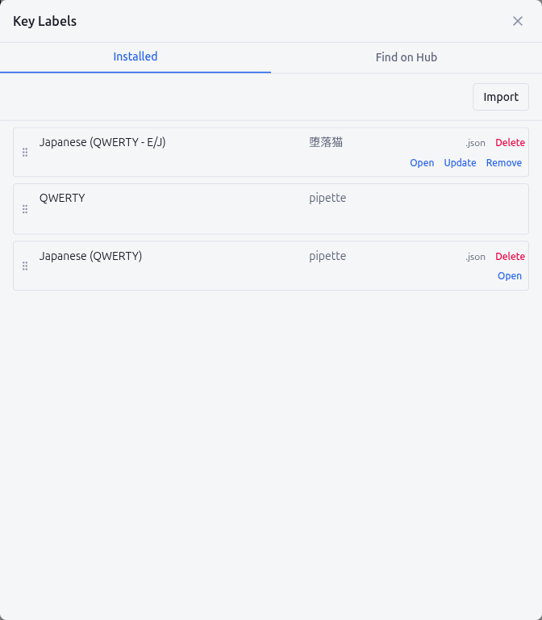

Lists every label set already on this device. Each row shows the label name, the uploader name (when the entry came from Hub), an `.json` export shortcut, and a Delete button. Drag the grip handle on the left to reorder rows — the order is propagated to the Settings dropdown and to every Key Labels picker in the editor.

A second line under each row exposes the Hub actions:

- **Open**: open the entry's Hub page in the system browser (only when the row is linked to a Hub post)
- **Upload**: publish a new Hub post from this local entry (only for entries that have not been uploaded yet)
- **Update**: push the current local content to the existing Hub post (owner only)
- **Remove**: take the post down from Hub. Confirms inline before running

QWERTY shows no Hub actions and cannot be deleted, but it can be reordered like any other row.

**Find on Hub tab**

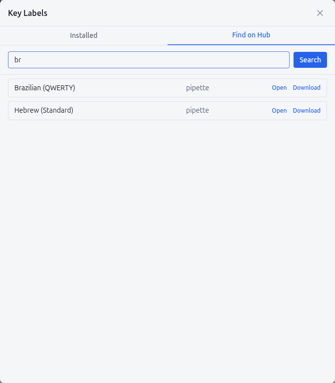

Searches Pipette Hub for label sets. Type 2 or more characters to start an automatic search (debounced); the **Search** button and **Enter** still work as manual triggers. Results show the label name, the uploader, and either a **Download** action or an **Installed** marker when the same name is already present locally. Re-importing a file with a name that already exists overwrites the local entry in place (`.json` content replaced, the Hub link is preserved).

---

## 7. Pipette Hub

[Pipette Hub](https://pipette-hub-worker.keymaps.workers.dev/) is a community keymap gallery where you can upload and share your keyboard configurations and favorite entries.

### 7.1 Hub Setup

Hub features require Google account authentication. Please complete Google account authentication first. Configure Hub in the **Settings** modal (gear icon on the device selection screen):

1. In the **Data** tab, click **Connect** under the Google Account section to sign in with your Google account
2. Scroll down to the **Pipette Hub** section in the same Data tab — it should show **Connected**
3. Set your **Display Name** — this name is shown on your Hub posts
4. Your uploaded keymaps appear in the **My Posts** list

### 7.2 Uploading a Keymap

To upload a keymap to Hub:

1. Connect to your keyboard and open the editor settings (gear icon in the keymap editor)
2. Switch to the **Data** tab
3. Save the current state with a label (e.g., "Default")

4. Click the **Upload** button on the saved snapshot entry
5. After uploading, the entry shows **Uploaded** status with **Open in Browser**, **Update**, and **Remove** buttons

- **Open in Browser**: Opens the Hub page for this keymap
- **Update**: Re-uploads the current keyboard state to update the existing Hub post
- **Remove**: Removes the keymap from Hub

> **Note**: Hub uploads include a `.pipette` file alongside the standard export formats, allowing other users to load the full keyboard state directly.

### 7.3 Uploading Favorite Entries

Individual favorite entries (Tap Dance, Macro, Combo, Key Override, Alt Repeat Key) can also be uploaded to Hub:

1. Open any editor modal with the inline favorites panel, or use the Data modal from the device selection screen
2. In the favorites list, each entry shows an **Upload to Hub** button when Hub is connected
3. Click **Upload to Hub** to share the configuration
4. After uploading, **Open in Browser**, **Update on Hub**, and **Remove from Hub** buttons appear
5. Renaming a favorite that is uploaded to Hub also updates the title on Hub automatically

> **Note**: A Display Name must be set before uploading. If no Display Name is configured, a warning is shown instead of the Upload button.

### 7.4 Hub Website

The [Pipette Hub website](https://pipette-hub-worker.keymaps.workers.dev/) displays uploaded keymaps in a gallery format.

- Browse uploaded keymaps from the community
- Search by keyboard name
- Download keymaps as `.vil`, `.c`, or `.pdf` files

#### Individual Keymap Page

Clicking a keymap card opens the detail page with a full keyboard layout visualization.

- View all layers (Layer 0–3) of the uploaded keymap
- Review Tap Dance, Macro, Combo, Alt Repeat Key, and Key Override configurations
- **Copy URL** or **Share on X** to share with others
- Download in various formats (`.pdf`, `.c`, `.vil`)

See the [Data Guide](Data.md) for details on how Hub authentication works.

---

## 8. Modal Interactions

Pipette applies a uniform set of keyboard and dismissal rules to every top-level modal (Settings, Data, Macro, QMK Settings, Tap Dance, Combo, Key Override, Alt Repeat Key, Notification, Language Selector, Layout Store, Editor Settings, Favorite Store, and the History Toggle dialog).

### Escape to Close

Pressing **Escape** closes the modal, with the following exceptions so that Escape never interrupts text entry:

- If the focused element is an `<input>`, `<textarea>`, `<select>`, or anything inside a `contenteditable` region, Escape is ignored (the element receives it instead)
- During an IME composition (e.g., Japanese input), Escape is ignored so the composition can be cancelled without dismissing the modal

### Unlock Dialog Protection

The Unlock Dialog (prompting for a physical key press after a boot-unlock keycode is invoked) **intercepts Escape before it reaches the parent modal**. Pressing Escape on top of an unlock prompt cannot leak through, preventing accidental dismissal of a half-configured Settings or Data modal by rapid Escape presses.

### Escape Suppression During Busy Flows

Escape-to-close is disabled while the containing modal is in a transient state that must complete:

- **Settings / Data modals**: disabled while a sync / troubleshooting flow is running
- **Macro Modal**: disabled while the recorder is actively capturing keystrokes (see §3.7 Recording Lock); the backdrop click and top-right Close button are also inert at the same time

---

## 9. Status Bar

The status bar at the bottom of the screen shows connection information and action buttons.

- **Device name**: Shows the name of the connected keyboard
- **Loaded label**: The label of the loaded snapshot (shown only when a snapshot is loaded)
- **Auto Advance**: Status of automatic key advancement after assigning a keycode (shown only when enabled)
- **Key Tester**: Toggle button for Matrix Tester mode (requires matrix tester support; hidden when Typing Test is active)
- **Typing View**: Toggle button to enter view-only mode — a compact window showing only the keyboard layout (see §4.3). Requires matrix tester support; hidden when Typing Test is active
- **Typing Test**: Toggle button for Typing Test mode (requires matrix tester support)
- **Locked / Unlocked**: Keyboard lock status (prevents accidental changes to dangerous keycodes)
- **Sync status**: Cloud sync status (shown only when sync is configured)
- **Hub connection**: Pipette Hub connection status (shown only when Hub is configured)
- **Disconnect button**: Disconnects from the keyboard and returns to the device selection screen (hidden while Typing Test is active)
